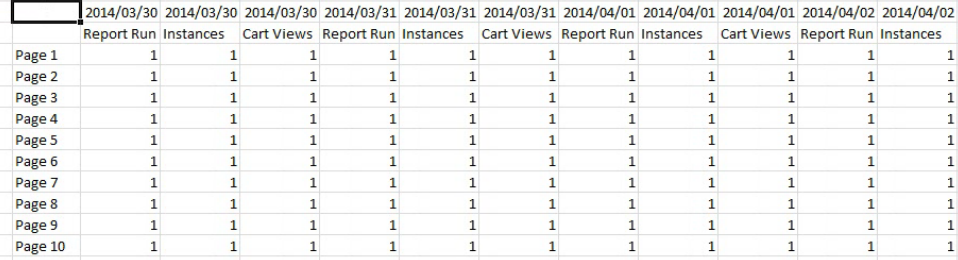

# Mode hors ligne pour la création et la modification de requêtes

{{legacy-arb}}

Le mode hors ligne renvoie des données d’espace réservé afin d’accélérer le processus de création et de modification des requêtes.

Lorsque vous créez ou modifiez une requête, des appels d’API de rapport sont effectués pour récupérer la réponse. Parfois, ces appels ralentissent le processus de création de requête, car vous devez attendre que les données reviennent avant de passer à l’étape suivante. Le mode hors ligne renvoie uniquement les données d’espace réservé et les API ne sont pas créées.

Pour activer le mode hors ligne

1. Cliquez sur **[!UICONTROL Options]** dans le menu du Report Builder.

   

1. Cochez la case en regard de l’option **[!UICONTROL Passez hors ligne pour créer/modifier des demandes]**.
1. Dans le champ **[!UICONTROL Afficher les données de mesure au format]**, saisissez les données d’espace réservé que vous voulez renvoyer dans votre requête. Par exemple, saisissez « 1 ».
1. Cliquez sur **[!UICONTROL OK]**.
1. Créez et exécutez votre requête en mode hors ligne à l’aide de l’Assistant Requête. La capture d’écran suivante présente un exemple de requête avec « 1 » comme données d’espace réservé.

   

   >[!IMPORTANT]
   >
   >Assurez-vous d’avoir désactivé le mode hors ligne avant d’exécuter vos requêtes avec des données réelles.
