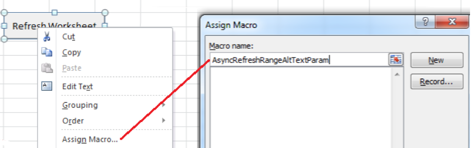

# Utilisation des fonctions Report Builder avec Microsoft Excel

{{legacy-arb}}

Vous pouvez utiliser les fonctions Report Builder pour accéder à la fonctionnalité sans accéder à l’interface utilisateur de Report Builder.

Par exemple, pour actualiser automatiquement les requêtes Report Builder avec des filtres d’entrée basés sur les données extraites d’autres sources dans Excel, utilisez la chaîne RefreshRequestsInCellsRange(..) fonction. Tous les appels sont asynchrones et ils reviennent immédiatement sans attendre l’exécution complète.

**Conditions**

* Report Builder 5.0 (ou version ultérieure) est requis.

Le tableau suivant répertorie les fonctions exposées.

| Nom de la fonction | Type | Description |
|:---| --- | ---|
| AsyncRefreshAll() | string | Actualise toutes les requêtes du Report Builder présentes dans un classeur. |
| AsyncRefreshRange(string rangeAddressInA1Format) | string | Actualise toutes les requêtes Report Builder présentes dans l’adresse de plage de cellules spécifiée (une expression de chaîne représentant une plage de cellules au format A1, par exemple « Sheet1!A2:A10 »). |
| AsyncRefreshRangeAltTextParam() | string | Actualise toutes les requêtes du Report Builder présentes dans la plage de cellules spécifiée qui est transférée par l’intermédiaire du Texte de remplacement du Contrôle de formulaire MS. |
| AsyncRefreshActiveWorksheet() | string | Actualise toutes les requêtes du Report Builder présentes dans la feuille de calcul active. |
| AsyncRefreshWorksheet(string worksheetName) | string | Actualise toutes les requêtes du Report Builder présentes dans la feuille de calcul indiquée (le nom de la feuille de calcul tel qu’il s’affiche dans l’onglet). |
| AsyncRefreshWorksheetAltTextParam(); | string | Actualise toutes les requêtes du Report Builder présentes dans le nom de feuille de calcul spécifique qui a été transféré par l’intermédiaire du Texte de remplacement du Contrôle de formulaire MS. |
| chaîne GetLastRunStatus() | string | Renvoie une chaîne qui décrit le statut de la dernière exécution. |

Pour accéder aux fonctions Report Builder, accédez à **[!UICONTROL Formules]** > **[!UICONTROL Insérer une fonction]**. Utilisez le champ de recherche pour rechercher une fonction ou sélectionnez une catégorie pour répertorier les fonctions de cette catégorie.


## Exemple {#section_034311081C8D4D7AA9275C1435A087CD}

L&#39;exemple suivant montre *Si la valeur de la cellule P5 est du texte ou est vide, actualisez la plage qui se trouve dans la cellule P9*.

```
=IF(OR(ISTEXT(P5),ISBLANK(P5)),AsyncRefreshRange("P9"),"")
```

## Utilisation des fonctions Report Builder avec le contrôle de format {#section_26123090B5BD49748C8D8ED7A1C5ED84}

Vous pouvez affecter une macro à un contrôle que vous avez créé et ce contrôle peut être une fonction qui actualise une demande de classeur. Par exemple, la fonction AsyncRefreshActiveWorksheet actualisera toutes les demandes d&#39;une feuille de calcul. Cependant, il peut arriver que vous souhaitiez actualiser uniquement certaines requêtes.

1. Définissez le paramètre de macro.
1. Cliquez avec le bouton droit sur le contrôle et sélectionnez **[!UICONTROL Affecter une macro]**.
1. Saisissez le nom de la fonction Report Builder (pas de paramètres ni de parenthèses).



## Transmettre des paramètres aux fonctions Report Builder à l’aide du contrôle de format {#section_ECCA1F4990D244619DFD79138064CEF0}

Deux fonctions qui prennent un paramètre peuvent être utilisées avec le contrôle de format. Vous devez utiliser le champ **Texte secondaire:** :

* AsyncRefreshRange(string rangeAddressInA1Format)
* AsyncRefreshWorksheet(string worksheetName)

Pour transmettre des paramètres à des fonctions Report Builder à l’aide du contrôle de format

1. Cliquez avec le bouton droit et sélectionnez **[!UICONTROL Format de contrôle]**.

   

1. Cliquez sur l’onglet **[!UICONTROL Texte de remplacement]**.

   

1. Sous **[!UICONTROL Texte secondaire]**, saisissez la plage de cellules à actualiser.
1. Ouvrez la liste des paramètres Report Builder sous **[!UICONTROL Formules]** > **[!UICONTROL Insérer une fonction]**> **[!UICONTROL Adobe.ReportBuilder.Bridge]**.

1. Sélectionnez une des deux fonctions qui se terminent par AltTextParam et cliquez sur **[!UICONTROL OK]**.
