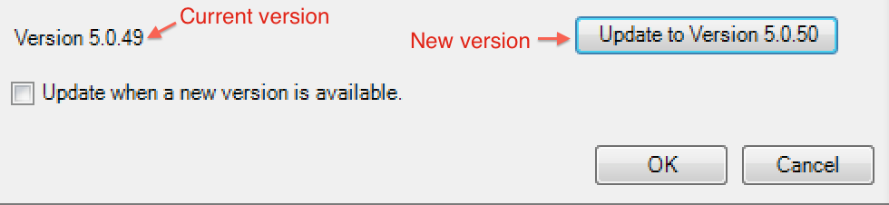
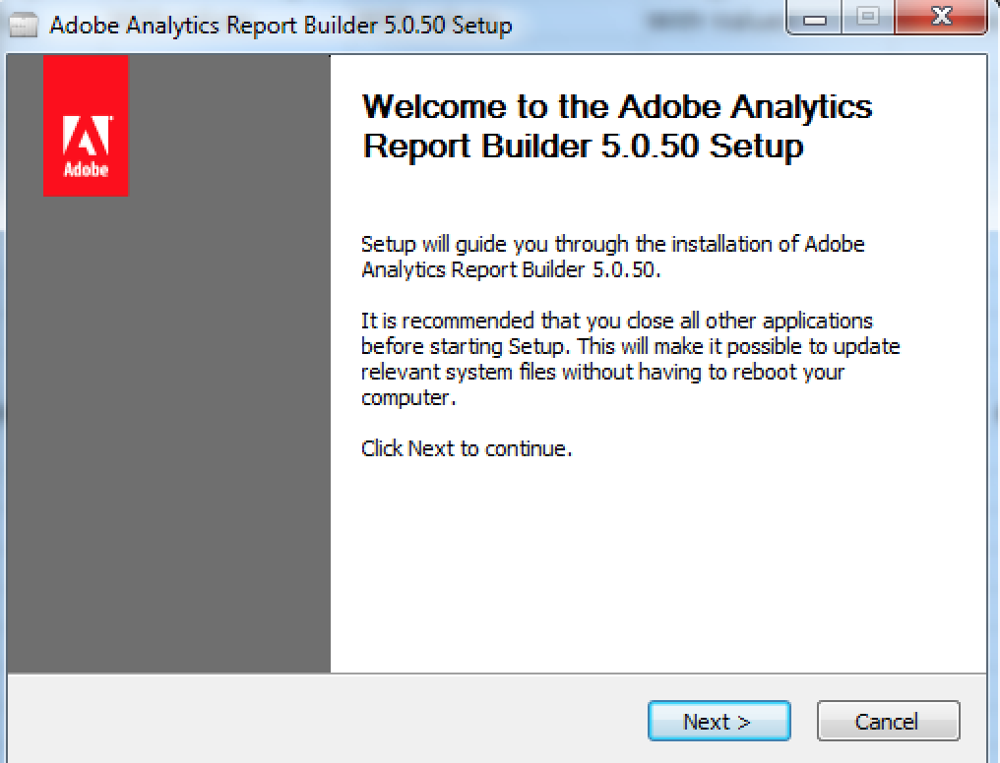

# Mise à niveau du Report Builder

Lorsque vous effectuez une mise à niveau du Report Builder, tenez compte des recommandations suivantes :

* L’ancienne version sera supprimée.

* Tous les rapports existants continueront à fonctionner.

* Tous les paramètres personnels, y compris les paramètres d’authentification, continueront à fonctionner.

Pour mettre à niveau le Report Builder

1. Connectez-vous à votre version existante du Report Builder.
1. Accédez au menu **[!UICONTROL Options]** pour effectuer la mise à niveau vers la nouvelle version. Le numéro de la version actuelle s’affiche au bas de la boîte de dialogue Options.

   

1. Si une nouvelle version est disponible, cliquez sur **[!UICONTROL Mettre à jour]**. Le bouton affiche la version vers laquelle vous effectuez la mise à jour, par exemple : *Mise à jour vers la version 5.0.50*

   >[!NOTE]
   >
   >Si ce bouton est grisé, aucune nouvelle version du Report Builder n’est disponible.

1. (Facultatif) Cochez la case **[!UICONTROL Mettre à jour lorsqu&#39;une nouvelle version est disponible]** . À l’avenir, le processus de mise à jour commencera automatiquement à chaque fois qu’une nouvelle version est disponible.
1. Quand l’écran de configuration s’ouvre, cliquez sur **[!UICONTROL Suivant >]**.

   

1. Une fois la mise à niveau terminée, reconnectez-vous au Report Builder.

## Instructions de mise à niveau manuelle {#section_27A0200010DC4747A718F1A65B180599}

Vous pouvez toujours obtenir la dernière version du Report Builder dans Adobe Analytics.

1. Connectez-vous à Adobe Analytics et sélectionnez **[!UICONTROL Outils]**.
1. Cliquez sur **[!UICONTROL Report Builder]**.
1. Dans l’écran **[!UICONTROL Aperçu]**, sélectionnez la version 32 bits ou 64 bits.
1. Cliquez sur **[!UICONTROL Téléchargez dès maintenant !]**.
