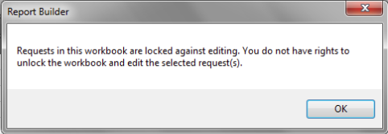

# Verrouiller et déverrouiller des classeurs

{{legacy-arb}}

Vous pouvez protéger toutes les requêtes d’un classeur contre l’ajout et la modification des demandes en verrouillant le classeur. Cette option permet la modification hors ligne des classeurs en mettant en pause toutes les requêtes de rapport pour une modification plus efficace.

En tant qu’analyste, le verrouillage d’un classeur permet de protéger vos requêtes contre les modifications apportées par d’autres utilisateurs de votre entreprise. En même temps, les autres utilisateurs peuvent tout de même actualiser les requêtes du classeur.

Pour protéger un classeur contre la modification, cliquez sur **[!UICONTROL Verrouillé]** dans la barre d’outils Report Builder ().

Pour annuler la protection d’un classeur, cliquez sur **[!UICONTROL Déverrouillé]** ( ).

Vous pouvez déverrouiller un classeur verrouillé si vous êtes doté de l’une des autorisations suivantes :

* Vous êtes administrateur, ou
* Vous êtes la personne qui a initialement verrouillé le classeur. Dans ce cas, il n’est pas requis d’être administrateur.

>[!NOTE]
>
>Vous ne pouvez pas ajouter une demande à un classeur protégé à moins d’être autorisé à déverrouiller le classeur.

Lorsqu’un classeur est verrouillé pour empêcher la modification de requête :

* Les utilisateurs ne peuvent pas créer ni ajouter de requêtes.
* Les utilisateurs ne peuvent pas modifier de requêtes par l’intermédiaire de l’Assistant Requête.
* Les utilisateurs ne peuvent pas modifier de requêtes par l’intermédiaire des fonctionnalités Modifier plusieurs requêtes.
* Les utilisateurs ne peuvent pas couper, copier ou coller des requêtes. Néanmoins, les utilisateurs peuvent tout de même utiliser le menu contextuel natif d’Excel Couper/Copier/Coller afin de couper/copier/coller le contenu des requêtes.
* Les utilisateurs peuvent actualiser les requêtes, soit individuellement, soit en tant que partie d’un groupe.
* Si la requête utilise les valeurs d’entrée provenant des cellules (période, segment, filtres), les utilisateurs peuvent modifier ces valeurs dans les cellules et, ainsi, indirectement modifier les requêtes en les actualisant.

Si vous essayez de modifier un classeur protégé par le biais du menu contextuel, du **[!UICONTROL Gestionnaire de requêtes]** ou du **[!UICONTROL Modifier plusieurs requêtes]**, vous pouvez être autorisé ou non à le faire :

* Si vous ne disposez pas des autorisations nécessaires pour déverrouiller une demande, un message s’affiche vous indiquant que vous ne disposez pas des droits nécessaires pour déverrouiller et modifier le classeur.

  

## Workflow {#section_260D05FF632B41DB97DB43E2ADBE2E75}

Présumons que le classeur A comporte une requête qui se trouve à l’état verrouillé et qui a été créée par l’utilisateur A.

**Exemple 1 : utilisateur administrateur (ou utilisateur A)**

1. L’utilisateur se connecte au Report Builder et ouvre un classeur
1. Le classeur A est actuellement verrouillé. De ce fait, le bouton « Créer une requête » est désactivé dans la barre d’outils ainsi que tous les autres boutons dont le fonctionnement est désactivé par le verrouillage.
1. Si l’utilisateur tente d’utiliser un des boutons désactivés, un message s’affiche indiquant que le classeur est actuellement verrouillé.
1. L’utilisateur peut déverrouiller le classeur, ce qui active la fonctionnalité de modification.
1. Une fois déverrouillé, le classeur reste dans cet état jusqu’à ce qu’il soit explicitement reverrouillé.

**Exemple 2 : utilisateur non administrateur (utilisateur B)**

1. L’utilisateur se connecte au Report Builder et ouvre un classeur
1. L’utilisateur ne peut pas ajouter/modifier la requête.
1. L’utilisateur ne peut pas déverrouiller le classeur.
