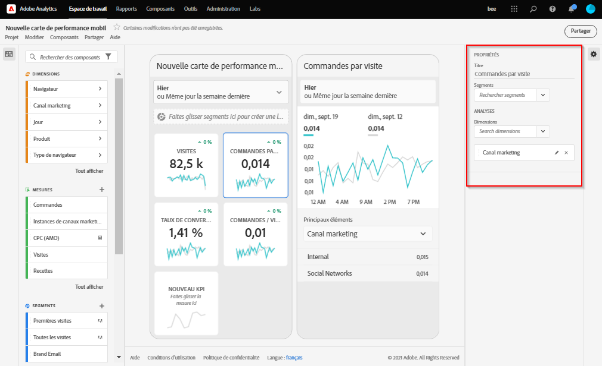

# Création d’une Fiche d’évaluation

Une fiche d’évaluation Adobe Analytics affiche les visualisations de données clés pour les utilisateurs en charge de l’exécution sous la forme d’une mosaïque, comme illustré ci-dessous :

En tant que curateur de cette Fiche d’évaluation, vous pouvez utiliser le Créateur de Fiche d’évaluation pour configurer les mosaïques qui apparaissent sur la Fiche d’évaluation de votre consommateur en charge de l’exécution. Vous pouvez également configurer la manière dont les vues détaillées, ou les ventilations, peuvent être ajustées une fois que les mosaïques sont activées. L’interface du Créateur de Fiche d’évaluation est illustrée ci-dessous :

Pour créer la Fiche d’évaluation, vous devrez effectuer les opérations suivantes :

1. Accédez au modèle de [!UICONTROL Fiche d’évaluation mobile vierge].
2. Configurer la Fiche d’évaluation avec des données, puis l’enregistrer.

## Accéder au modèle de [!UICONTROL Fiche d’évaluation mobile vierge]

Vous pouvez accéder au modèle de [!UICONTROL Fiche d’évaluation mobile vierge] de l’une des manières suivantes :

**Créer un nouveau projet**

1. Ouvrez Adobe Analytics, puis cliquez sur l’onglet **[!UICONTROL Workspace]**.
1. Cliquez sur **[!UICONTROL Créer un projet]** et sélectionnez le modèle de projet **[!UICONTROL Fiche d’évaluation mobile vierge]**.
1. Cliquez sur **[!UICONTROL Créer]**.

OU

1. Dans le menu **[!UICONTROL Outils]**, sélectionnez **[!UICONTROL Tableaux de bord Analytics (application mobile)]**.
1. Sur l’écran suivant, cliquez sur le bouton **[!UICONTROL Créer une fiche d’évaluation]**.

## Configuration de la Fiche d’évaluation avec des données et enregistrement

Pour implémenter le modèle de Fiche d’évaluation :

1. Dans **[!UICONTROL Propriétés]** (dans le rail droit), précisez la **[!UICONTROL suite de rapports du projet]** depuis laquelle vous souhaitez utiliser les données.

   

1. Pour ajouter une nouvelle mosaïque à votre fiche d’évaluation, faites glisser une mesure depuis le panneau de gauche et déposez-la dans la zone **[!UICONTROL Glisser-déposer les mesures ici]**. Vous pouvez également insérer une mesure entre deux mosaïques en utilisant un workflow similaire.

   

   *Depuis chaque mosaïque, vous pouvez accéder à une vue détaillée qui affiche des informations supplémentaires sur la mesure comme les éléments principaux pour une liste de dimensions associées.*

1. Pour ajouter une dimension associée à une mesure, faites glisser une dimension depuis le panneau de gauche, puis déposez-la dans une mosaïque. Par exemple, vous pouvez ajouter des dimensions appropriées (comme **[!DNL DMA Region]** dans cet exemple) à la mesure **[!UICONTROL Visiteurs uniques]** en la faisant glisser et en la déposant sur la mosaïque. Les dimensions que vous ajoutez apparaîtront dans la section de ventilation des **[!UICONTROL Propriétés]** spécifiques à la mosaïque. Plusieurs dimensions peuvent être ajoutées à chaque mosaïque.

   

   Lorsque vous cliquez sur une mosaïque du Créateur de la Fiche d’évaluation, le rail de droite affiche les propriétés et les caractéristiques associées à cette mosaïque. Depuis ce rail, vous pouvez renseigner un nouveau **[!UICONTROL Titre]** pour la mosaïque ou configurer la mosaïque en précisant des composants au lieu de les faire glisser et de les déposer depuis le rail de gauche.

   

   En outre, si vous cliquez sur les mosaïques, une fenêtre pop-up dynamique affichera comment l’utilisateur en charge de l’exécution voit la vue de ventilation dans l’application. Si aucune dimension n’a été appliquée à la mosaïque, la dimension de ventilation sera **heure** ou **jours**, en fonction de la période par défaut.

   

   Chaque dimension ajoutée à la mosaïque apparaît dans une liste déroulante dans la vue détaillée de l’application. L’utilisateur en charge de l’exécution peut alors choisir parmi les options répertoriées dans la liste déroulante.

1. Pour appliquer des segments à des mosaïques individuelles, faites glisser un segment du panneau de gauche et déposez-le directement en haut de la mosaïque. Si vous souhaitez appliquer le segment à toutes les mosaïques de la Fiche d’évaluation, déposez la mosaïque en haut de la Fiche d’évaluation. Vous pouvez également appliquer des segments en les sélectionnant dans le menu de filtre situé sous les périodes. Vous [configurez et appliquez des filtres pour vos Fiches d’évaluation](https://experienceleague.adobe.com/docs/analytics-learn/tutorials/analysis-workspace/using-panels/using-drop-down-filters.html?lang=fr) de la même manière que dans Adobe Analytics Workspace.

   

1. De même, si vous souhaitez supprimer un composant appliqué à la totalité de la carte de performance, cliquez n’importe où sur celle-ci en dehors des mosaïques, puis supprimez le composant en cliquant sur le **x** qui apparaît lorsque vous placez le pointeur de la souris au-dessus de lui, comme indiqué ci-dessous pour le segment **Premières visites** :

   

1. Ajoutez et supprimez des combinaisons de périodes pouvant être sélectionnées dans votre carte de performance en cliquant sur le menu déroulant des périodes.

   

   Chaque nouvelle carte de performance démarre avec 6 combinaisons de périodes centrées sur les données du jour et de la veille. Vous pouvez supprimer les périodes inutiles en cliquant sur le x. Vous pouvez également modifier chaque combinaison de périodes en cliquant sur le crayon.

   

   Pour créer ou modifier une date principale, utilisez la liste déroulante pour sélectionner une période disponible ou faites glisser un composant de date depuis le rail de droite et déposez-le dans la zone de dépôt.

   

   Pour créer une date de comparaison, vous pouvez choisir parmi des paramètres prédéfinis utiles aux comparaisons d’heures fréquentes dans le menu déroulant. Vous pouvez également glisser-déposer un composant de date à partir du rail de droite.

   

   Si la période souhaitée n’a pas encore été créée, vous pouvez en créer une en cliquant sur l’icône de calendrier.

   

1. Vous accédez ainsi au créateur de périodes, où vous pouvez créer un composant de période avant de l’enregistrer. Pour nommer la Fiche d’évaluation, cliquez sur l’espace de noms en haut à gauche de l’écran, puis saisissez le nouveau nom.

   

## Partage de la fiche d’évaluation

Pour partager la Fiche d’évaluation avec un utilisateur en charge de l’exécution :

1. Cliquez sur le menu **[!UICONTROL Partager]**, puis sélectionnez **[!UICONTROL Partager la fiche d’évaluation]**.

1. Dans le formulaire **[!UICONTROL Partager la fiche d’évaluation mobile]**, complétez les champs en :

   * indiquant le nom de la Fiche d’évaluation ;
   * indiquant une description de la Fiche d’évaluation ;
   * ajoutant des balises pertinentes ;
   * précisant les destinataires de la Fiche d’évaluation.

1. Cliquez sur **[!UICONTROL Partager]**.

Une fois que vous avez partagé une fiche d’évaluation, vos destinataires peuvent y accéder dans leurs tableaux de bord Analytics. Si vous apportez des modifications ultérieures à la Fiche d’évaluation dans le Créateur de Fiche d’évaluation, elles seront automatiquement mises à jour dans la Fiche d’évaluation partagée. Les utilisateurs en charge de l’exécution pourront accéder aux changements en actualisant la Fiche d’évaluation sur leur application.

Si vous mettez à jour la Fiche d’évaluation en ajoutant de nouveaux composants, vous voudrez peut-être partager à nouveau la Fiche d’évaluation (et cocher l’option **[!UICONTROL Partager les composants incorporés]**) afin de vous assurer que vos utilisateurs en charge de l’exécution ont accès à ces modifications.