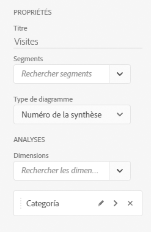
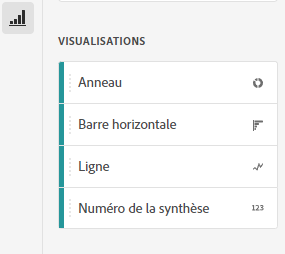
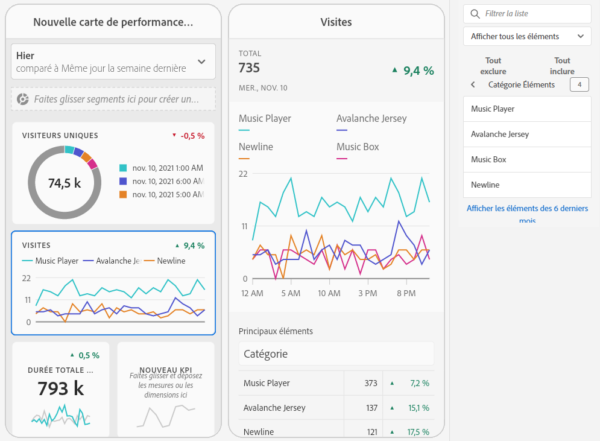
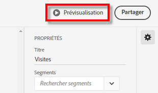
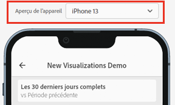

# Création dʼune carte de performance mobile

Les informations suivantes indiquent aux curateurs des données Adobe Analytics comment configurer et présenter des cartes de performance mobiles pour les utilisateurs en charge de lʼexécution. Regardez dʼabord la vidéo sur le Créateur de cartes de performance pour les tableaux de bord Adobe Analytics :

>[!VIDEO](https://video.tv.adobe.com/v/34544)

Une carte de performance Adobe Analytics affiche les visualisations de données principales pour les utilisateurs en charge de lʼexécution sous la forme dʼune disposition en mosaïques, comme indiqué ci-dessous :

En tant que curateur de cette carte de performance, vous pouvez utiliser le Créateur de cartes de performance pour configurer les mosaïques qui apparaissent sur la carte de performance de votre consommateur en charge de lʼexécution. Vous pouvez également configurer la manière dont lʼaffichage des détails ou les ventilations sʼajustent lorsque lʼutilisateur appuie sur les mosaïques. L’interface du Créateur de Fiche d’évaluation est illustrée ci-dessous :

Pour créer la Carte de performance, procédez comme suit :

1. Accédez au modèle de [!UICONTROL Fiche d’évaluation mobile vierge].
1. Configurer la carte de performance avec des données, puis enregistrez-la.

## Accéder au modèle de [!UICONTROL Fiche d’évaluation mobile vierge] {#template}

Vous pouvez accéder au modèle de [!UICONTROL Carte de performance mobile vierge] en créant un projet ou à partir du menu Outils.

### Créer un nouveau projet {#create}

1. Ouvrez Adobe Analytics, puis cliquez sur l’onglet **[!UICONTROL Espace de travail]**.
1. Cliquez sur **[!UICONTROL Créer un projet]**, puis sélectionnez le modèle de projet **[!UICONTROL Carte de performance mobile vierge]**.
1. Cliquez sur **[!UICONTROL Créer]**.

### Menu Outils

1. Dans le menu **[!UICONTROL Outils]**, sélectionnez **[!UICONTROL Tableaux de bord Analytics (application mobile)]**.
1. Sur lʼécran suivant, cliquez sur **[!UICONTROL Créer une carte de performance]**.

## Configurez la carte de performance avec des données, puis enregistrez-la. {#configure}

Pour implémenter le modèle de Fiche d’évaluation :

1. Dans **[!UICONTROL Propriétés]** (dans le rail droit), précisez la **[!UICONTROL suite de rapports du projet]** depuis laquelle vous souhaitez utiliser les données.

   

1. Pour ajouter une nouvelle mosaïque à votre fiche d’évaluation, faites glisser une mesure depuis le panneau de gauche et déposez-la dans la zone **[!UICONTROL Glisser-déposer les mesures ici]**. Vous pouvez également insérer une mesure entre deux mosaïques en utilisant un workflow similaire.

   

1. Depuis chaque mosaïque, vous pouvez accéder à une vue détaillée qui affiche des informations supplémentaires sur la mesure comme les éléments principaux pour une liste de dimensions associées.

## Ajout de dimensions ou de mesures {#dimsmetrics}

Pour ajouter une dimension associée à une mesure, faites glisser une dimension depuis le panneau de gauche, puis déposez-la dans une mosaïque.

Par exemple, vous pouvez ajouter des dimensions appropriées (comme **[!DNL Marketing Channel]** dans cet exemple) à la mesure **[!UICONTROL Visiteurs uniques]** en effectuant une opération de glisser-déposer sur la mosaïque. Les ventilations de dimensions sʼaffichent sous la section [!UICONTROL Analyses détaillées] des **[!UICONTROL propriétés]** propres à la diapositive détaillée. Plusieurs dimensions peuvent être ajoutées à chaque mosaïque.

## Appliquer les segments {#segments}

Pour appliquer des segments à des mosaïques individuelles, faites glisser un segment du panneau de gauche et déposez-le directement en haut de la mosaïque.

Si vous souhaitez appliquer le segment à toutes les mosaïques de la Fiche d’évaluation, déposez la mosaïque en haut de la Fiche d’évaluation. Vous pouvez également appliquer des segments en les sélectionnant dans le menu de filtre situé sous les périodes. Vous [configurez et appliquez des filtres pour vos Fiches d’évaluation](https://experienceleague.adobe.com/docs/analytics-learn/tutorials/analysis-workspace/using-panels/using-drop-down-filters.html?lang=fr) de la même manière que dans Adobe Analytics Workspace.

## Ajout de périodes {#dates}

Ajoutez et supprimez des combinaisons de périodes pouvant être sélectionnées dans votre carte de performance en cliquant sur le menu déroulant des périodes.

Chaque nouvelle carte de performance démarre avec 6 combinaisons de périodes centrées sur les données du jour et de la veille. Vous pouvez supprimer les périodes inutiles en cliquant sur le x. Vous pouvez également modifier chaque combinaison de périodes en cliquant sur le crayon.

Pour créer ou modifier une date principale, utilisez la liste déroulante pour sélectionner une période disponible ou faites glisser un composant de date depuis le rail de droite et déposez-le dans la zone de dépôt.

Pour créer une date de comparaison, vous pouvez choisir parmi des paramètres prédéfinis utiles aux comparaisons d’heures fréquentes dans le menu déroulant. Vous pouvez également glisser-déposer un composant de date à partir du rail de droite.

Si la période souhaitée n’a pas encore été créée, vous pouvez en créer une en cliquant sur l’icône de calendrier.

Vous accédez ainsi au créateur de périodes, où vous pouvez créer un composant de période avant de l’enregistrer.

### Afficher/Masquer les périodes de comparaison {#show-comparison-dates}

Pour afficher ou masquer des périodes de comparaison, utilisez le bouton (bascule) du paramètre **Inclure des dates de comparaison**.

Le paramètre est *activé* par défaut. Désélectionnez l’option si vous ne souhaitez pas afficher les dates de comparaison.

## Appliquer les visualisations {#viz}

Regardez cette vidéo sur les visualisations pour les cartes de performance mobiles :

>[!VIDEO](https://video.tv.adobe.com/v/337570/?quality=12&learn=on)

Les tableaux de bord Analytics offrent quatre visualisations qui vous permettent de mieux comprendre les éléments de dimension et les mesures. Appliquez une visualisation différente en modifiant le [!UICONTROL type de graphique] des [!UICONTROL propriétés] d’une mosaïque. Sélectionnez simplement la mosaïque de droite, puis modifiez le type de graphique.

Ou cliquez sur l’icône [!UICONTROL Visualisations] dans le rail de gauche, puis glissez-déposez la visualisation de droite sur la mosaïque :

### [!UICONTROL Numéro du résumé]

Utilisez la visualisation Synthèse des chiffres pour mettre en évidence un grand nombre d’éléments importants dans un projet.

### [!UICONTROL Anneau]

Semblable à un graphique en secteurs, cette visualisation présente les données comme des portions ou des segments d’un tout. Utilisez un graphique en anneau pour comparer les pourcentages dʼun total. Supposons, par exemple, que vous souhaitiez identifier la plateforme publicitaire responsable du nombre total de visiteurs uniques :

### [!UICONTROL Ligne]

Dans la visualisation en ligne, les mesures sont représentées sous la forme d’une ligne afin d’indiquer l’évolution des valeurs dans le temps. Un graphique en lignes affiche les dimensions au fil du temps, mais fonctionne avec n’importe quelle visualisation. Dans cet exemple, vous visualisez la dimension de catégorie de produits.

### [!UICONTROL Barre horizontale]

Dans cette visualisation, des barres horizontales représentent plusieurs valeurs pour une ou plusieurs mesures. Par exemple, pour voir facilement quels sont vos principaux produits, utilisez [!UICONTROL Barre horizontale] comme visualisation préférée.

### Suppression des éléments de dimension [!UICONTROL Non spécifiés]

Pour supprimer les éléments de dimension [!UICONTROL Non spécifiés] dans vos données, procédez comme suit :

1. Sélectionnez la mosaïque appropriée.
1. Dans le rail de droite, sous **[!UICONTROL Analyses]**, sélectionnez la flèche vers la droite en regard de l’élément de dimension pour lequel vous voulez supprimer les éléments **[!UICONTROL Non spécifiés]**.

   

1. Cliquez sur l’icône en regard de **[!UICONTROL Non spécifié]** pour supprimer les données non spécifiées de vos comptes rendus de performances. (Vous pouvez également supprimer tout autre élément de dimension.)

## Afficher et configurer des propriétés dʼune vignette {#tiles}

Lorsque vous cliquez sur une vignette dans le créateur de cartes de performance, le rail de droite affiche les propriétés et les caractéristiques associées à cette vignette et à sa diapositive détaillée. Dans ce rail, vous pouvez fournir un nouveau **titre** pour la vignette ainsi que la configurer en appliquant des segments.

## Afficher les diapositives détaillées {#view-detail-slides}

Si vous cliquez sur les vignettes, une fenêtre contextuelle dynamique monte comment l’utilisateur en charge de l’exécution voit la diapositive détaillée dans l’application. Vous pouvez ajouter des dimensions pour ventiler vos données selon vos besoins. Si aucune dimension n’a été appliquée, la dimension de ventilation sera **heure** ou **jours**, en fonction de la période par défaut.

Les ventilations affinent votre analyse en ventilant les mesures par éléments de dimension, tels que :

* Mesure Visiteurs uniques ventilée par Plateforme publicitaire (AMO ID)
* Mesure Visites ventilée par Catégorie de produit (vente au détail)
* Mesure Chiffre dʼaffaires total ventilée par Nom de produit

Chaque dimension ajoutée à la diapositive détaillée s’affichera dans une liste déroulante dans l’affichage de la diapositive détaillée de l’application. L’utilisateur en charge de l’exécution peut alors choisir parmi les options répertoriées dans la liste déroulante.

## Personnaliser des diapositives détaillées {#customize-detail-slide}

Les diapositives détaillées personnalisées vous permettent d’être encore plus ciblé sur les informations que vous partagez avec votre audience.

>[!VIDEO](https://video.tv.adobe.com/v/3410002)

Vous pouvez modifier la disposition de chaque diapositive détaillée et ajouter du texte afin de mieux expliquer ce que l’utilisateur final peut voir dans les données. Vous pouvez également modifier le type de graphique à l’aide du menu déroulant.

### Modifier la disposition de la diapositive

Modifiez la disposition de la diapositive pour vous concentrer sur les informations les plus importantes. Par exemple, vous pouvez modifier la disposition pour n’afficher qu’un graphique ou un tableau. Pour modifier la disposition de la diapositive, sélectionnez l’un des formats prédéfinis.

Vous pouvez également modifier la disposition des diapositives en glissant-déposant les composants de visualisation du rail de gauche sur la zone de travail. Chaque diapositive détaillée ne peut contenir que deux visualisations à la fois.

### Ajouter un texte descriptif à une diapositive

Vous pouvez ajouter du texte pour fournir des informations significatives sur le contenu des graphiques ou des nuances sur les données.

Pour ajouter du texte à une diapositive détaillée, sélectionnez une disposition qui affiche le symbole `T` ou glissez-déposez le composant Visualisation de texte depuis le rail de gauche. L’éditeur de texte s’ouvre automatiquement lors de l’ajout d’une nouvelle visualisation de texte ou du choix d’une disposition de diapositives avec texte. L’éditeur de texte fournit toutes les options standard pour le formatage de votre texte. Vous pouvez appliquer des styles de texte tels que des paragraphes, des en-têtes et des sous-titres, ainsi qu’appliquer des polices en gras et en italique. Vous pouvez justifier du texte, ajouter des listes à puces ou numérotées et ajouter des liens. Une fois la modification terminée, cliquez sur le bouton Réduire dans le coin supérieur droit de l’éditeur de texte pour le fermer. Pour modifier le texte que vous avez déjà ajouté, cliquez sur l’icône en forme de crayon pour ouvrir à nouveau l’éditeur de texte.

## Supprimer des composants {#remove}

De même, si vous souhaitez supprimer un composant appliqué à la totalité de la carte de performance, cliquez n’importe où sur celle-ci en dehors des mosaïques, puis supprimez le composant en cliquant sur le **x** qui apparaît lorsque vous placez le pointeur de la souris au-dessus de lui, comme indiqué ci-dessous pour le segment **Premières visites** :

## Création d’articles de données {#create-data-story}

Un article de données est un ensemble de points de données pris en charge, de contexte d’entreprise et de mesures connexes reposant sur un thème ou une mesure central.

Si, par exemple, vous vous concentrez sur le trafic web, la mesure la plus importante peut être les visites, mais vous pouvez également vous intéresser aux nouveaux visiteurs, aux visiteurs uniques. Vous pouvez également consulter les données ventilées par page web ou par type de périphérique d’où provient le trafic. Les articles de données dans les projets de Fiche d’évaluation mobile vous permettent de mettre vos mesures les plus importantes au premier plan et au centre tout en racontant l’histoire derrière les mesures avec plusieurs diapositives détaillées.

Regardez la vidéo pour en savoir plus sur la création d’articles de données dans des projets de Fiche d’évaluation mobile dans Analysis Workspace.

>[!VIDEO](https://video.tv.adobe.com/v/3416392/?quality=12&learn=on)

**Pour créer un article de données**

Créez votre article de données en ajoutant plusieurs diapositives détaillées à une mosaïque.

1. Commencez par un projet de Fiche d’évaluation mobile.
1. Sélectionnez une mosaïque à partir de laquelle vous souhaitez créer un article.

   

   {width=".50%"}

1. Ajoutez des diapositives pour créer votre article de données. Votre première diapositive est générée par défaut.

   Pour ajouter de nouvelles diapositives, survolez ou cliquez sur une diapositive, puis sélectionnez l’une des options disponibles :

   * Appuyez sur le bouton [!UICONTROL +] signe pour créer une nouvelle diapositive.

   * Appuyez sur l’icône de duplication pour dupliquer la diapositive existante.

1. Si vous créez une diapositive vierge, faites glisser et déposez des composants depuis le rail de gauche, ou choisissez une mise en page pour remplir automatiquement la diapositive avec les données de la mosaïque.

   

Pour supprimer une diapositive, appuyez sur l’icône de corbeille.

### Personnalisation d’un article de données {#customize-data-story}

Les articles de données vous permettent de personnaliser tout ce dont vous avez besoin afin de partager des informations que vous souhaitez partager et d’exclure tout ce dont vous n’avez pas besoin. Vous pouvez personnaliser les mosaïques et les diapositives individuelles pour ajouter des filtres, afficher des ventilations, modifier la mise en page et modifier les visualisations.

**Personnalisation des mosaïques**

1. Appuyez sur une mosaïque. La mosaïque sélectionnée est entourée en bleu et le panneau de droite affiche les propriétés de la mosaïque.
1. Modifiez le titre, le type de graphique et d’autres options de mosaïque.
1. Faites glisser un composant sur la mosaïque.

   

   Lorsque vous faites glisser et déposez un composant, tel qu’une visualisation, sur une mosaïque, le composant est appliqué à toutes les diapositives de l’article de données.

1. Pour appliquer une modification uniquement au titre, maintenez la touche Maj enfoncée pour appliquer la modification.

   

>[!NOTE]
>Les diapositives héritent des composants de la mosaïque, mais les mosaïques n’héritent pas des composants des diapositives.

**Personnalisation de diapositives individuelles**

Vous pouvez modifier la visualisation de diapositives individuelles dans un article de données. Vous pouvez, par exemple, changer une barre horizontale en graphique en anneau pour une diapositive spécifique. Vous pouvez également modifier la mise en page. Voir [Personnalisation des diapositives détaillées](#customize-detail-slide).

### Aperçu d’un article de données {#preview-data-story}

Après avoir créé un article de données, utilisez la variable **Aperçu** pour afficher et interagir avec un article de données comme si vous étiez un utilisateur de l’application. Pour plus d’informations sur la prévisualisation de votre article de données, voir [Aperçu d’une fiche d’évaluation](#preview)

### Navigation entre les mosaïques et les diapositives {#navigate-tiles-slides}

La barre de navigation affiche des icônes représentant ce qui se trouve sur chaque diapositive. La barre de navigation permet d’accéder facilement à une diapositive spécifique si vous disposez de nombreuses diapositives.

Pour vous déplacer entre la mosaïque et les diapositives, appuyez sur la barre de navigation.

{width="25%"}

Vous pouvez également naviguer entre les deux en utilisant les flèches de votre clavier ou en sélectionnant un composant et en le maintenant à gauche ou à droite de votre écran pour le faire défiler.

## Prévisualiser la carte de performance {#preview}

Vous pouvez prévisualiser l’aspect et le fonctionnement de la carte de performance une fois qu’elle sera publiée dans l’application de tableaux de bord Analytics.

1. Cliquez sur **[!UICONTROL Prévisualisation]** dans le coin supérieur droit de l’écran.

   

1. Pour afficher la carte de performance telle qu’elle apparaîtra sur différents appareils, sélectionnez un appareil dans le menu déroulant [!UICONTROL Prévisualisation de l’appareil].

   

1. Pour interagir avec la prévisualisation, vous pouvez :

   * Cliquer avec le bouton gauche pour simuler l’appui sur l’écran du téléphone.

   * Utiliser la fonction de défilement de votre ordinateur pour simuler le défilement de l’écran du téléphone avec votre doigt.

   * Cliquer et maintenir la touche appuyée pour simuler la pression et le maintien de votre doigt sur l’écran du téléphone. Cela s’avère utile pour interagir avec les visualisations dans la vue détaillée.

## Nommer une carte de performance {#name}

Pour nommer la Fiche d’évaluation, cliquez sur l’espace de noms en haut à gauche de l’écran, puis saisissez le nouveau nom.

## Partage dʼune carte de performance {#share}

Pour partager la Fiche d’évaluation avec un utilisateur en charge de l’exécution :

1. Cliquez sur le menu **[!UICONTROL Partager]**, puis sélectionnez **[!UICONTROL Partager la fiche d’évaluation]**.

1. Dans le formulaire **[!UICONTROL Partager la fiche d’évaluation mobile]**, complétez les champs en :

   * indiquant le nom de la carte de performance
   * fournissant une description de la carte de performance
   * ajoutant des balises pertinentes
   * précisant les destinataires de la carte de performance

1. Cliquez sur **[!UICONTROL Partager]**.

Après avoir partagé une carte de performance, vos destinataires peuvent y accéder depuis leurs tableaux de bord Analytics. Si, par la suite, vous apportez des modifications à la carte de performance dans le Créateur de cartes de performance, celles-ci seront mises à jour automatiquement dans la carte de performance que vous avez partagée. Les utilisateurs en charge de l’exécution pourront accéder aux changements en actualisant la Fiche d’évaluation sur leur application.

Si vous mettez à jour la carte de performance en ajoutant de nouveaux composants, vous voudrez peut-être à nouveau la partager (et cocher lʼoption **[!UICONTROL Partager les composants incorporés]**) afin de vous assurer que vos utilisateurs en charge de lʼexécution ont accès à ces modifications.
