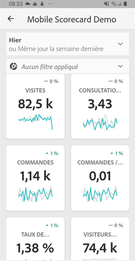
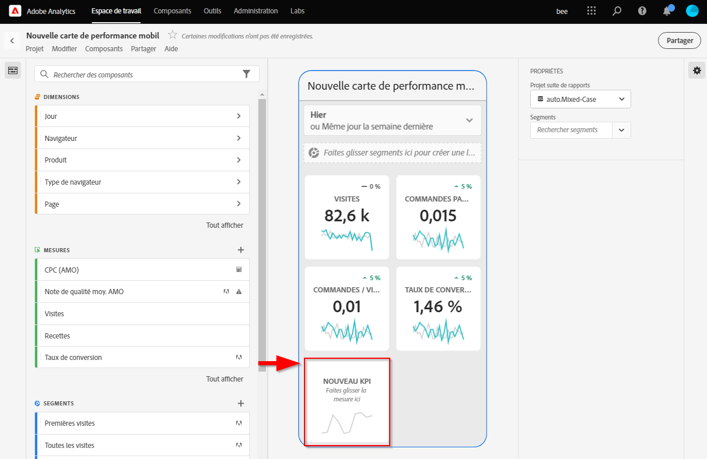
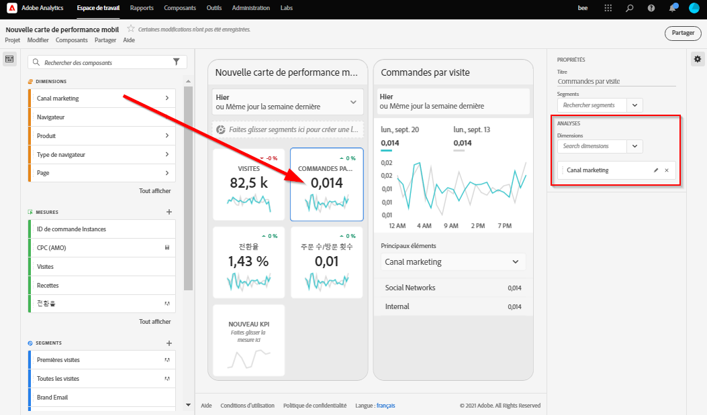
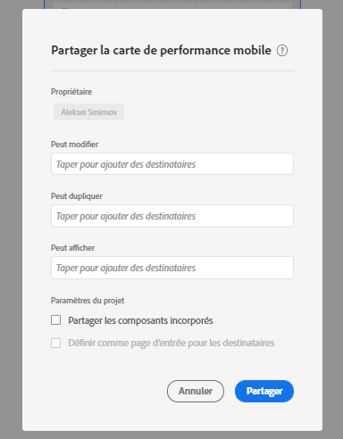
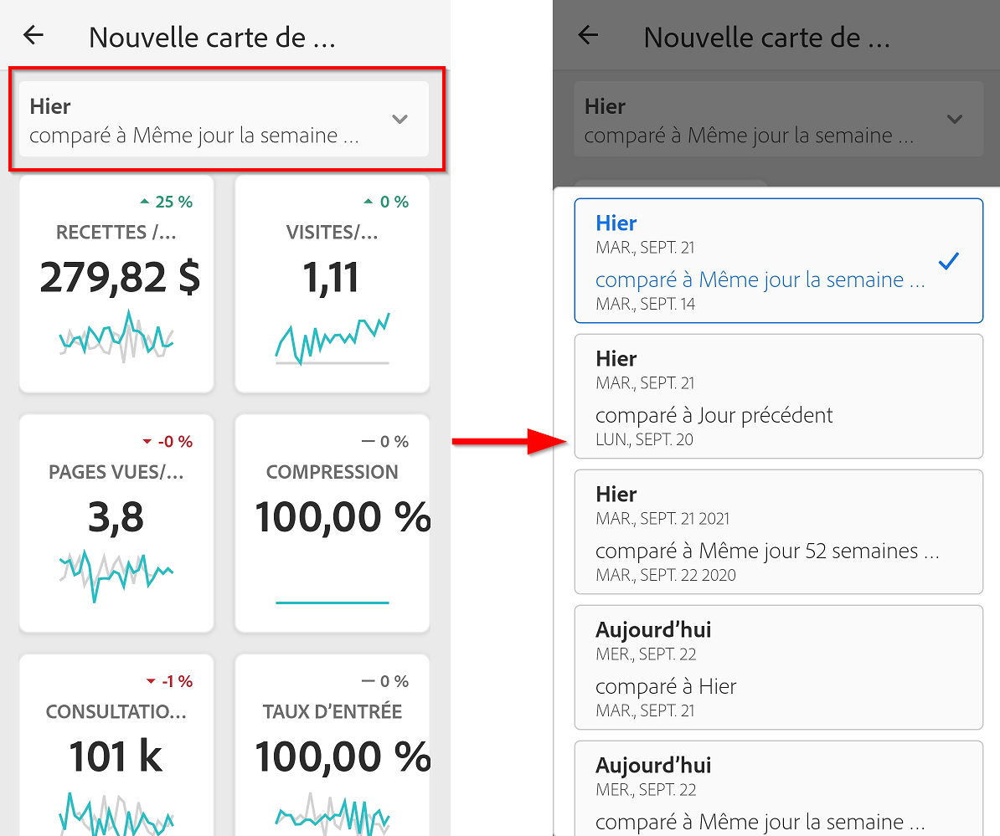

# Guide du conservateur pour les tableaux de bord Adobe Analytics

Les informations suivantes indiquent aux responsables de la gestion des données Adobe Analytics comment configurer et présenter des tableaux de bord pour les administrateurs.

## Introduction

Les tableaux de bord Adobe Analytics fournissent des informations à tout moment et où que vous soyez à partir d’Adobe Analytics. L’application permet aux utilisateurs mobiles d’accéder à des Fiches d’évaluation intuitives, que vous créez et partagez à partir de l’interface utilisateur de bureau d’Adobe Analytics. Les Fiches d’évaluation sont un ensemble de mesures clés et d’autres composants présentés sous la forme d’une mosaïque sur laquelle vous pouvez appuyer pour obtenir des ventilations plus détaillées ainsi que des rapports de tendances. Vous pouvez personnaliser les Fiches d’évaluation en fonction des données qui comptent le plus pour vous. Les tableaux de bord Analytics sont pris en charge sur les systèmes d’exploitation iOS et Android.

## En savoir plus sur ce guide

L’objectif de ce guide est d’aider les curateurs de données Adobe Analytics à configurer des Fiches d’évaluation pour les utilisateurs en charge de l’exécution sur les tableaux de bord Analytics. Les curateurs peuvent être des administrateurs de l’entreprise ou des personnes occupant d’autres rôles chargés de configurer des Fiches d’évaluation dans l’application qui permettent aux utilisateurs en charge de l’exécution de visualiser rapidement et facilement un large rendu de données récapitulatives importantes sur leurs propres appareils mobiles. Bien que les utilisateurs en charge de l’exécution soient les utilisateurs finaux des tableaux de bord Analytics, ce guide aidera les curateurs de données à configurer efficacement l’application pour ces utilisateurs.

## Glossaire terminologique

Le tableau suivant décrit les termes nécessaires à la compréhension de l’audience, des fonctionnalités et du fonctionnement des tableaux de bord Analytics.

| Terme | Définition |
|--- |--- |
| Consommateur | Personne en charge de l’exécution affichant les mesures clés et les insights d’Analytics sur un appareil mobile |
| Curateur | Personne possédant des compétences en littératie des données qui découvre et distribue des insights d’Analytics et configure les Fiches d’évaluation que verra le consommateur |
| Traitement | L’acte de création ou de modification d’une Fiche d’évaluation mobile contenant des mesures, des dimensions ainsi que d’autres composants pertinents pour le consommateur |
| Fiche d’évaluation | Un affichage dans les tableaux de bord contenant une ou plusieurs mosaïques |
| Mosaïque | Un rendu d’une mesure dans un affichage de la Fiche d’évaluation |
| Ventilation | Un affichage secondaire accessible en appuyant sur une mosaïque de la Fiche d’évaluation. Cet affichage étend la mesure affichée sur la mosaïque et peut de manière facultative gérer des dimensions de ventilation supplémentaires |
| Période | La période principale pour la création de rapports dans les tableaux de bord |
| Période de comparaison | La période comparée à la période principale |

 
## Créer une Fiche d’évaluation à destination des utilisateurs en charge de l’exécution dans l’application

Une Fiche d’évaluation affiche les visualisations de données principales pour les utilisateurs en charge de l’exécution dans l’application sous la forme d’une mosaïque comme indiqué ci-dessous :

En tant que curateur de cette Fiche d’évaluation, vous pouvez utiliser le Créateur de Fiches d’évaluations pour configurer les mosaïques qui apparaissent sur la Fiche d’évaluation de votre consommateur. Vous pouvez également configurer la manière dont l’affichage des détails ou les ventilations s’ajustent lorsque l’utilisateur appuie sur les mosaïques. L’interface du Créateur de Fiche d’évaluation est illustrée ci-dessous :

Pour créer la Fiche d’évaluation, vous devrez effectuer les opérations suivantes :

1. Accéder au modèle de Fiche d’évaluation mobile vierge.
2. Configurer la Fiche d’évaluation avec des données, puis l’enregistrer.

### Accéder au modèle de Fiche d’évaluation vierge

Vous pouvez accéder au modèle de Fiche d’évaluation mobile vierge de l’une des manières suivantes :

**Créer un nouveau projet**

1. Ouvrez Adobe Analytics, puis cliquez sur l’onglet **Workspace**.
2. Cliquez sur le bouton **Créer un nouveau projet**, puis sélectionnez le modèle de projet **Fiche d’évaluation mobile vierge**.
3. Cliquez sur le bouton **Créer**.

*Remarque : si le modèle de Fiche d’évaluation vierge n’apparaît pas comme indiqué ci-dessous, cela signifie que votre entreprise n’a pas encore accès à la bêta. Veuillez contacter votre responsable du service à la clientèle.*

**Ajouter un projet**

Depuis l’écran **Projets**, dans l’onglet **Composants**, cliquez sur le bouton **Ajouter**, puis sélectionnez **Fiche d’évaluation mobile.**

**Utilisation des outils Analytics**

Dans Analytics, cliquez sur le menu **Outils**, puis sélectionnez **Tableaux de bord**. Sur l’écran suivant, cliquez sur le bouton **Créer une Fiche d’évaluation**.

### Configurer la Fiche d’évaluation avec des données, puis l’enregistrer.

Pour implémenter le modèle de Fiche d’évaluation :

1. Dans **Propriétés** (dans le rail droit), précisez la **suite de rapports du projet** depuis laquelle vous souhaitez utiliser les données.

   

2. Pour ajouter une nouvelle mosaïque à votre Fiche d’évaluation, faites glisser une mesure depuis le panneau de gauche et déposez-la dans la zone **Faire glisser et déposer les mesures ici**. Vous pouvez également insérer une mesure entre deux mosaïques en utilisant un workflow similaire.

   

   *Depuis chaque mosaïque, vous pouvez accéder à une vue détaillée qui affiche des informations supplémentaires sur la mesure comme les éléments principaux pour une liste de dimensions associées.*

3. Pour ajouter une dimension associée à une mesure, faites glisser une dimension depuis le panneau de gauche, puis déposez-la dans une mosaïque. Par exemple, vous pouvez ajouter des dimensions appropriées (comme **DMA region** dans cet exemple) à la mesure **Unique Visitors** en la faisant glisser et en la déposant sur la mosaïque. Les dimensions que vous ajoutez apparaîtront dans la section de ventilation des **Propriétés** spécifiques à la mosaïque. Plusieurs dimensions peuvent être ajoutées à chaque mosaïque.

   

   *Remarque : vous pouvez également ajouter une dimension à toutes les mosaïques en la déposant sur la zone de travail de la Fiche d’évaluation.*

   Lorsque vous cliquez sur une mosaïque du Créateur de la Fiche d’évaluation, le rail de droite affiche les propriétés et les caractéristiques associées à cette mosaïque. Depuis ce rail, vous pouvez renseigner un nouveau **Titre** pour la mosaïque ou configurer la mosaïque en précisant des composants au lieu de les faire glisser et de les déposer depuis le rail de gauche.

   En outre, si vous cliquez sur les mosaïques, une fenêtre pop-up dynamique affichera comment l’utilisateur en charge de l’exécution voit la vue de ventilation dans l’application. Si aucune dimension n’a été appliquée à la mosaïque, la dimension de ventilation sera **heure** ou **jours**, en fonction de la période par défaut.

   

   *Notez comment chaque dimension ajoutée à la mosaïque apparaît dans une liste déroulante dans la vue détaillée de l’application. L’utilisateur en charge de l’exécution peut alors choisir parmi les options répertoriées dans la liste déroulante.*

4. Pour appliquer des segments à des mosaïques individuelles, faites glisser un segment du panneau de gauche et déposez-le directement en haut de la mosaïque. Si vous souhaitez appliquer le segment à toutes les mosaïques de la Fiche d’évaluation, déposez la mosaïque en haut de la Fiche d’évaluation.

5. De même, si vous souhaitez supprimer un composant appliqué à la totalité de la Fiche d’évaluation, cliquez n’importe où sur la Fiche d’évaluation en dehors des mosaïques, puis supprimez-le en cliquant sur le **x** qui apparaît lorsque vous placez le pointeur de la souris sur le composant, comme indiqué ci-dessous pour le segment **Clients mobiles** :

   

6. Dans les **Propriétés** de la Fiche d’évaluation, vous pouvez également préciser en option les éléments suivants :

   * Une **période par défaut**. Les périodes que vous précisez ici seront identiques à celles appliquées lorsque l’utilisateur en charge de l’exécution accède pour la première fois à la Fiche d’évaluation dans l’application.

   * Une **période de comparaison**

   * Tout **segment** à appliquer à la totalité de la Fiche d’évaluation

7. Pour nommer la Fiche d’évaluation, cliquez sur l’espace de noms en haut à gauche de l’écran, puis saisissez le nouveau nom.

   

## Partager la Fiche d’évaluation

Pour partager la Fiche d’évaluation avec un utilisateur en charge de l’exécution :

1. Cliquez sur le menu **Partager**, puis sélectionnez **Partager la Fiche d’évaluation**.

2. Dans le formulaire **Partager**, complétez les champs en :

   * indiquant le nom de la Fiche d’évaluation ;
   * indiquant une description de la Fiche d’évaluation ;
   * ajoutant des balises pertinentes ;
   * précisant les destinataires de la Fiche d’évaluation.
   * Sélectionnez l’option **Partager les composants incorporés avec les destinataires** pour vous assurer que l’utilisateur en charge de l’exécution a accès à tous les composants de la Fiche d’évaluation.

3. Cliquez sur **Partager**.

Après avoir partagé une Fiche d’évaluation, vos destinataires peuvent y accéder depuis leurs tableaux de bord Analytics. Si, par la suite, vous apportez des modifications à la Fiche d’évaluation dans le Créateur de Fiche d’évaluation, celles-ci seront mises à jour automatiquement dans la Fiche d’évaluation que vous avez partagée. Les utilisateurs en charge de l’exécution pourront accéder aux changements en actualisant la Fiche d’évaluation sur leur application.

*Remarque : si vous mettez à jour la Fiche d’évaluation en ajoutant de nouveaux composants, vous pouvez vouloir partager à nouveau la Fiche d’évaluation (et cocher l’option **Partager automatiquement les composants incorporés avec les destinataires**) afin de vous assurer que vos utilisateurs en charge de l’exécution ont accès à ces modifications.*

## Configurer des utilisateurs en charge de l’exécution dans l’application

Dans certains cas, les utilisateurs en charge de l’exécution peuvent avoir besoin d’aide pour accéder à l’application et l’utiliser. Cette section fournit des informations pour vous aider à apporter cette aide.

### Aider les utilisateurs en charge de l’exécution à obtenir les accès à l’application

Pour aider les utilisateurs en charge de l’exécution à accéder à vos Fiches d’évaluation sur l’application, assurez-vous des points suivants :

* Les spécifications minimales en matière de systèmes d’exploitation mobile sur leurs appareils sont la version 10 ou ultérieure d’iOS ou la version 4.4 (KitKat) ou ultérieure d’Android.
* Ils possèdent des identifiants de connexion valides à Adobe Analytics.
* Vous avez créé et partagé correctement des Fiches d’évaluation avec eux.
* Ils ont accès à Analysis Workspace et à la suite de rapports sur laquelle la Fiche d’évaluation est basée.
* Ils ont accès aux composants que la Fiche d’évaluation inclut. Remarque : lorsque vous partagez vos Fiches d’évaluation, vous pouvez sélectionnez l’option **Partager automatiquement les composants incorporés avec les destinataires**.

### Aider les utilisateurs en charge de l’exécution à utiliser l’application

Pendant la phase de bêta et avant que l’application ne soit dévoilée au public, vous pouvez contrôler qui a accès à l’application.

1. Aidez les utilisateurs en charge de l’exécution à télécharger et à installer l’application. Pour ce faire, indiquez-leur les étapes suivantes pour étendre l’accès à vos utilisateurs en charge de l’exécution selon qu’ils utilisent un appareil iOS ou Android.

   **Pour les utilisateurs en charge de l’exécution sur iOS :**

   1. Cliquez sur le lien public suivant (celui-ci est également disponible dans Analytics dans **Outils** > **Tableaux de bord**) :

      [Lien iOS](https://testflight.apple.com/join/WtXMQxlI) : `https://testflight.apple.com/join/WtXMQxlI`

      Lorsque vous cliquez sur le lien, l’écran Testflight suivant s’affiche :

      

   2. Appuyez sur le lien **Afficher dans l’App Store** à l’écran pour télécharger l’application Testflight.

   3. Une fois que vous avez installé l’application Testflight, cherchez et installez les tableaux de bord Adobe Analytics depuis Testfilght comme illustré ci-dessous :

      
   **Pour les utilisateurs en charge de l’exécution sur Android :**

   1. Appuyez sur le lien Play Store suivant sur l’appareil de l’utilisateur (celui-ci se trouve également dans Analytics dans **Outils** > **Tableaux de bord**) :
      [Android](https://play.google.com/apps/testing/com.adobe.analyticsmobileapp) : `https://play.google.com/apps/testing/com.adobe.analyticsmobileapp`

      Après avoir appuyé sur le lien, appuyez sur le lien Devenir testeur sur l’écran suivant :

      

   2. Appuyez sur le lien de **téléchargement sur Google Play** sur l’écran suivant :

      

   3. Téléchargez et installez l’application.
Une fois l’application téléchargée et installée, les utilisateurs en charge de l’exécution peuvent se connecter à l’application en utilisant leurs informations d’identification Adobe Analytics existantes. Nous prenons en charge aussi bien les Adobe ID que les Enterprise/Federated ID.
   

2. Aidez-les à accéder à votre Fiche d’évaluation. Lorsque les utilisateurs en charge de l’exécution sont connectés à l’application, l’écran **Choisir une entreprise** apparaît. Cet écran répertorie les entreprises connectées auxquelles l’utilisateur en charge de l’exécution appartient. Pour les aider à accéder à la Fiche d’évaluation :

   * Appuyez sur le nom de l’entreprise connectée ou de l’organisation Experience Cloud auquel la Fiche d’évaluation que vous avez créée s’applique. La liste des Fiches d’évaluation affiche alors toutes les Fiches d’évaluation partagées avec la personne en charge de l’exécution pour cette entreprise connectée.
   * Aidez-les à trier cette liste selon la **Modification la plus récente**, le cas échéant.
   * Appuyez sur le nom de la Fiche d’évaluation pour l’afficher.
   

   Remarque : si l’utilisateur en charge de l’exécution se connecte et qu’un message s’affiche indiquant que rien n’a été partagé :

   * L’utilisateur en charge de l’exécution peut avoir sélectionné la mauvaise instance Analytics.
   * La Fiche d’évaluation peut ne pas avoir été partagée avec l’utilisateur en charge de l’exécution.

      
   Vérifiez que l’utilisateur en charge de l’exécution peut se connecter à la bonne instance Analytics et que la Fiche d’évaluation a bien été partagée.

3. Expliquez à l’utilisateur en charge de l’exécution comment les mosaïques apparaissent dans les Fiches d’évaluation que vous partagez.

   

   Informations supplémentaires sur les mosaïques :

   * La granularité des graphiques sparkline dépend de la longueur de la période :
      * Une tendance horaire s’affiche pour les plages d’une journée.
      * Une tendance quotidienne s’affiche pour les plages comprises entre une journée et un an.
      * Une tendance hebdomadaire s’affiche pour les plages supérieures à un an.
   * La formule de modification de la valeur de pourcentage est calculée de la manière suivante : total de la mesure (période en cours) - total de la mesure (période de comparaison)/total de la mesure (période de comparaison).
   * Vous pouvez tirer l’écran vers le bas pour actualiser la Fiche d’évaluation.

4. Appuyez sur une mosaïque pour afficher comment fonctionne une ventilation détaillée sur la mosaïque.

   

5. Pour modifier les périodes de votre fiche d’évaluation :

   

   *Remarque : vous pouvez également modifier les périodes dans la vue Ventilation affichée ci-dessus de la même manière.*

   Selon l’intervalle sur lequel vous appuyez (**Jour**, **Semaine**, **Mois** ou **Année**), deux options de période s’affichent : soit la période actuelle, soit celle qui la précède immédiatement. Appuyez sur l’une de ces deux options pour sélectionner la première période. Dans la liste **COMPARER À**, appuyez sur l’une des options qui s’affiche pour comparer les données de cette période avec la première période que vous avez sélectionnée. Appuyez sur **Terminé** en haut à droite de l’écran. Le champ **Périodes** et les mosaïques de la Fiche d’évaluation sont mis à jour avec les nouvelles données de comparaison des périodes que vous venez de sélectionner.

6. Pour faire part de vos commentaires sur cette application :

   1. Appuyez sur l’icône utilisateur en haut à droite de l’écran de l’application.
   2. Sur l’écran **Mon compte**, appuyez sur l’option **Commentaires**.
   3. Appuyez pour afficher les options permettant de laisser un commentaire.
   
   

**Pour signaler un bogue** :

Appuyez sur l’option, puis choisissez une sous-catégorie de bogue. Dans le formulaire de signalement d’un bogue, indiquez votre adresse électronique dans le champ supérieur et votre description du bogue dans le champ qui suit. Une capture d’écran des informations de votre compte est jointe automatiquement au message, mais vous pouvez la supprimer en appuyant sur le **X** dans l’image de la pièce jointe. Vous disposez également d’options pour effectuer un enregistrement de l’écran, ajouter davantage de captures d’écran ou joindre des fichiers. Pour envoyer le rapport, appuyez sur l’icône en forme d’avion en papier en haut à droite du formulaire.

**Pour suggérer une amélioration** :

Appuyez sur l’option et choisissez une sous-catégorie de suggestion. Dans le formulaire de suggestion, indiquez votre adresse électronique dans le champ supérieur et votre description de la suggestion dans le champ qui suit. Une capture d’écran des informations de votre compte est jointe automatiquement au message, mais vous pouvez la supprimer en appuyant sur le **X** dans l’image de la pièce jointe. Vous disposez également d’options pour effectuer un enregistrement de l’écran, ajouter davantage de captures d’écran ou joindre des fichiers. Pour envoyer la suggestion, appuyez sur l’icône en forme d’avion en papier en haut à droite du formulaire.

**Pour poser une question** :

Appuyez sur l’option et indiquez votre adresse électronique dans le champ supérieur et votre question dans le champ qui suit. Une capture d’écran est jointe automatiquement au message, mais vous pouvez la supprimer en appuyant sur le **X** dans l’image de la pièce jointe. Vous disposez également d’options pour effectuer un enregistrement de l’écran, ajouter davantage de captures d’écran ou joindre des fichiers. Pour envoyer la question, appuyez sur l’icône en forme d’avion en papier en haut à droite du formulaire.
