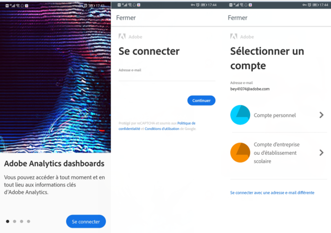
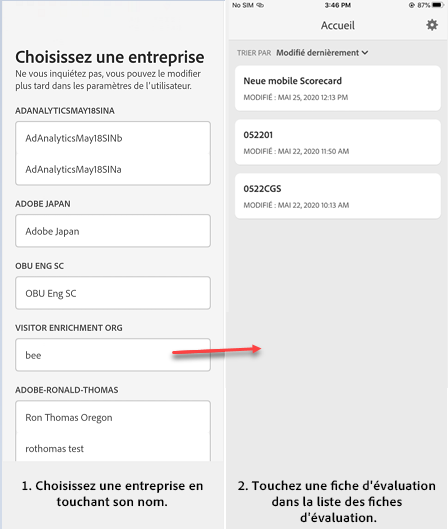
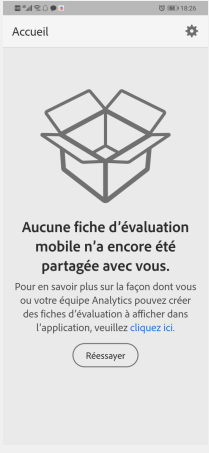
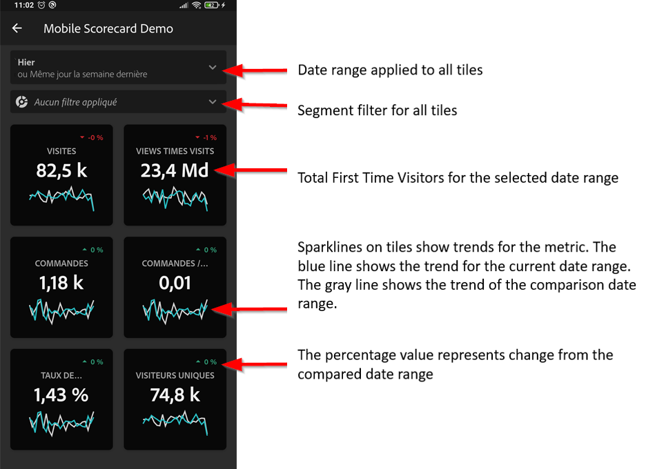
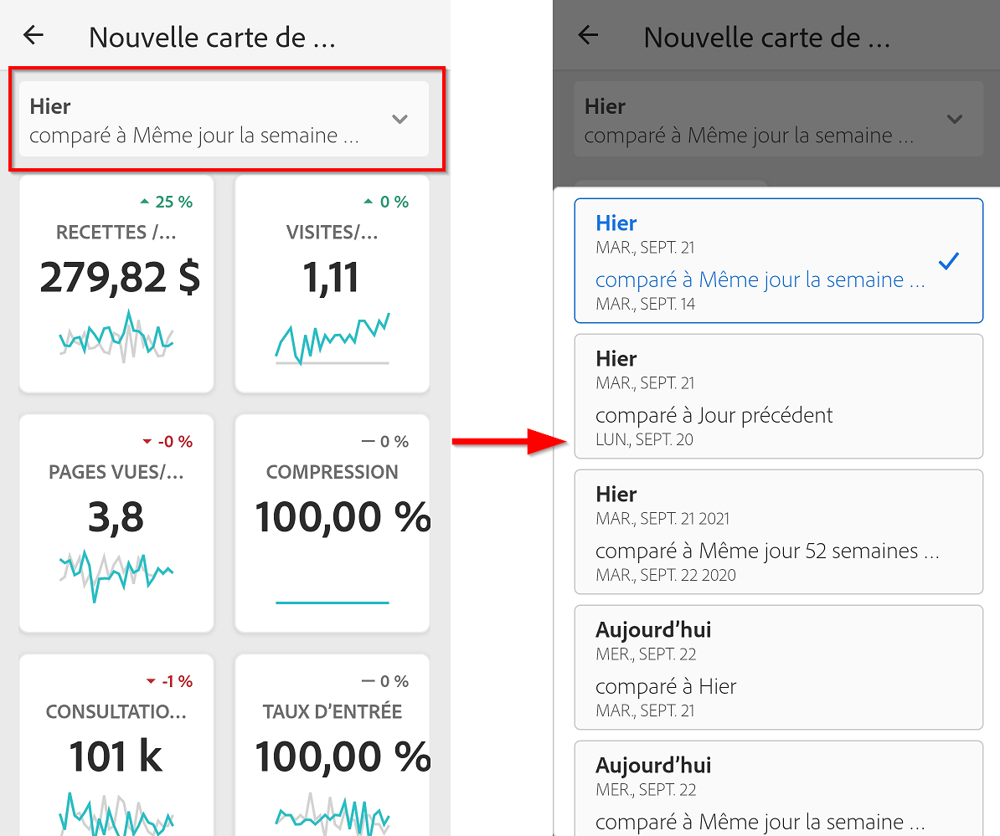
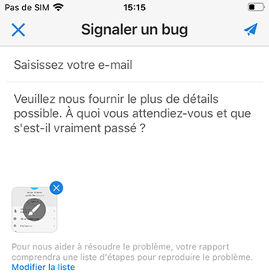

# Application mobile Analytics : Guide de démarrage rapide de l’utilisateur exécutif

## Introduction

L’application mobile Adobe Analytics fournit des informations à tout moment et en tout lieu à partir d’Adobe Analytics.  L’application permet aux utilisateurs d’accéder à des cartes de performance intuitives à partir d’un appareil mobile. Les tableaux de bord sont un ensemble de mesures clés et d’autres composants présentés dans une disposition en mosaïque que vous pouvez appuyer pour obtenir des ventilations plus détaillées et des rapports de tendances. L’application mobile est prise en charge sur les systèmes d’exploitation iOS et Android.

## À propos de ce guide

 Ce guide a pour but d’aider les utilisateurs de la direction à lire et à interpréter les cartes de performance dans l’application mobile Analytics. L’application permet aux utilisateurs de visualiser rapidement et facilement un grand rendu des données récapitulatives importantes sur leurs propres périphériques mobiles.

## Glossaire

|Terme|Définition||—|—||Consommateur|Personnalité exécutive affichant les mesures clés et les informations d’Analytics sur un périphérique mobile||Curateur|Personnalité qui identifie et distribue les statistiques d’Analytics et configure les cartes de performance à afficher par le consommateur||Traitement|L'acte de créer ou de modifier une carte de performance mobile contenant les mesures, dimensions et autres composants appropriés pour le consommateur||Scorecard|Une vue d'application mobile contenant une ou plusieurs mosaïques||Mosaïque|Rendu d'une mesure dans une vue de carte de performance||Ventilation|Une vue secondaire accessible en appuyant sur une mosaïque dans la carte de performance. Cette vue s’étend sur la mesure affichée sur la mosaïque et génère éventuellement des rapports sur des dimensions de ventilation supplémentaires.||Période|Plage de dates principale pour les rapports sur les applications mobiles||Période de comparaison|Période comparée à la période principale|

## Configuration de l’application sur votre périphérique

Pour utiliser efficacement l’application, vous devez disposer de l’aide de votre conservateur de carte de performance pour la configurer. Cette section fournit des informations pour vous aider à vous installer avec l'aide de votre conservateur.

### Accès

Pour accéder aux Scorecards dans l’application, assurez-vous que :

* Vous disposez d’une connexion valide à Adobe Analytics.
* Votre conservateur a correctement créé des cartes de performance mobiles et les a partagées avec vous.

### Téléchargement et installation de l’application

Pour télécharger et installer l’application, suivez les étapes décrites dans le système d’exploitation de votre périphérique.

    **Pour les périphériques iOS :**
    
    1. Cliquez sur le lien public suivant (il est également disponible dans Analytics sous **Outils** &gt; **Application mobile**):
    
    [lien iOS](https://testflight.apple.com/join/WtXMQxlI) : `https://testflight.apple.com/join/WtXMQxlI`
    
    Après avoir cliqué sur le lien, l'écran Testflight suivant s'affiche:
    
    
    
    2. Appuyez sur le lien **Afficher dans l’App Store*** à l’écran pour télécharger l’application Testflight.
    
    3. Après avoir installé l’application Testflight, recherchez et installez l’application mobile Adobe Analytics depuis Testflight, comme illustré ci-dessous:
    
    
    
    **Pour les périphériques Android :**
    
    1. Appuyez sur le lien Play Store suivant sur le périphérique de l’utilisateur (il est également disponible dans Analytics sous **Tools** &gt; **Mobile App**):
    
    
    [Android](https://play.google.com/apps/testing/com.adobe.analyticsmobileapp) : `https://play.google.com/apps/testing/com.adobe.analyticsmobileapp`
    
    Après avoir appuyé sur le lien, appuyez sur le lien Devenir un testeur dans l'écran suivant:
    
    
    
    2. Appuyez sur le lien **télécharger sur Google Play*** sur l’écran suivant:
    
    

## Utilisation de l’application

Pour utiliser l’application :

1. Connectez-vous à l’application. L’écran de connexion s’affiche au lancement de l’application. Suivez les invites à l’aide de vos informations d’identification Adobe Analytics existantes. Nous prenons en charge les ID Adobe et Enterprise/Federated.

   

2. Choisissez une entreprise. Une fois connecté à l’application, l’écran **Choisir une société** s’affiche. Cet écran répertorie les sociétés de connexion auxquelles vous appartenez. Appuyez sur le nom de l’entreprise associée à la carte de performance partagée avec vous.

3. La liste Tableau de bord affiche alors toutes les cartes de performance qui ont été partagées avec vous. Appuyez sur la carte de performance que vous souhaitez afficher.

   

   *Remarque : Si vous vous connectez et voyez un message indiquant que rien n’a été partagé, vérifiez ce qui suit avec votre conservateur :*

   * *Vous pouvez vous connecter à l’instance Analytics appropriée.*
   * *La carte de performance a été partagée avec vous.*
   

4. Examinez l’aspect des mosaïques dans la carte de performance.

   

   Informations supplémentaires sur les mosaïques :

   * La granularité des graphiques sparkline dépend de la longueur de la plage de dates :
   * Un jour affiche une tendance horaire
   * Plus d’une journée et moins d’un an affiche une tendance quotidienne
   * Un an ou plus affiche une tendance hebdomadaire
   * La formule de changement de valeur en pourcentage est le total de la mesure (période actuelle) - total de la mesure (période de comparaison) / total de la mesure (période de comparaison).
   * Vous pouvez descendre l’écran pour actualiser la carte de performance.

5. Appuyez sur une mosaïque pour afficher le mode de fonctionnement d’une ventilation détaillée pour la mosaïque.

   

6. Pour modifier les plages de dates de votre carte de performance :

   

   *Remarque : Vous pouvez également modifier les plages de dates dans la vue Ventilation illustrée ci-dessus de la même manière.*

   Selon l’intervalle que vous appuyez (**Jour**, **Semaine**, **Mois** ou **Année), deux options s’affichent pour les plages de dates : soit la période actuelle, soit la période qui l’précède immédiatement.** Appuyez sur l’une de ces deux options pour sélectionner la première plage. Sous la liste **COMPARER** à, appuyez sur l’une des options présentées pour comparer les données de cette période avec la première plage de dates que vous avez sélectionnée. Appuyez sur **Terminé** dans l’angle supérieur droit de l’écran. Le champ **Plages** de dates et les mosaïques Scorecard sont mis à jour avec les nouvelles données de comparaison des nouvelles plages sélectionnées.

7. Obtenez les mises à jour de Scorecard. Si une carte de performance n’inclut pas toutes les mesures ou ventilations qui peuvent vous intéresser, contactez votre équipe Analytics pour que la carte de performance soit mise à jour. Une fois la carte mise à jour, vous pouvez l’actualiser et charger les données récemment ajoutées.

8. Laissez vos commentaires. Pour laisser vos commentaires :

   1. Appuyez sur l’icône de l’utilisateur dans l’angle supérieur droit de l’écran de l’application.
   2. Dans l’écran **Mon compte** , appuyez sur l’option **Commentaires** .
   3. Appuyez sur pour afficher les options permettant de laisser un commentaire.
   
   

**Pour signaler un bogue**:

Appuyez sur l’option et choisissez une sous-catégorie du bogue. Dans le formulaire pour signaler un bogue, indiquez votre adresse électronique dans le champ supérieur et votre description du bogue dans le champ situé en dessous. Une capture d’écran des informations de votre compte est automatiquement jointe au message, mais vous pouvez la supprimer si vous le souhaitez en appuyant sur le **X** dans l’image de la pièce jointe. Vous avez également la possibilité de prendre un enregistrement d’écran, d’ajouter d’autres captures d’écran ou de joindre des fichiers. Pour envoyer le rapport, appuyez sur l’icône du plan de papier dans l’angle supérieur droit du formulaire.

**Pour suggérer une amélioration**:

Appuyez sur l’option et choisissez une sous-catégorie pour la suggestion. Dans le formulaire de suggestion, indiquez votre adresse électronique dans le champ supérieur et votre description du bogue dans le champ situé en dessous. Une capture d’écran des informations de votre compte est automatiquement jointe au message, mais vous pouvez la supprimer si vous le souhaitez en appuyant sur le **X** dans l’image de la pièce jointe. Vous avez également la possibilité de prendre un enregistrement d’écran, d’ajouter d’autres captures d’écran ou de joindre des fichiers. Pour envoyer la suggestion, appuyez sur l’icône du plan de papier dans l’angle supérieur droit du formulaire.

**Pour poser une question**:

Appuyez sur l’option et indiquez votre adresse électronique dans le champ supérieur et votre question dans le champ situé en dessous. Une capture d’écran est automatiquement jointe au message, mais vous pouvez la supprimer si vous le souhaitez en appuyant sur le **X** dans l’image de pièce jointe. Vous avez également la possibilité de prendre un enregistrement d’écran, d’ajouter d’autres captures d’écran ou de joindre des fichiers. Pour envoyer la question, appuyez sur l’icône du plan de papier dans l’angle supérieur droit du formulaire.
