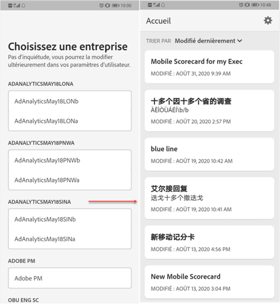
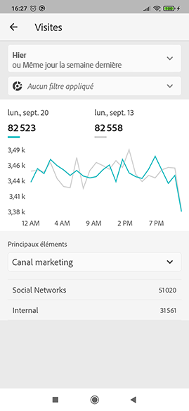
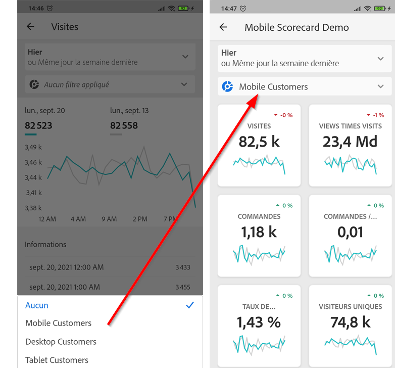

# Tableaux de bord Adobe Analytics : guide de démarrage rapide de l’utilisateur en charge de l’exécution

Les informations suivantes fournissent aux utilisateurs en charge de l’exécution des informations sur les bonnes pratiques pour l’utilisation et l’affichage des tableaux de bord Adobe Analytics. Pour regarder une vidéo présentant ces informations, reportez-vous à la section [Experience in-app des tableaux de bord Adobe Analytics](https://youtu.be/QXqQ_PkArbA).

## Introduction

Les tableaux de bord Adobe Analytics fournissent des informations à tout moment et où que vous soyez à partir d’Adobe Analytics.  L’application permet aux utilisateurs mobiles d’accéder à des Fiches d’évaluation intuitives. Les Fiches d’évaluation sont un ensemble de mesures clés et d’autres composants présentés sous la forme d’une mosaïque sur laquelle vous pouvez appuyer pour obtenir des ventilations plus détaillées ainsi que des rapports de tendances. Les tableaux de bord sont pris en charge sur les systèmes d’exploitation iOS et Android.

## En savoir plus sur ce guide

L’objectif de ce guide est d’aider les utilisateurs en charge de l’exécution à lire et à interpréter les Fiches d’évaluation des tableaux de bord Analytics. L’application permet aux utilisateurs en charge de l’exécution de visualiser rapidement et facilement un large rendu de données récapitulatives importantes sur leurs propres appareils mobiles.

## Glossaire terminologique

| Terme | Définition |
|--- |--- |
| Consommateur | Personne en charge de l’exécution affichant les mesures clés et les insights d’Analytics sur un appareil mobile |
| Curateur | Personne possédant des compétences en littératie des données qui découvre et distribue des insights d’Analytics et configure les Fiches d’évaluation que verra le consommateur |
| Traitement | L’acte de création ou de modification d’une Fiche d’évaluation mobile contenant des mesures, des dimensions ainsi que d’autres composants pertinents pour le consommateur |
| Fiche d’évaluation | Un affichage dans les tableaux de bord contenant une ou plusieurs mosaïques |
| Mosaïque | Un rendu d’une mesure dans un affichage de la Fiche d’évaluation |
| Ventilation | Un affichage secondaire accessible en appuyant sur une mosaïque de la Fiche d’évaluation. Cet affichage étend la mesure affichée sur la mosaïque et peut de manière facultative gérer des dimensions de ventilation supplémentaires |
| Période | La période principale pour la création de rapports dans les tableaux de bord |
| Période de comparaison | La période comparée à la période principale |

## Configuration des tableaux de bord sur votre appareil

Pour utiliser efficacement les tableaux de bord, vous devrez demander l’aide de votre curateur de Fiches d’évaluation pour les configurer. Cette section fournit des informations pour vous aider à la configurer avec l’aide de votre curateur.

### Obtenir l’accès

Pour accéder aux Fiches d’évaluation sur les tableaux de bord, assurez-vous que :

* vous disposez d’identifiants de connexion valides à Adobe Analytics ;
* votre curateur a créé correctement les Fiches d’évaluation mobiles et les a partagées avec vous.

### Téléchargement et installation des tableaux de bord

Pour télécharger et installer l’application, suivez les étapes correspondant au système d’exploitation de votre appareil.

**Pour les utilisateurs en charge de l’exécution sur iOS :**

Cliquez sur le lien suivant (il est également disponible dans Analytics sous **Outils** > **Tableaux de bord**) et suivez les invites pour télécharger, installer et ouvrir l’application :

[Lien iOS](https://apple.co/2zXq0aN)

**Pour les utilisateurs en charge de l’exécution sur Android :**

Cliquez sur le lien suivant (il est également disponible dans Analytics sous **Outils** > **Tableaux de bord**) et suivez les invites pour télécharger, installer et ouvrir l’application :

[Lien Android](https://bit.ly/2LM38Oo)

Une fois l’application téléchargée et installée, les utilisateurs en charge de l’exécution peuvent se connecter à l’application à l’aide de leurs identifiants Adobe Analytics existants.

## Utilisation des tableaux de bord

Pour utiliser les tableaux de bord :

1. Connectez-vous à l’application. L’écran de connexion apparaîtra au lancement des tableaux de bord. Suivez les instructions et utilisez vos informations d’identification Adobe Analytics existantes. Nous prenons en charge aussi bien les Adobe ID que les Enterprise/Federated ID.

   

2. Choisissez une entreprise. Lorsque vous êtes connecté aux tableaux de bord, l’écran **Choisir une entreprise** apparaît. Cet écran répertorie les entreprises connectées auxquelles vous appartenez. Appuyez sur le nom de l’entreprise associé à la fiche d’évaluation partagée avec vous.

3. La liste de Fiches d’évaluation affiche ensuite toutes les Fiches d’évaluation partagées avec vous. Appuyez sur la Fiche d’évaluation que vous souhaitez afficher.

   

   Si vous vous connectez et que vous voyez un message indiquant que rien n’a été partagé, vérifiez les éléments suivants avec votre curateur :

   * Vous pouvez vous connecter à la bonne instance Analytics.
   * La fiche d’évaluation a été partagée avec vous.

   

4. Examinez l’affichage des mosaïques dans la Fiche d’évaluation (la première Fiche d’évaluation s’affiche en mode sombre, consultez **Préférences** ci-dessous pour plus d’informations).

   

   Informations supplémentaires sur les mosaïques :

   * La granularité des graphiques sparkline dépend de la longueur de la période :

      * Une tendance horaire s’affiche pour les plages d’une journée.
      * Une tendance quotidienne s’affiche pour les plages comprises entre une journée et un an.
      * Une tendance hebdomadaire s’affiche pour les plages supérieures à un an.
   * La formule de modification de la valeur de pourcentage est calculée de la manière suivante : total de la mesure (période en cours) - total de la mesure (période de comparaison)/total de la mesure (période de comparaison).

   * Vous pouvez tirer l’écran vers le bas pour actualiser la Fiche d’évaluation.

   L’exemple suivant de la Fiche d’évaluation est affiché en mode normal :

   

5. Appuyez sur une mosaïque pour voir comment fonctionne une ventilation détaillée sur la mosaïque.

   

6. Pour modifier les périodes de votre fiche d’évaluation :

   

   * Vous pouvez également modifier les périodes dans la vue Ventilation affichée ci-dessus de la même manière.

   * Selon l’intervalle sur lequel vous appuyez (**Jour**, **Semaine**, **Mois** ou **Année**), deux options de période s’affichent : soit la période actuelle, soit celle qui la précède immédiatement. Appuyez sur l’une de ces deux options pour sélectionner la première période. Dans la liste **COMPARER À**, appuyez sur l’une des options qui s’affiche pour comparer les données de cette période avec la première période que vous avez sélectionnée. Appuyez sur **Terminé** en haut à droite de l’écran. Le champ **Périodes** et les mosaïques de la Fiche d’évaluation sont mis à jour avec les nouvelles données de comparaison des périodes que vous venez de sélectionner.

7. Pour appliquer un filtre de segment à votre Fiche d’évaluation, appuyez sur le filtre déroulant et sélectionnez un segment qui a été configuré par votre curateur. Les [filtres](https://docs.adobe.com/content/help/en/analytics-learn/tutorials/analysis-workspace/using-panels/using-drop-down-filters.html) de l’application fonctionnent de la même manière que dans Analytics Workspace.

   

8. Récupérer les mises à jour des Fiches d’évaluation. Si une Fiche d’évaluation ne contient pas toutes les mesures ou les ventilations qui vous intéressent, demandez une mise à jour de la fiche d’évaluation à votre équipe Analytics. Une fois la fiche mise à jour, vous pouvez tirer sur la fiche à l’écran pour l’actualiser et charger les données récemment ajoutées.

9. Pour faire part de vos commentaires sur cette application :

   1. Appuyez sur l’icône des paramètres en haut à droite de l’écran de l’application.
   2. Sur l’écran **Paramètres**, appuyez sur l’option **Commentaires**.
   3. Appuyez pour afficher les options permettant de laisser un commentaire.

      

10. Pour modifier les préférences, appuyez sur l’option **Préférences** affichée ci-dessus. Dans les préférences, vous pouvez activer la connexion biométrique ou définir l’application pour le mode sombre comme illustré ci-dessous :

   

**Pour signaler un bogue** :

Appuyez sur l’option, puis choisissez une sous-catégorie de bogue. Dans le formulaire de signalement d’un bogue, indiquez votre adresse électronique dans le champ supérieur et votre description du bogue dans le champ qui suit. Une capture d’écran des informations de votre compte est jointe automatiquement au message, mais vous pouvez la supprimer en appuyant sur le **X** dans l’image de la pièce jointe. Vous disposez également d’options pour effectuer un enregistrement de l’écran, ajouter davantage de captures d’écran ou joindre des fichiers. Pour envoyer le rapport, appuyez sur l’icône en forme d’avion en papier en haut à droite du formulaire.

**Pour suggérer une amélioration** :

Appuyez sur l’option et choisissez une sous-catégorie de suggestion. Dans le formulaire de suggestion, indiquez votre adresse électronique dans le champ supérieur et votre description de la suggestion dans le champ qui suit. Une capture d’écran des informations de votre compte est jointe automatiquement au message, mais vous pouvez la supprimer en appuyant sur le **X** dans l’image de la pièce jointe. Vous disposez également d’options pour effectuer un enregistrement de l’écran, ajouter davantage de captures d’écran ou joindre des fichiers. Pour envoyer la suggestion, appuyez sur l’icône en forme d’avion en papier en haut à droite du formulaire.

**Pour poser une question** :

Appuyez sur l’option et indiquez votre adresse électronique dans le champ supérieur et votre question dans le champ qui suit. Une capture d’écran est jointe automatiquement au message, mais vous pouvez la supprimer en appuyant sur le **X** dans l’image de la pièce jointe. Vous disposez également d’options pour effectuer un enregistrement de l’écran, ajouter davantage de captures d’écran ou joindre des fichiers. Pour envoyer la question, appuyez sur l’icône en forme d’avion en papier en haut à droite du formulaire.
