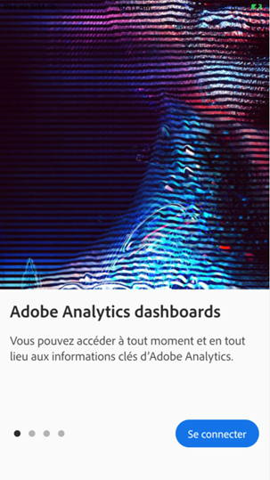
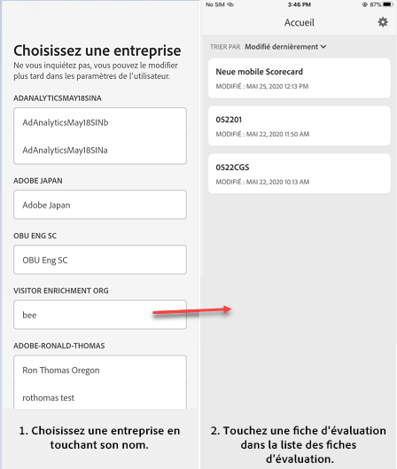

# Configurer les utilisateurs en charge de l’exécution avec l’application

Dans certains cas, les utilisateurs en charge de l’exécution peuvent avoir besoin d’aide pour accéder à l’application et l’utiliser. Cette section fournit des informations pour vous aider à apporter cette aide.

## Vérifiez que les utilisateurs de l’application ont accès à Adobe Analytics

1. Configurez de nouveaux utilisateurs dans [Admin Console dʼExperience Cloud](/help/admin/admin-console/permissions/product-profile.md).

1. Avant de pouvoir partager des cartes de performance, vous devez accorder aux utilisateurs de lʼapplication les autorisations nécessaires pour accéder aux composants de la carte de performance (tels quʼAnalysis Workspace, les suites de rapports sur lesquelles les cartes de performance sont basées, ainsi que les segments, les mesures et les dimensions).

## Configuration requise pour les utilisateurs de lʼapplication

Pour vous assurer que les utilisateurs en charge de lʼexécution ont accès à vos cartes de performance dans lʼapplication, vérifiez les éléments suivants :

* Les spécifications minimales en matière de systèmes d’exploitation mobile sur leurs appareils sont la version 10 ou ultérieure d’iOS ou la version 4.4 (KitKat) ou ultérieure d’Android.
* Ils possèdent des identifiants de connexion valides à Adobe Analytics.
* Vous avez créé et partagé correctement des cartes de performance mobiles avec eux.
* Ils ont accès aux composants inclus dans la carte de performance. Notez que lorsque vous partagez vos cartes de performance, vous pouvez sélectionnez lʼoption **[!UICONTROL Partager les composants incorporés]**.

## Aider les utilisateurs en charge de lʼexécution à télécharger et à installer lʼapplication

**Pour les utilisateurs en charge de l’exécution sur iOS :**

Cliquez sur le lien suivant (il est également disponible dans Analytics sous **[!UICONTROL Outils]** > **[!UICONTROL Tableaux de bord Analytics (application mobile)]**) et suivez les invites pour télécharger, installer et ouvrir l’application :

`[iOS link](https://apple.co/2zXq0aN)`

**Pour les utilisateurs en charge de l’exécution sur Android :**

Cliquez sur le lien suivant (il est également disponible dans Analytics sous **[!UICONTROL Outils]** > **[!UICONTROL Tableaux de bord Analytics (application mobile)]**) et suivez les invites pour télécharger, installer et ouvrir l’application :

`[Android link](https://bit.ly/2LM38Oo)`

Une fois l’application téléchargée et installée, les utilisateurs en charge de l’exécution peuvent se connecter à l’application en utilisant leurs informations d’identification Adobe Analytics existantes. Nous prenons en charge aussi bien les Adobe ID que les Enterprise/Federated ID.

## Aider les utilisateurs en charge de lʼexécution à accéder à votre carte de performance

1. Demandez aux utilisateurs en charge de lʼexécution de se connecter à lʼapplication.

   Lʼécran **[!UICONTROL Choisir une société]** sʼaffiche. Cet écran répertorie les entreprises connectées auxquelles l’utilisateur en charge de l’exécution appartient.

1. Invitez-les ensuite à appuyer sur le nom de la société de connexion ou de lʼorganisation Experience Cloud auquel la carte de performance que vous avez créée sʼapplique.

   La liste des Cartes de performance affiche alors toutes les cartes de performance partagées avec la personne en charge de lʼexécution pour cette société de connexion.

1. Enfin, demandez-leur de trier cette liste selon la **[!UICONTROL Modification la plus récente]**, le cas échéant.

1. Il ne leur reste plus quʼà appuyer sur le nom de la Carte de performance pour lʼafficher.

   

### Explication de lʼinterface utilisateur des cartes de performance

Expliquez à lʼutilisateur en charge de lʼexécution comment les mosaïques apparaissent dans les cartes de performance que vous partagez.

Informations supplémentaires sur les mosaïques :

* La granularité des graphiques sparkline dépend de la longueur de la période :
* Une tendance horaire s’affiche pour les plages d’une journée.
   * Une tendance quotidienne s’affiche pour les plages comprises entre une journée et un an.
   * Une tendance hebdomadaire s’affiche pour les plages supérieures à un an.
   * La formule de modification de la valeur de pourcentage est calculée de la manière suivante : total de la mesure (période en cours) - total de la mesure (période de comparaison)/total de la mesure (période de comparaison).
   * Vous pouvez tirer l’écran vers le bas pour actualiser la Fiche d’évaluation.

1. Appuyez sur une mosaïque pour afficher comment fonctionne une ventilation détaillée sur la mosaïque.

   

   * Appuyez sur n’importe quel point d’un graphique sparkline pour afficher les données associées à ce point sur la ligne.

   * Un tableau est inclus pour afficher les données des dimensions ajoutées à la mosaïque. Appuyez sur la flèche vers le bas pour sélectionner les dimensions. Si aucune dimension n’a été ajoutée à la mosaïque, le tableau affiche les données de graphique.

1. Pour modifier les périodes de votre carte de performance, appuyez sur l’en-tête de date et sélectionnez la combinaison de période de comparaison et de période principale que vous voulez afficher.

   

## Modifier les préférences de l’application

Pour modifier les préférences, appuyez sur l’option **[!UICONTROL Préférences]** affichée ci-dessus. Dans les préférences, vous pouvez activer la connexion biométrique ou définir l’application pour le mode sombre comme illustré ci-dessous :

## Résolution des problèmes

Si l’utilisateur en charge de l’exécution se connecte et qu’un message s’affiche indiquant que rien n’a été partagé :

* L’utilisateur en charge de l’exécution peut avoir sélectionné la mauvaise instance Analytics, ou
* La carte de performance peut ne pas avoir été partagée avec l’utilisateur en charge de l’exécution.

Vérifiez que l’utilisateur en charge de l’exécution peut se connecter à la bonne instance Adobe Analytics et que la carte de performance a bien été partagée.

>[!IMPORTANT]
>
>Depuis octobre 2020, Adobe déploie progressivement une série d’améliorations destinées à optimiser les performances de l’application « Tableaux de bord Adobe Analytics ». Ces améliorations portent principalement sur la mise en cache des données Analytics historiques utilisées pour remplir les fiches d’évaluation avec des dates (à l’exception du jour en cours). Ces données seront mises en cache pendant 24 heures maximum dans un compte de stockage cloud public Microsoft Azure sécurisé. Contactez votre équipe de compte d’Adobe si vous souhaitez vous désinscrire de ces fonctionnalités d’amélioration des performances.
