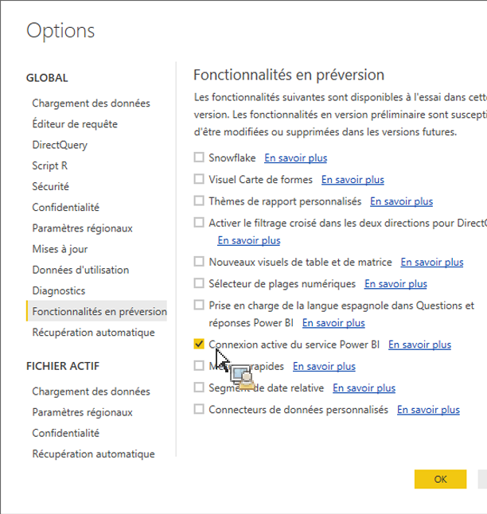

# Extraction des éléments publiés dans Power BI Desktop

Explique comment extraire des ressources publiées du Report Builder dans Power BI Desktop

## Conditions préalables {#section_BDFDAE1E300B429FB6EBCB21AD1383A0}

* Vous devez avoir installé la version la plus récente de Power BI Desktop (version d’avril 2017)
* Ce processus suppose que vous avez déjà publié des tableaux ou des requêtes au format du Report Builder sur le service Power BI.

## Processus {#section_CB03E6E1B066457EA0F6FC08FFF5EFDD}

Dans la mise à jour d’avril 2017 de Power BI Desktop, Microsoft a introduit la possibilité de se connecter à des jeux de données dans le service Power BI. Cette fonctionnalité vous permet de créer de nouveaux rapports à partir de jeux de données existants que vous avez déjà publiés sur le cloud. Vous pouvez tirer parti de cette fonctionnalité pour améliorer la collaboration et réduire le chevauchement des tâches au sein de votre équipe.

1. Dans Power BI Desktop, accédez à **[!UICONTROL File]** > **[!UICONTROL Options and settings]** > **[!UICONTROL Options]** > **[!UICONTROL Preview features.]**
1. Activez **[!UICONTROL Power BI Service Live Connection]** et cliquez sur **[!UICONTROL OK]**. 

1. Redémarrez Power BI Desktop.
1. Une fois que vous avez redémarré le bureau, sélectionnez **[!UICONTROL Home]** > **[!UICONTROL Get Data]** > **[!UICONTROL More...]**.
1. Recherchez et sélectionnez **[!UICONTROL Power BI service]**.
1. Sous **[!UICONTROL Microsoft Power BI service]** > **[!UICONTROL My Workspace]**, sélectionnez le jeu de données que vous aviez précédemment publié dans le créateur de rapports.

Pour plus d’informations, voir ce [billet de blog de Microsoft](https://powerbi.microsoft.com/en-us/blog/connecting-to-datasets-in-the-power-bi-service-from-desktop/).
