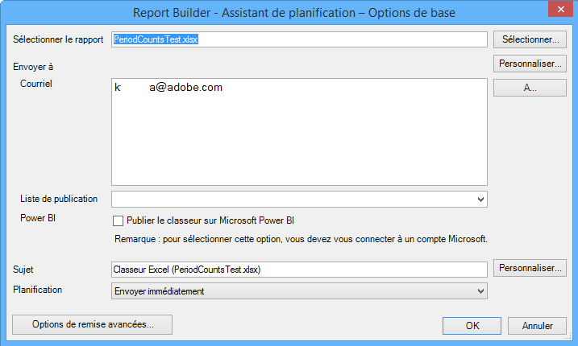
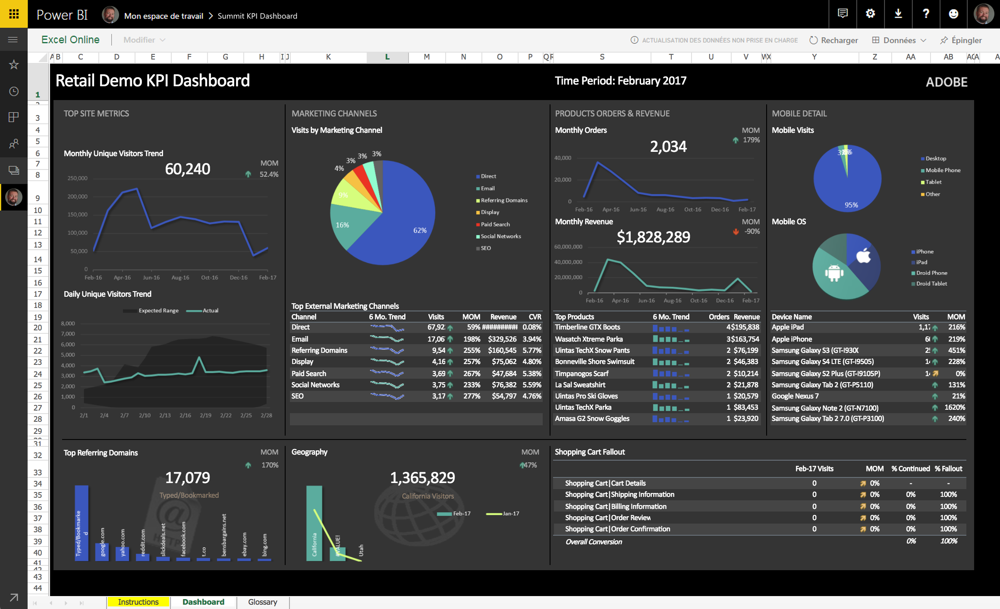
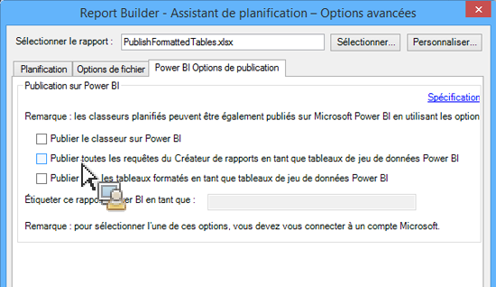
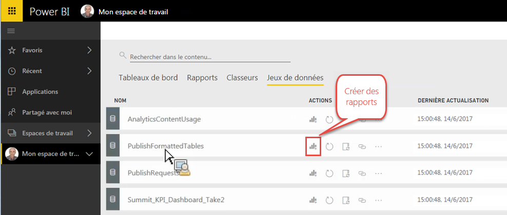
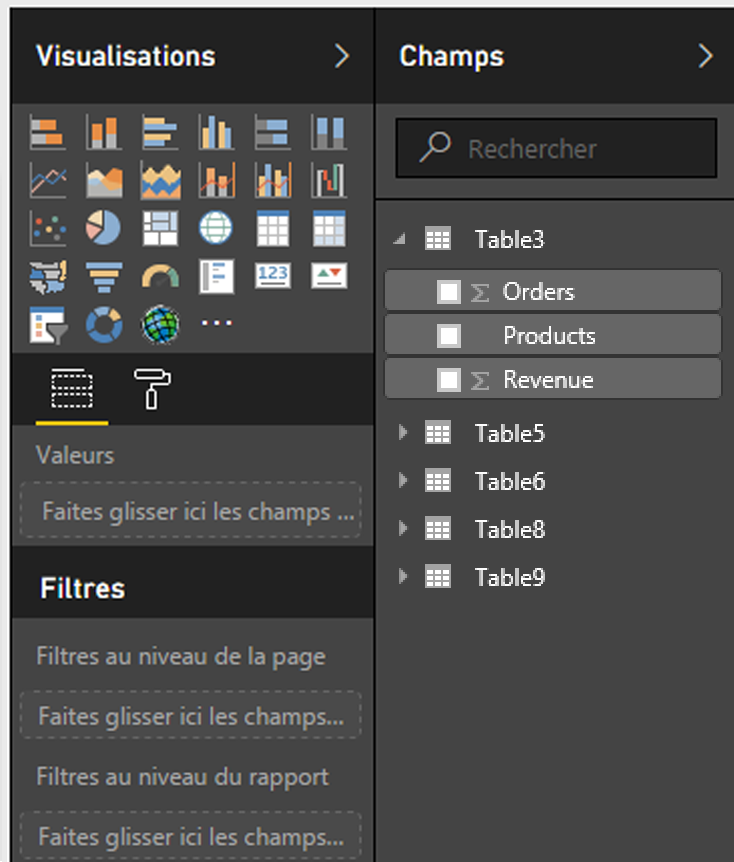
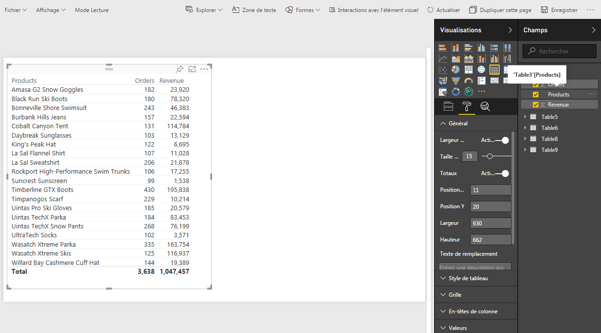
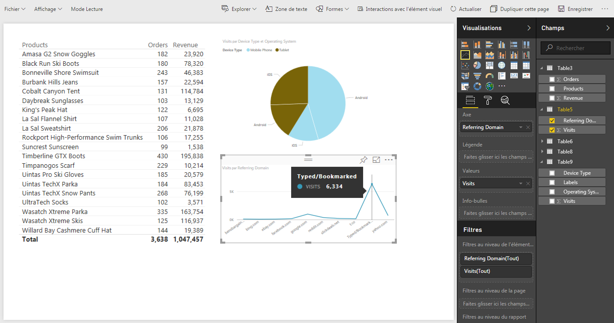
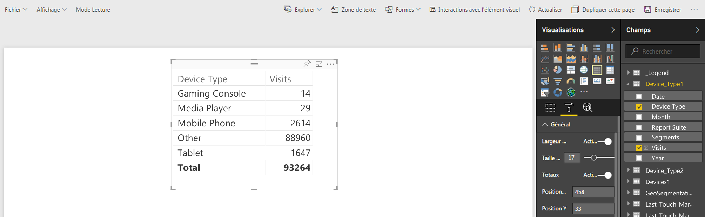
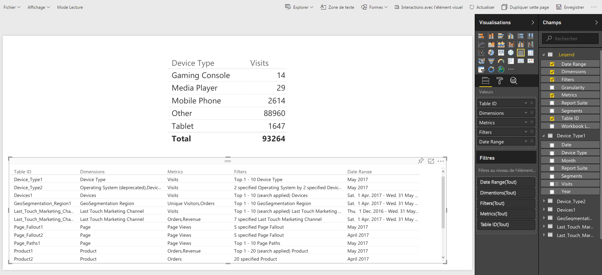

# Publication sur Power BI - Aperçu

Microsoft Power BI est une suite de tableaux de bord d’analyse commerciale permettant d’analyser les données et de partager les informations. L’intégration d’Adobe Analytics à Power BI vous permet de visualiser les données d’analyse du Report Builder sur Microsoft Power BI et de les partager facilement avec l’ensemble de votre entreprise.

Auparavant, en tant qu’analyste, vous deviez planifier la diffusion des classeurs du Report Builder par courrier électronique (ou ftp). Vous pouvez désormais permettre à vos utilisateurs et intervenants métier d’accéder (depuis leur compte Power BI) à des données exactes et à jour dans un environnement Web qui est accessible quels que soient les plateformes et les périphériques utilisés.

L’association de la fonctionnalité de génération de rapports du Report Builder aux fonctionnalités de visualisation de Power BI rend les informations plus accessibles pour tous les membres de l’organisation. Grâce à Power BI, vous pouvez également intégrer Adobe Analytics à d’autres sources de données (par exemple, point de vente, gestion de la relation client) de façon à découvrir des statistiques sur les clients, des associations et des opportunités uniques.

L’intégration avec le Report Builder Adobe vous permet de

* [Publier les classeurs du Report Builder planifiés sur Power BI](/help/analyze/report-builder/whats-new-arb.md#rb-5-5-section)
* [Publier tous les tableaux formatés du classeur en tant que tableaux de jeu de données Power BI](/help/analyze/report-builder/whats-new-arb.md#rb-5-5-section)
* [Publier toutes les requêtes du Report Builder sous forme de tableaux de jeu de données Power BI](/help/analyze/report-builder/whats-new-arb.md#rb-5-5-section)

## Configuration requise {#section_0B71092D853446F38FA36447DAC0D32B}

* La version 5.5 du Report Builder d’Adobe est [installée](/help/analyze/report-builder/setup/t-install-arb.md)
* Compte Microsoft actif qui vous permet de vous connecter à Power BI

## Publier le classeur sur Power BI {#section_21CA66229EC240D49594A9A7D3FBA687}

Les classeurs planifiés sont des feuilles de calcul Excel renseignées avec des données d’Adobe Analytics et envoyées à intervalles réguliers planifiés.

**Publier un classeur dans le Report Builder**

1. Dans le Report Builder, générez et sauvegardez un classeur.
1. Dans la barre d’outils du Report Builder, cliquez sur **[!UICONTROL Planifier]** > **[!UICONTROL Nouveau]**.

1. Dans l’Assistant de planification - Options de base, cochez la case située en regard de **[!UICONTROL Publier le classeur sur Microsoft Power BI]**.

   

1. Indiquez votre adresse électronique et envoyez immédiatement, ou définissez la fréquence de planification (par heure, quotidiennement, etc.).
1. Cliquez sur **[!UICONTROL OK]** pour publier.
1. Vous devrez alors vous connecter à votre compte Microsoft. Indiquez vos informations d’identification.
1. Le classeur du Report Builder est planifié et publié sur Power BI.

   À chaque instance planifiée, et après que le processus de planification du Report Builder a actualisé le classeur avec les données d’analyse mises à jour, le classeur sera publié sur Microsoft Power BI.

**Afficher les données du classeur du Report Builder dans Power BI**

1. Dans Power BI, double-cliquez sur le classeur en dessous du menu [!UICONTROL Classeurs].

   

1. Vous pouvez désormais visualiser les données de tableau de bord du classeur.  

1. Vous pouvez ensuite épingler une zone de ce classeur de façon à l’inclure dans l’un de vos tableaux de bord Power BI.

## Publier tous les tableaux formatés du classeur en tant que tableaux de jeu de données Power BI {#section_7C54A54E75184DD6BAEF4ACCE241239A}

> [!NOTE] Si le classeur contient une macro, l’option « Publier tous les tableaux formatés du classeur en tant que tableaux de jeu de données Power BI » sera désactivée.

Au lieu d’importer l’ensemble du classeur, vous pouvez n’importer que le contenu de l’ensemble des tableaux formatés de ce classeur.

**Cas d’utilisation** : Vous avez un classeur Excel qui extrait des données à partir de plusieurs requêtes du Report Builder et crée un tableau récapitulatif avec de nombreuses formules. Vous pouvez n’importer que le tableau récapitulatif dans Power BI et créer une visualisation pour ce tableau.

**Publier un tableau formaté dans le Report Builder**

1. Dans le Report Builder, générez un tableau de données comprenant une ligne d’en-tête, suivie d’une ligne de données.
1. Sélectionnez le tableau, puis l’option **[!UICONTROL Formater en tant que tableau]** dans le menu [!UICONTROL Accueil]. Un nom de tableau par défaut est attribué (Tableau 1, Tableau 2, etc.), mais vous pouvez le modifier dans le menu [!UICONTROL Conception].

1. Dans la barre d’outils du Report Builder, cliquez sur **[!UICONTROL Planifier]** > **[!UICONTROL Nouveau]**.

1. Dans l’Assistant de planification - Options de base, cliquez sur **[!UICONTROL Options de planification avancées]**.
1. Dans l’[!UICONTROL Assistant de planification - Options avancées], dans l’onglet **[!UICONTROL Options de publication]**, cochez la case située en regard de **[!UICONTROL Publier tous les tableaux formatés en tant que tableaux de jeu de données Power BI]**.

   

1. (Facultatif) Vous pouvez personnaliser le nom de la ressource publiée dans Power BI. Cela peut être utile si vous utilisez le contrôle de version dans le nom du classeur (par exemple, monclasseur_v1.1.xlsx) et que vous ne souhaitez pas que le numéro de version figure dans le nom de la ressource Power BI publiée. Un autre avantage est que la ressource publiée ne changera pas si le numéro de version change. (Affichez les [spécifications](/help/analyze/report-builder/c-publish-power-bi/specifications-limits.md) ici.)

**Visualiser les données de tableau dans Power BI**

1. Dans Power BI, accédez au menu **[!UICONTROL Espaces de travail]** > **[!UICONTROL Jeux de données]**.

   

1. Sélectionnez le jeu de données que vous avez publié et cliquez sur l’icône [!UICONTROL Créer un rapport] située juste à côté. Notez que les tableaux s’affichent en tant que Champs.

   

1. Sélectionnez un tableau et ses colonnes associées.

   

1. Dans le menu [!UICONTROL Visualisations], vous pouvez sélectionner la manière de visualiser un tableau dans Power BI. Par exemple, vous pouvez choisir de présenter vos données sous forme d’un graphique linéaire :

   

1. À partir de là, vous pouvez créer des visualisations à partir de ce tableau de jeu de données.

## Publier toutes les requêtes du Report Builder sous forme de tableaux de jeu de données Power BI {#section_0C26057C7DBB4068A643FDD688F6E463}

Vous pouvez transformer toutes vos requêtes en tableaux de jeu de données et générer des visualisations à partir de ces tableaux.

>[!IMPORTANT]
>
>Si le classeur contient plus de 100 requêtes, seules les 100 premières requêtes seront publiées sur Power BI. Par ailleurs, pour chaque requête publiée sur Power BI, seules les 10 000 premières lignes de données seront publiées. Par conséquent, bien que ces requêtes soient distribuées correctement à travers la planification, la portée de la publication sur Power BI est limitée.

1. Dans le Report Builder, ouvrez ou créez un classeur avec des requêtes du Report Builder.
1. Dans la barre d’outils du Report Builder, cliquez sur **[!UICONTROL Planifier]** > **[!UICONTROL Nouveau]**.

1. Dans l’Assistant de planification - Options de base, cliquez sur **[!UICONTROL Options de planification avancées]**.
1. Dans l’[!UICONTROL Assistant de planification - Options avancées], dans l’onglet **[!UICONTROL Options de publication]**, cochez la case située en regard de **[!UICONTROL Publier toutes les requêtes du Report Builder en tant que tableaux de jeu de données Power BI]** 

1. Cliquez sur **[!UICONTROL OK]**.

**Visualiser les données de requête dans Power BI**

Chaque requête du Report Builder planifiée sera publiée en tant que tableau dans le jeu de données. Chaque tableau de requête est nommé en fonction de la dimension principale de la requête et comprend une colonne [!UICONTROL Suites de rapports] et une colonne [!UICONTROL Segments].

1. Dans Power BI, accédez au menu **[!UICONTROL Espaces de travail]** > **[!UICONTROL Jeux de données]**.

1. Sélectionnez la requête que vous avez publiée et cliquez sur l’icône [!UICONTROL Create report] située juste à côté.

   Notez que les requêtes s’affichent en tant que tableaux dans le menu [!UICONTROL Champs].

   

   >[!NOTE]
   >
   >Quelle que soit la façon dont vous avez configuré la présentation de votre requête du Report Builder dans le classeur (disposition croisée dynamique, disposition personnalisée, certaines colonnes invisibles), le Report Builder publie toujours votre requête selon le même format bidimensionnel à une seule ligne d’en-tête : Date, Dimensions, Mesures, Suites de rapports, Segments.

1. Notez également l’existence d’un tableau supplémentaire intitulé **[!UICONTROL Légende]**. Si vous sortez une requête du contexte du Report Builder, il peut être difficile de se rappeler ce à quoi correspond chaque requête. Le tableau Légende a pour fonction, par exemple, d’afficher le nom de chaque requête sous Identifiant du tableau. Vous pouvez également ajouter les autres colonnes de Légende pour obtenir un aperçu global de la requête.

   

