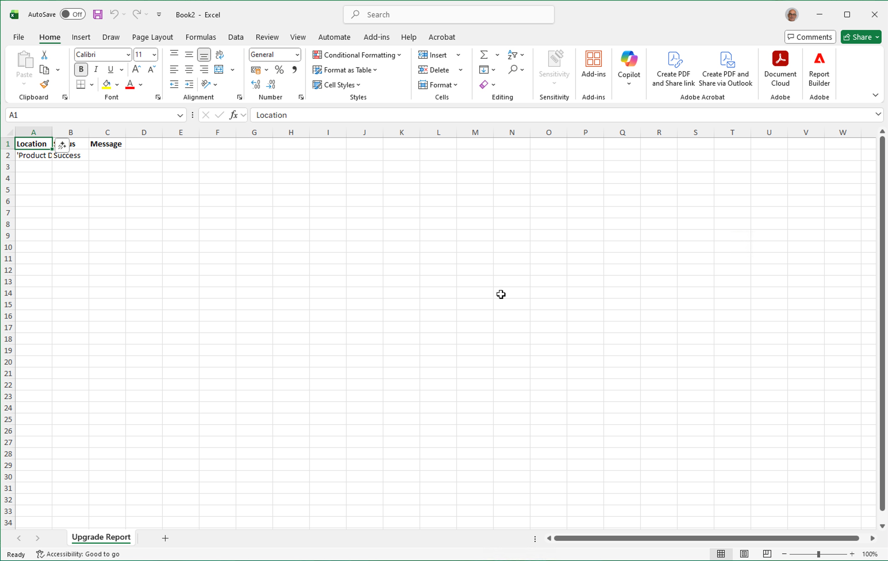
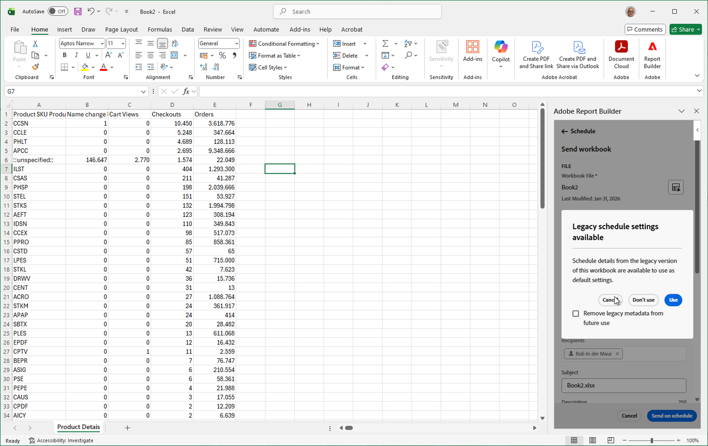

# Conversion des classeurs Report Builder hérités

Dans le cadre de la transition vers une nouvelle fonctionnalité Report Builder, vous pouvez rapidement convertir vos classeurs Report Builder hérités actuels (classeurs hérités) pour utiliser la nouvelle fonctionnalité Report Builder [blocs de données](create-a-data-block.md).

>[!IMPORTANT]
>
>Dupliquez chaque classeur et renommez une version avant de convertir l’ancien classeur. Vous disposez ainsi toujours d’une copie du classeur hérité d’origine, si vous en avez besoin.

>[!BEGINSHADEBOX]

Voir  [Convert workbooks](https://experienceleague.adobe.com/fr/docs/analytics-learn/tutorials/exporting/report-builder/upgrade-and-reschedule-workbooks){target="_blank"} pour une vidéo de démonstration.

>[!ENDSHADEBOX]

>[!NOTE]
>
>Pour convertir des classeurs hérités, vous devez d’abord [configurer le nouveau Report Builder](/help/analyze/report-builder/report-builder-setup.md).

## Ouvrir un classeur hérité

Pour ouvrir un classeur hérité, vous pouvez :

* Ouvrez un classeur hérité planifié dans l’onglet **[!UICONTROL Planifier]** du hub [Report Builder](report-builder-hub.md). Il s’agit de la méthode préférée pour les classeurs hérités planifiés. Vous avez la possibilité d’utiliser la planification associée au classeur hérité dès que vous [planifiez le classeur hérité converti](#schedule-a-converted-legacy-workbook).

   1. Ouvrez Excel et sélectionnez  **[!UICONTROL Report Builder]** dans la barre de ruban Excel.

   1. Sélectionnez **[!UICONTROL Connexion]** et connectez-vous à Report Builder.

   1. Sélectionnez **[!UICONTROL Planifier]** dans le hub [Report Builder](report-builder-hub.md).
   1. Sélectionnez l’onglet **[!UICONTROL Hérité]**. Cet onglet répertorie les classeurs planifiés Report Builder hérités.

      

   1. Sélectionnez  le classeur planifié à convertir dans la liste, puis sélectionnez . Le classeur est téléchargé et s’ouvre dans une nouvelle fenêtre dans Excel. Vous pouvez désormais [convertir l’ancien classeur Report Builder](#convert-a--workbook).

* Ouvrez un classeur hérité directement depuis votre ordinateur ou réseau local. Lorsque vous utilisez cette méthode, il ne vous est pas proposé d’utiliser la planification qui peut être associée au classeur hérité.  Lorsque le classeur hérité est ouvert dans Excel :

   1. Sélectionnez  **[!UICONTROL Report Builder]** dans la barre de ruban Excel.
   1. Sélectionnez **[!UICONTROL Connexion]** et connectez-vous à Report Builder.
   1. Convertissez ensuite [&#x200B; classeur hérité](#convert-a-workbook).

## Convertir un classeur hérité

Pour convertir votre classeur hérité :

1. Une fois que vous avez ouvert un classeur hérité, le nouveau Report Builder détecte si ce classeur contient des requêtes [Report Builder héritées](/help/analyze/legacy-report-builder/home.md).

   {zoomable="yes"}

1. Si une ou plusieurs requêtes héritées sont trouvées, cliquez sur **[!UICONTROL Mettre à niveau]** dans la boîte de dialogue **[!UICONTROL Mettre à niveau le classeur]** pour mettre à niveau le classeur.

   >[!NOTE]
   >
   >Vous devez mettre à niveau chaque demande individuellement. La mise à niveau en bloc n’est pas prise en charge.

1. Une boîte de dialogue **[!UICONTROL Avertissement]** s’affiche pour vous avertir des modifications apportées au classeur en cas de mise à niveau. Il vous invite également à créer une sauvegarde de votre classeur hérité avant de continuer.

   {zoomable="yes"}

1. Cliquez sur **[!UICONTROL Continuer]** pour poursuivre la mise à niveau.

   Si la mise à niveau est réussie, une notification **[!UICONTROL La mise à niveau du classeur est maintenant terminée]** s’affiche.

   

   * Sélectionnez **[!UICONTROL Fermer]** pour fermer la notification et continuer à travailler dans le classeur avec les demandes mises à jour pour le nouveau Report Builder.

   * Sélectionnez **[!UICONTROL Télécharger le rapport de mise à niveau]** pour télécharger et ouvrir un nouveau classeur Excel qui affiche le résultat de la mise à niveau. Pour obtenir un exemple, reportez-vous à la section ci-dessous.

     

Vous pouvez désormais [gérer les blocs de données](/help/analyze/report-builder/manage-reportbuilder.md) dans le classeur. Ces blocs de données sont le résultat de la mise à niveau et remplacent vos requêtes Report Builder héritées.

## Planifier un classeur hérité converti

Vous avez la possibilité d’utiliser les détails de la planification du classeur hérité que vous avez téléchargé et ouvert à partir de l’onglet **[!UICONTROL Planification]** dans le hub Report Builder. Cette option n’est pas disponible pour les classeurs hérités avec les détails de planification que vous ouvrez depuis votre ordinateur ou réseau local.

1. Pour planifier un classeur hérité converti avec une planification héritée :

   * Sélectionnez **[!UICONTROL Envoyer le classeur]** dans le hub Report Builder, ou
   * Sélectionnez **[!UICONTROL Planifier le classeur]** dans l’onglet **[!UICONTROL Classeurs]** disponible dans l’onglet **[!UICONTROL Planifications]** de Report Builder.

1. Vous pouvez utiliser les détails de planification du classeur hérité comme paramètres de planification par défaut.

   

   * Sélectionnez **[!UICONTROL Utiliser]** pour utiliser les détails du planning hérité. Les détails du planning sont préremplis dans l’interface [&#x200B; Envoyer le classeur &#x200B;](schedule-reportbuilder.md#schedule-a-workbook).
   * Sélectionnez **[!UICONTROL Ne pas utiliser]** pour ne pas utiliser les détails du planning hérité.
   * Sélectionnez **[!UICONTROL Annuler]** pour annuler.

   Sélectionnez **[!UICONTROL Supprimer les métadonnées héritées d’une utilisation ultérieure]** pour ne plus utiliser les détails de la planification héritée de ce classeur à l’avenir.

## Fonctionnalités Report Builder héritées non prises en charge {#unsupported}

Certaines fonctionnalités Report Builder héritées ne sont plus disponibles dans le nouveau Report Builder

* Requêtes en temps réel.

* Rapports Chemin/Abandon.

* Option FTP pour les rapports planifiés.

* Mesures Visiteurs et visiteuses. Les mesures suivantes sont converties en *visiteurs uniques*, même si le résultat du compte rendu des performances peut ne pas correspondre exactement : `visitorshourly`, `visitorsdaily`, `visitorsweekly`, `visitorsmonthly`, `visitorsquarterly` et `visitorsyearly`. Cette conversion s’applique également à `mobilevisitorshourly`, `mobilevisitorsdaily`, `mobilevisitorsweekly`, `mobilevisitorsmonthly`, `mobilevisitorsquarterly` et `mobilevisitorsyearly`.
