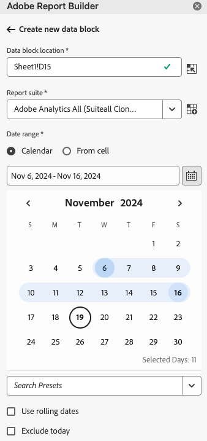

# Création dʼun bloc de données

Un *bloc de données* est le tableau de données créé par une requête de données unique. Un classeur Report Builder peut contenir plusieurs blocs de données. Lorsque vous créez un bloc de données, vous devez dʼabord le configurer avant de le créer.

## Configuration du bloc de données

Configurez les paramètres initiaux du bloc de données : son emplacement, la suite de rapports et une période.

1. Cliquez sur **[!UICONTROL Créer]**.

   

1. Définissez lʼ&#x200B;**[!UICONTROL Emplacement du bloc de données]**.

   Lʼoption relative à lʼemplacement du bloc de données définit lʼemplacement de la feuille de calcul dans laquelle Report Builder ajoute les données.

   Pour spécifier l’emplacement du bloc de données, sélectionnez une seule cellule dans la feuille de calcul et cliquez sur l’icône en regard de **[!UICONTROL Emplacement du bloc de données]** :

   Vous pouvez également saisir une adresse de cellule telle que a3, \\\$a3, a\\$3 ou sheet1!a2. La cellule spécifiée marque le coin supérieur gauche du bloc de données lors de la récupération des données.

1. Choisissez une **suite de rapports**.

   L’option Suites de rapports vous permet de choisir une suite de rapports dans un menu déroulant ou de référencer une suite de rapports à partir d’un emplacement de cellule.

1. Définissez la **[!UICONTROL Période]**.

   Lʼoption relative à la Période vous permet de choisir une période. Les périodes peuvent être fixes ou variables. Pour plus dʼinformations sur les options relatives aux périodes, consultez la section [Sélection dʼune période](select-date-range.md).

1. Cliquez sur **[!UICONTROL Suivant]**.

   

   Une fois le bloc de données configuré, sélectionnez des dimensions, des mesures et des segments pour le créer. Les onglets Dimensions, Mesures et Filtres sʼaffichent au-dessus du volet Générateur de tableaux.

## Création du bloc de données

Pour créer le bloc de données, sélectionnez les composants du rapport et personnalisez leur disposition.

1. Ajoutez des dimensions, des mesures et des segments.

   Faites défiler les listes de composants ou utilisez le champ **[!UICONTROL Rechercher]** pour localiser les composants. Faites glisser et déposez les composants dans le volet Tableau ou double-cliquez sur le nom dʼun composant dans la liste pour lʼajouter automatiquement au volet Tableau.

   Double-cliquez sur un composant pour lʼajouter à une section par défaut du tableau.

   - Les composants de dimension sont ajoutés à la section Ligne ou Colonne si une dimension figure déjà dans les colonnes.
   - Les composants de date sont ajoutés à la section Colonne.
   - Les composants de segment sont ajoutés à la section Segments .

   **Date de début en tant que Dimension**

   Définissez la **[!UICONTROL Date de début]** comme dimension pour identifier clairement la date de début de votre bloc de données. Cela s’avère utile si vous disposez d’un rapport planifié régulièrement avec une période flottante ou si vous disposez d’une période non conventionnelle et que vous devez indiquer clairement la date de début.

   {width="30%"}

1. Organisez les éléments dans le volet Tableau pour personnaliser la disposition de votre bloc de données.

   Faites glisser et déposez des composants dans le volet Tableau pour réorganiser les composants, ou cliquez avec le bouton droit sur le nom dʼun composant et sélectionnez le choix approprié dans le menu Options.

   Lorsque vous ajoutez des composants au tableau, une prévisualisation du bloc de données sʼaffiche à lʼemplacement du bloc de données dans la feuille de calcul. La disposition de la prévisualisation du bloc de données est automatiquement mise à jour lorsque vous ajoutez, déplacez ou supprimez des éléments du tableau.

   

   **Afficher ou masquer les en-têtes de ligne et de colonne**

1. Cliquez sur l’icône **[!UICONTROL Paramètres du tableau]**.

   {width="35%"}

1. Cochez ou désélectionnez l’option Afficher les en-têtes de ligne et de colonne . Les en-têtes s’affichent par défaut.

   **Masquer ou afficher les libellés de dimension et les en-têtes de mesure**

1. Cliquez sur l’icône représentant des points de suspension au niveau des dimensions ou des en-têtes de colonne pour afficher les paramètres.

   {width="35%"}

1. Cliquez sur Masquer ou Afficher pour activer/désactiver les libellés de dimension ou les en-têtes de colonne. Tous les libellés sont affichés par défaut.

1. Cliquez sur **[!UICONTROL Terminer]**.

   Un message de traitement sʼaffiche pendant la récupération des données Analytics.

   Report Builder récupère les données et affiche le bloc de données renseigné dans la feuille de calcul.

   
