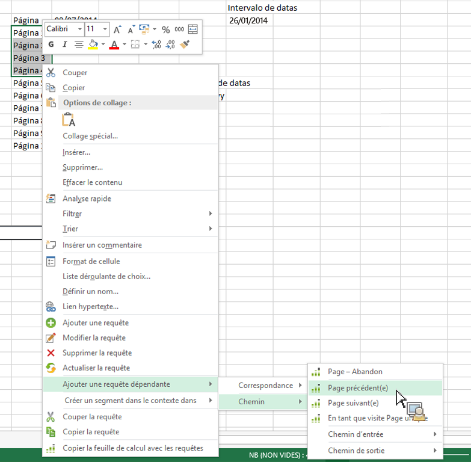

# Filtrage des rapports Chemin en ajoutant des requêtes dépendantes

Décrit comment créer des rapports Chemin avec des filtres prédéfinis.

Les Reports &amp; Analytics marketing proposent quelques rapports autonomes qui sont des rapports Chemin supérieurs avec des filtres prédéfinis, tels que les rapports [!UICONTROL Section de site suivante] et [!UICONTROL précédente], [!UICONTROL Section d’accès au site et de sortie du site] et le rapport [!UICONTROL Section de site unique].

Le Report Builder ne propose pas ces rapports de manière autonome, mais vous pouvez les créer par l’intermédiaire des menus contextuels **[!UICONTROL Ajouter une requête dépendante]** > **[!UICONTROL Chemin]**. Les rapports suivants sont disponibles :

* Chemin > Page - Abandon
* Chemin > Chemin d’accès
* Chemin > Chemin de sortie
* Chemin > Page suivante
* Chemin > Chemin d’accès > Page suivante
* Chemin > Page précédente
* Chemin > Chemin de sortie > Page précédente
* Chemin > Chemin d’accès > En tant que page d’entrée
* Chemin > Chemin de sortie > En tant que page de sortie

1. Sélectionnez plusieurs lignes à partir d’une requête existante, puis cliquez avec le bouton droit sur **[!UICONTROL Ajouter une requête dépendante]** > **[!UICONTROL Chemin]**. Vous devez sélectionner au moins trois lignes si vous souhaitez afficher le **[!UICONTROL Abandon de page]** de menu.

   

2. Sélectionnez le filtre prédéfini, par exemple **[!UICONTROL Page précédente]**.

   L’Assistant Requête s’affiche, avec la mesure Page précédente déjà sélectionnée. 1. Continuez à préciser votre requête dans l’Assistant Requête avant de la générer.
