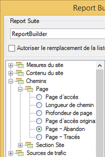
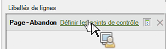

# Filtrage d’un rapport sur les abandons à l’aide de l’Assistant Requête

Décrit les étapes d’application de filtres à un rapport Abandon.

Cet exemple affiche le rapport Page - Abandon.

1. In Adobe Report Builder, click **[!UICONTROL Create]** to open the Request Wizard.
1. Sélectionnez la suite de rapports appropriée.
1. Dans le de l’arborescence de gauche, sélectionnez **[!UICONTROL Paths]** > **[!UICONTROL Page]** > **[!UICONTROL Page Fallout]**.

   

1. Configurez les [plages de dates](/help/analyze/report-builder/data-requests/configuring-report-dates/custom-calendar.md) appropriées.
1. Cliquez sur **[!UICONTROL Next]**.
1. À l’étape 2 de l’Assistant, sous **[!UICONTROL Row Labels]**, cliquez sur le **[!UICONTROL Define Checkpoints]** lien. (Dans un rapport d’abandon, vous devez toujours définir des éléments de chemin, à la différence d’un rapport de cheminement où un modèle est pré-appliqué.)

   

1. Sélectionnez l’option **[!UICONTROL Filter]**.

1. Dans la **[!UICONTROL Define Site Section Fallout Checkpoints]** boîte de dialogue, définissez des points de contrôle à partir d’une plage de cellules ou d’un . Ensuite, cliquez sur **[!UICONTROL OK]**.
1. Choisissez d’effectuer la sélection depuis une plage de cellules ou depuis une liste.
1. If you select from a list, click **[!UICONTROL Add]** to select checkpoints to add to the fallout path. Vous pouvez définir entre 3 et 8 points de contrôle. (Search for available elements by clicking **[!UICONTROL More]**.)

   Pour plus d’informations sur l’affinage du filtre, voir [Filtres de dimension](/help/analyze/report-builder/layout/c-filter-dimensions/filter-dimensions.md). 1. Move **[!UICONTROL Available Elements]** from the left column to the right by selecting them and clicking the orange arrow.
1. Click **[!UICONTROL OK]** three times, then click **[!UICONTROL Finish]**.

   Le rapport devrait à présent s’actualiser.
