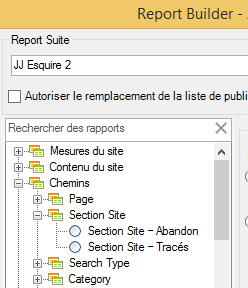
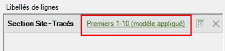
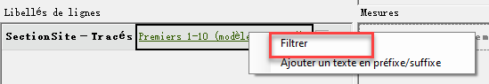
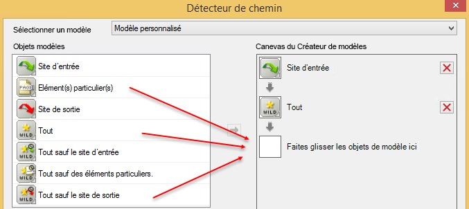
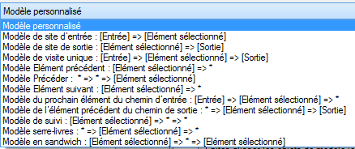
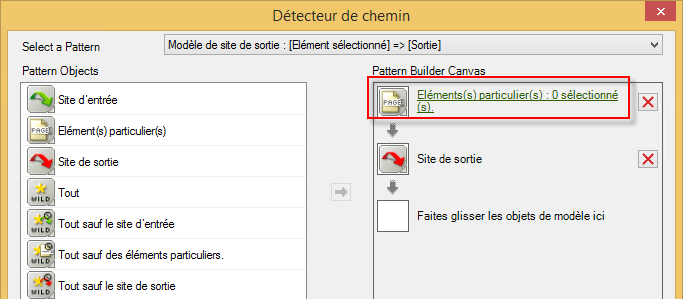
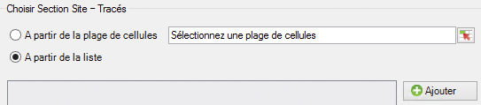
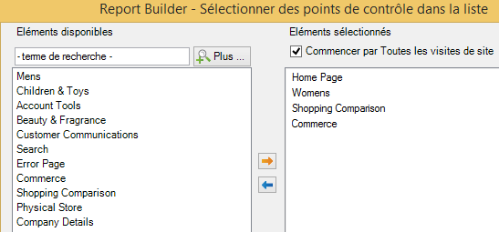

# Filtrage d’un rapport de cheminement à l’aide de l’Assistant Requête

Décrit les étapes d’application de filtres à un rapport de cheminement.

Cet exemple utilise Chemins &gt; Section Site.

1. In Adobe Report Builder, click **[!UICONTROL Create]** to open the Request Wizard.
1. Sélectionnez la suite de rapports appropriée.
1. In the tree view on the left, select **[!UICONTROL Paths]** &gt; **[!UICONTROL Site Sections]** &gt; **[!UICONTROL Site Section Paths]**.

   

1. Indiquez la ou les dates appropriée(s). 
1. Cliquez sur **[!UICONTROL Suivant]**.
1. In Step 2 of the Wizard, under **[!UICONTROL Row Labels]**, click the **[!UICONTROL Top 1-10 (pattern applied)]** link. Dans un rapport de cheminement, un modèle est appliqué par défaut.

   

1. Select the **[!UICONTROL Filter]** option.

   

1. In the **[!UICONTROL Define 'Site Section Paths' Path Pattern]** dialog, you can specify
   1. l’ordre de classement de début du premier rapport ; 
   1. le nombre d’entrées que vous souhaitez afficher dans ce rapport.
1. Click **[!UICONTROL Edit]** to define a path pattern.
1. If you want a custom pattern, drag and drop any **[!UICONTROL Pattern Objects]** from the list on the left into the **[!UICONTROL Pattern Build Canvas]** on the right.

   

1. You can also select a predefined pattern from the **[!UICONTROL Select a Pattern]** drop-down list and modify it. Vous trouverez ci-dessous les motifs disponibles : 

   

   Certains de ces motifs sont spécifiques au Créateur de rapports : Modèle Élément suivant du chemin d’entrée, Modèle Élément précédent du chemin de sortie, Modèle Élément suivant.
1. Pour modifier un modèle prédéfini,
   1. sélectionnez-le. For example, select the **[!UICONTROL Exited Site Pattern]**: 

   1. Maintenant, vous devez définir le chemin de la section du site que l’utilisateur suit avant de sortir. Click **[!UICONTROL Specific Item(s): 0 selected]**. Vous pouvez définir ce chemin en effectuant une sélection à partir d’une plage de cellules (si vous modifiez une requête existante) ou en effectuant une sélection depuis une liste de sections.
   1. To select from a range of cells from a previous request, select **[!UICONTROL From range of cells]** and click the cell selector icon. Puis, sélectionnez les cellules depuis le rapport. 

   1. To select from a list of site sections, select **[!UICONTROL From list]** and click **[!UICONTROL Add]**.
   1. Move elements from the **[!UICONTROL Available Elements]** column to the **[!UICONTROL Selected Elements]** column by selecting them and clicking the orange arrow. Puis, cliquez sur **[!UICONTROL OK]**. 

   1. To save the pattern you just established, click **[!UICONTROL Save]**.
   1. Click **[!UICONTROL OK]** three times and then click **[!UICONTROL Finish]**. La requête de chemin filtrée est à présent générée.
