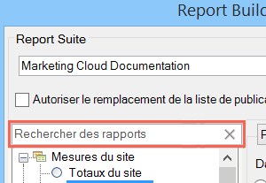

# Types de rapports - Aperçu

Vous pouvez sélectionner le type de rapport de base à affecter à votre requête de données, tel que Mesures du site, Contenu du site ou encore Vidéo.

Vous ne pouvez choisir qu’un seul type de rapport de base pour une plage de cellules de feuille de calcul. Si vous modifiez une requête créée précédemment, vous pouvez modifier le type de rapport sur la page [!UICONTROL Assistant Requête : Étape 1] sans reconfigurer d’autres paramètres dans la requête.

Vous pouvez rechercher des rapports à l’aide de la barre de recherche à saisie semi-automatique. Après avoir sélectionné un rapport à partir de ce contrôle, l’arborescence sélectionne automatiquement le noeud correspondant.

