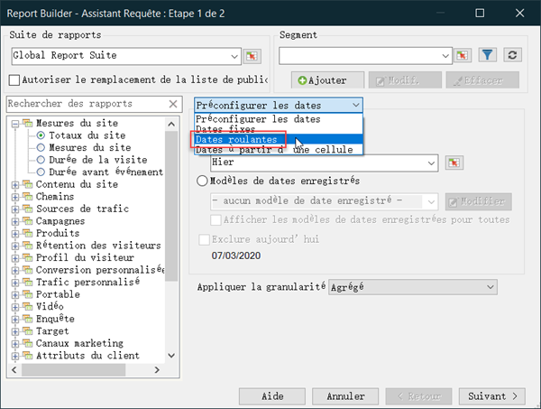
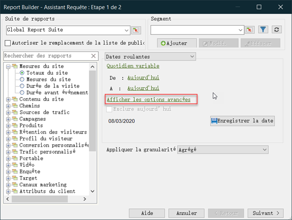
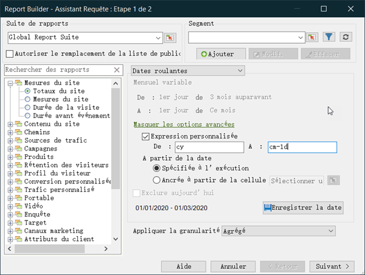
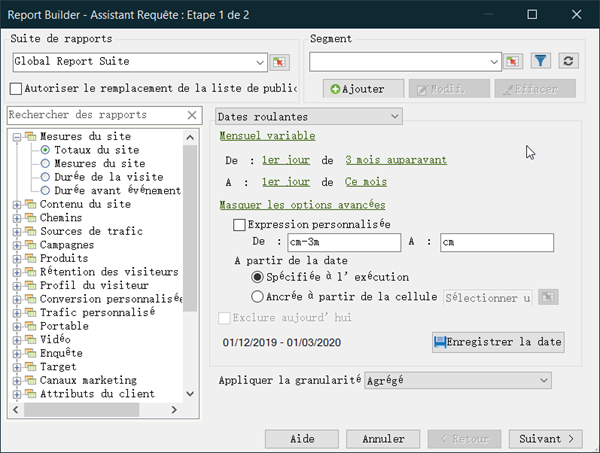

# Expressions de dates personnalisées - Aperçu

Vous pouvez préciser une période complexe en créant une expression personnalisée.

Pour ce faire, il est recommandé de se référer à un calendrier afin que le nombre de semaines et de jours soit correct. Excel est doté de plusieurs fonctions intégrées qui permettent de calculer le nombre de jours, de jours ouvrables, de mois et d’années entre les dates. Vous pouvez appliquer ces fonctions dans des formules afin de calculer d’autres intervalles, tels que des semaines et des trimestres.

**Pour activer des expressions personnalisées**

1. Sur la [!UICONTROL Request Wizard: Step 1]page, au lieu d’utiliser &quot;Préconfigurer les dates&quot;, sélectionnez **[!UICONTROL Rolling Dates]**. Remarquez comment les options ci-dessous changent.

   

1. Passez à hebdomadaire, mensuel, trimestriel ou annuel variable.
1. Pour plus d’options de personnalisation, cliquez sur **[!UICONTROL Show Advanced Options]**. En sélectionnant des options dans la section supérieure, vous pouvez facilement voir la syntaxe des expressions de date personnalisées.

   

1. Activer **[!UICONTROL Customize Expression]**. En sélectionnant des options sous **[!UICONTROL Rolling Dates]**, vous pouvez facilement voir la syntaxe des expressions de date personnalisées.

   

   Vous pouvez utiliser les options avancées pour combiner et faire correspondre des expressions de date personnalisées. Par exemple, si vous souhaitez afficher les données du premier de l’année jusqu’à la fin du dernier mois complet, vous pouvez écrire ce qui suit :De : cy To : cm-1d. Vous pouvez voir que dans l’assistant, il confirme ces dates comme étant du 1/1/2020-1/31/2020.

   Par exemple, si vous modifiez les dates ci-dessus en mois variable, du premier jour il y a trois mois au premier jour du mois, les dates dans la partie Options avancées se mettent à jour pour refléter ce qui suit :

   

