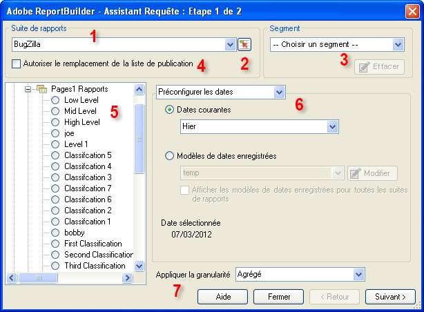

# Requêtes de données - Assistant Requête : Étape 1

Le formulaire Assistant Requête : Étape 1 vous permet de sélectionner la suite de rapports, le type de rapport, des segments, ainsi que de configurer des dates.

1. **[!UICONTROL Suite de rapports]** : liste des suites de rapports mises à votre disposition sur la base des vos identifiants de connexion. Voir [Sélectionner des suites de rapports](/help/analyze/report-builder/data-requests/selecting-report-suites/t-select-report-suites.md).

1. **Sélecteur de plage** : permet de sélectionner un identifiant de suite de rapports à partir d’une cellule dans Excel. Voir [Sélectionner des suites de rapports](/help/analyze/report-builder/data-requests/selecting-report-suites/t-select-report-suites.md).

1. **Segment** : les segments sont des sous-ensembles personnalisés de données ou des données filtrées selon des règles que vous créez. Les segments dépendent des accès, des visites et des visiteurs. Pour plus d’informations sur les segments, voir le [guide de segmentation d’Analytics](https://experienceleague.adobe.com/docs/analytics/components/segmentation/seg-home.html?lang=fr).

   Vous pouvez, par exemple, exécuter un [!UICONTROL rapport Pages], puis appliquer un segment Premières visites.

1. **Autorisation du remplacement de la liste de publication**: les listes de publication étaient une fonctionnalité de Reports &amp; Analytics, qui a été [fin de vie](https://new.express.adobe.com/webpage/WFCyq7w8kijmB?).

1. **Type de rapport** : indique le rapport de base à exécuter dans votre requête de données. Un seul rapport est exécuté par requête. Ce rapport peut contenir des dimensions et des mesures de type « un à plusieurs ». Les mesures et dimensions affectées à un type de rapport sont affichées dans l’interface [!UICONTROL Assistant Requête : Étape 2]. Voir [Sélection des types de rapports](/help/analyze/report-builder/data-requests/c-report-types/select-report-types.md).

1. **Périodes** : cette option définit la période couverte par la requête. Il existe plusieurs types de périodes de requête, telles que « prédéfinies », « fixes » et « variables ». Il ne peut pas y avoir plus de 366 périodes. Vous pouvez également choisir une période spécifiée par une cellule et enregistrer des périodes en tant que modèles en vue d’une utilisation ultérieure.  Voir [Configuration des dates des rapports](/help/analyze/report-builder/data-requests/configuring-report-dates/custom-calendar.md).

1. **Appliquer la granularité** : la granularité définit le niveau des détails temporels inclus dans le rapport. Voir [Granularité](/help/analyze/report-builder/data-requests/configuring-report-dates/granularity.md).

## Résolution des problèmes

Il arrive que l’Assistant Requête s’affiche hors de l’écran, en particulier pour les utilisateurs qui passent d’une configuration de moniteur à une autre. Par exemple, si vous utilisez une station d’accueil au travail et votre écran d’ordinateur portable à la maison. Si vous cliquez de nouveau sur « Créer » alors qu’un Assistant Requête est déjà ouvert, vous obtenez l’erreur suivante :

« Vous devez terminer le processus Assistant Requête avant d’en commencer un nouveau. »

Il suffit de ramener l’Assistant Requête à l’écran pour résoudre ce problème.

1. Ouvrez Microsoft Excel et connectez-vous à Report Builder.
2. Cliquez sur [!UICONTROL Créer], ce qui ouvre l’Assistant Requête hors de l’écran.
3. Appuyez sur `[Alt]` + `[Space]`.
4. Appuyez sur `[M]`.
5. Appuyez sur l’une des touches fléchées.
6. Déplacez votre souris, ce qui permet de fixer l’Assistant Requête à votre curseur.
7. Cliquez sur la souris pour relâcher l’Assistant Requête sur l’écran.
