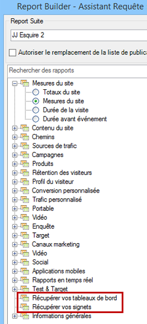

# Importation de rapports marqués d’un signet et de mini-rapports de tableau de bord

Tous les rapports mis en signet et de tableau de bord sont désormais répertoriés en tant que dimensions à l’étape 1 de l’Assistant Requête et peuvent être importés en tant que requêtes de Report Builder.

Lorsque vous sélectionnez un rapport mis en signet, l’Assistant Requête remplit toutes les dimensions et mesures qui définissent ce rapport mis en signet. La période, la granularité et le segment sélectionné sont également mis à jour selon le signet choisi..

Voici la façon dont l’étape 1 de l’Assistant Requête présente un tableau de bord et ses mini-rapports :

Lorsque vous cliquez sur **[!UICONTROL Récupérer vos tableaux de bord]** ou **[!UICONTROL Récupérer vos signets]**, les données des tableaux de bord et signets existants sont récupérées et collées dans la feuille de calcul.

>[!NOTE]
>
>Dans Report Builder, la liste des tableaux de bord et signets disponibles est limitée à l’utilisateur, mais aussi aux tableaux de bord et signets qui s’appliquent à la suite de rapports sélectionnée à la première étape de l’assistant. Par comparaison, dans Reports &amp; Analytics, vous avez accès à tous les signets et tableaux de bord à votre disposition, quelles que soient les suites de rapports utilisées dans ces tableaux de bord et signets.

>[!NOTE]
>
>Seules les données sont importées. En conséquence, si le signet comporte un graphique, ou si le petit rapport de tableau de bord n’est composé que d’un seul graphique, seules les données utilisées pour remplir le graphique sont importées.

Une fois que vous avez créé une requête en important un mini-rapport de tableau de bord (ou un signet), la requête est alors associée à la dimension principale du mini-rapport (ou signet). En conséquence, si vous modifiez la requête, l’arborescence ne sélectionne plus le nœud d’arborescence du mini-rapport de tableau de bord (ou nœud du signet) mais la dimension principale.

Le signet d’applet importé va définir correctement la suite de rapports, le segment sélectionné, la dimension et les mesures sélectionnées sur les mêmes paramètres que ceux du signet des Reports &amp; Analytics.

>[!IMPORTANT]
>
>La période est définie sur la même période mais sous la forme d’une période statique, même si cette période était une période variable dans le signet des Reports &amp; Analytics.
