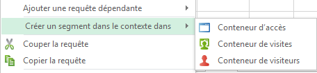
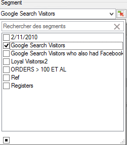
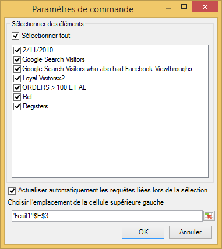
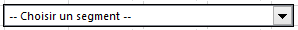
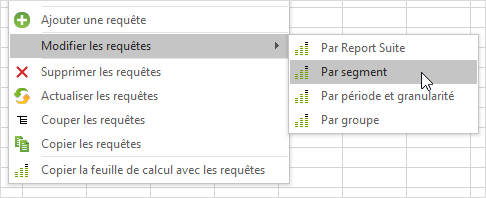

# Gestion des segments

Comment ajouter, modifier, appliquer et filtrer des segments Adobe Analytics dans le Report Builder.

Le Report Builder inclut un panneau de segmentation à l’étape 1 de l’Assistant Requête qui permet de créer et gérer des segments.

## Ajouter ou modifier des segments {#section_B2BC136F9A53498D90C7C2ECC5DB892B}

> [!NOTE] Pour ajouter ou modifier des segments, l’interface de segments du Report Builder lance le Créateur de segments d’Analytics dans une fenêtre Microsoft Internet Explorer. Votre session de Créateur de rapports reste active. Les navigateurs autres qu’Internet Explorer ne sont pas pris en charge pour cette opération.

1. Dans le panneau des segments de l’étape 1 de l’Assistant Requête, cliquez sur **[!UICONTROL Ajouter]**.
1. Une fenêtre Internet Explorer se lance et ouvre l’interface du Créateur de segment d’Analytics. Pour plus d’informations sur la création de segments, consultez la page [https://marketing.adobe.com/resources/help/fr_FR/analytics/segment/](https://marketing.adobe.com/resources/help/fr_FR/analytics/segment/).
1. Une fois le segment défini et enregistré, retournez à l’Assistant Requête.
1. Cliquez sur l’icône Actualiser afin d’actualiser la liste des segments.

>[!IMPORTANT]
>
>Cette liste est placée en mémoire cache ; le segment nouvellement créé s’affichera uniquement si vous actualisez la page.

## Créer des segments dans le contexte {#section_6DD2C663B2854469AA1075438F907678}

Vous souhaitez peut-être transformer en segments des associations spécifiques de dimensions de rapport. Vous pouvez créer ces segments depuis l’interface du Report Builder. Par exemple, sélectionnez quelques pages depuis une sortie de la requête Page et créez un segment basé sur ces valeurs.

1. Sélectionnez les éléments de sortie du rapport que vous souhaitez transformer en segment.
1. Cliquez avec le bouton droit pour sélectionner **[!UICONTROL Créer un segment dans le contexte dans]** et indiquez le conteneur approprié (Conteneur d’accès, Conteneur de visites, Conteneur de visiteurs).

   

   Pour plus d’informations sur les conteneurs, voir le [Guide de segmentation](https://marketing.adobe.com/resources/help/fr_FR/analytics/segment/).

1. L’interface utilisateur du Créateur de segments est à présent lancée dans Internet Explorer. Elle est initialisée avec le conteneur et le filtre que vous avez indiqués.
1. Une fois que vous avez ajouté un nom et une description au segment, enregistrez-le.
1. Revenez au Créateur de rapports et cliquez sur l’icône Actualiser pour actualiser la liste de segments.
1. Vous êtes à présent prêt à appliquer ce segment.

## Recherche et application de segments {#section_CACA269B48E94CFD91C2D5A15E9C77B7}

Chaque segment créé dans les Reports &amp; Analytics, dans Ad Hoc Analysis, dans Report Builder ou dans Data Warehouse est répertorié dans cette liste de segments. Pour actualiser la liste, cliquez sur l’icône Actualiser ( .

Vous pouvez appliquer un ou plusieurs segments à toute requête donnée. Cela inclut les segments séquentiels.

1. Accédez à la liste déroulante **[!UICONTROL Segment]** et cliquez sur la petite flèche vers le bas dans la zone **[!UICONTROL Rechercher des segments]** afin d’afficher tous les segments.

   

1. Cochez le ou les segments que vous souhaitez appliquer.

> [!NOTE] Dans le Report Builder, que vous soyez administrateur ou non, vous ne pouvez consulter que les segments que vous possédez et ceux qui ont été partagés avec vous. (Dans l’interface utilisateur de Reports &amp; Analytics marketing, l’administrateur peut consulter tous les segments de l’entreprise.)

## Filtrage des segments {#section_376E986D3E684999A7CDB08E53854159}

**Filtrez** les segments en cliquant sur l’icône Filtrer : 

Les filtres disponibles incluent :

| Nom du filtre | Description |
|---|---|
| Balises | Permet de filtrer les segments selon des balises spécifiques balises. Notez que les filtres de type balise utilisent l’opérateur ET. Si vous cochez deux balises, le panneau de droite affiche les segments qui ont été marqués avec **les deux** balises. |
| Propriétaires | Permet de filtrer les segments par propriétaire. Notez que les filtres de type propriétaire utilisent l’opérateur OU. Si vous cochez deux propriétaires, le panneau de droite affiche les segments qui sont possédés par **l’un** des propriétaires. |
| Autres filtres > Uniquement *le nom de la suite de rapports* | Si vous appliquez le filtre « Uniquement *le nom de la suite de rapports* » dans le Créateur de segments dans [!DNL marketing reports & analytics], puis affichez le filtre avancé dans [!DNL report builder], le filtre avancé affiche uniquement le segment correspondant à la suite de rapports sélectionnée. |
| Autres filtres > À moi | Affiche tous les segments que vous possédez. |
| Autres filtres > Partagés avec moi | Affiche tous les segments que d’autres ont partagé avec vous. |
| Autres filtres > Favoris | Affiche tous les segments que vous avez marqués comme Favoris. |
| Autres filtres > Approuvés | Affiche toutes les mesures approuvés. |

## Ajouter un contrôle de segments à un classeur {#section_E3E5149A8464441FA5445A98DBD520AC}

L’ajout d’un contrôle de segments vous permet de basculer entre les segments dans un classeur au lieu d’avoir à accéder à l’Assistant Requête.

1. Cliquez sur l’icône de contrôle  en regard de la liste déroulante de segments.

   

1. Cochez tous les segments que vous souhaitez inclure dans le contrôle de segments ou bien, cochez **[!UICONTROL Sélectionner tout]**.
1. Notez l’option permettant d’**[!UICONTROL Actualiser automatiquement les requêtes liées lors de la sélection]**.

   * Si cette case est cochée, toutes les requêtes qui utilisent ce contrôle sont actualisées.
   * Si elle n’est pas cochée, les paramètres de requête associés sont mis à jour mais les requêtes ne sont pas actualisées.

1. Spécifiez l’emplacement de la cellule supérieure gauche du contrôle de segments.
1. Cliquez sur **[!UICONTROL OK]** et le contrôle de segments apparaît à l’emplacement indiqué.

   

## Actualisation de la liste de segments {#section_22E4A86789444B4A998532396B476EFB}

Chaque fois que vous ajoutez un nouveau segment ou en modifiez un existant, vous devez cliquer sur l’icône Actualiser ( afin d’actualiser la liste mise en cache de segments.

## Gérer les segments à travers les requêtes {#section_C3D63FCBE1A94369A319243313B03C93}

Avant la version 5.4, les utilisateurs pouvaient modifier les segments pour plusieurs demandes dans le Report Builder. Toutefois, ce processus remplaçait systématiquement les segments existants. Les utilisateurs qui souhaitaient ajouter un nouveau segment à chaque demande ne pouvaient pas le faire, puisque l’ajout du segment supprimait le jeu précédent de segments déjà affectés à chaque demande.

Dans la version 5.4 du Report Builder, vous pouvez ajouter, supprimer et remplacer un ou tous les segments dans plusieurs demandes :

1. Sélectionnez plusieurs demandes dans un classeur.
1. Cliquez avec le bouton droit de la souris, puis sélectionnez **[!UICONTROL Modifier les requêtes]** > **[!UICONTROL Par segment]**.

   

1. Dans la boîte de dialogue Modifier le groupe, sélectionnez l’une des quatre options suivantes :

   | Option | Description |
   |---|---|
   | Ajouter Segment | Vous permet de choisir un ou plusieurs segments à ajouter à la liste du ou des segments actifs. |
   | Remplacer les segments | Vous permet de choisir quel(s) segment(s) remplacer par un ou plusieurs segments. |
   | Remplacer tous les segments par | Vous permet de choisir un ou plusieurs segments à remplacer par le ou les segments actifs. |
   | Supprimer les segments | Vous permet de supprimer les segments des demandes. |

