# Filtrage des dimensions

Par défaut, chaque élément de dimension du tableau renvoie les 10 premiers éléments de cette dimension.

Pour modifier les éléments de dimension renvoyés pour chaque dimension :

1. Sélectionnez une cellule dans le bloc de données.

1. Sélectionnez  **[!UICONTROL Modifier le bloc de données]** dans le panneau **[!UICONTROL Commandes]**.

1. Sélectionnez **[!UICONTROL Suivant]** pour afficher l’onglet **[!UICONTROL Dimensions]**.

1. Sélectionnez  en regard d’un nom de composant dans le tableau.

   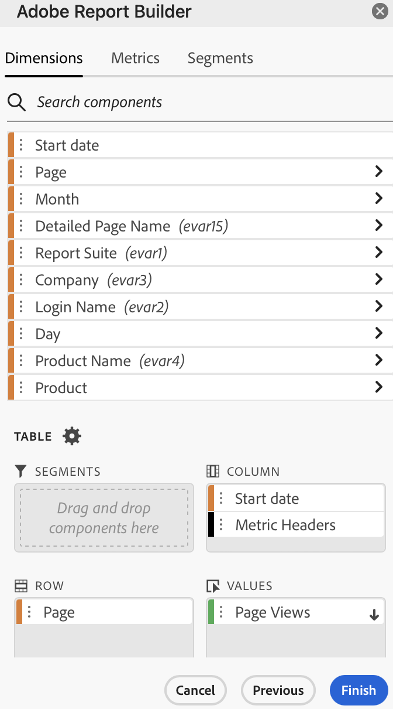{zoomable="yes"}

1. Sélectionnez **[!UICONTROL Filtrer la dimension]** dans le menu pop-up pour afficher le volet **[!UICONTROL Filtrer la dimension]**.

1. Sélectionnez **Les plus populaires** ou **Spécifique** comme **[!UICONTROL Type]**.

   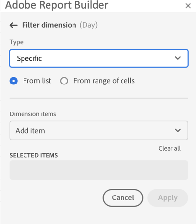{zoomable="yes"}

1. Sélectionnez les options appropriées en fonction du [type de filtre](#filter-type) choisi.

1. Sélectionnez **[!UICONTROL Appliquer]** pour ajouter le filtre.

1. Report Builder affiche une notification pour confirmer le filtre ajouté.

Pour afficher les filtres appliqués, passez la souris sur une dimension. Les dimensions avec des filtres appliqués affichent une icône de filtre  en regard du nom de la dimension.

## Modification du filtre et de l’ordre de tri

Un  ou  s’affiche en regard de la mesure utilisée pour filtrer et trier le bloc de données. La direction de la flèche indique si la mesure est triée par ordre croissant ou décroissant.

Pour modifier l’ordre de tri :

- Sélectionnez  ou  en regard de la mesure pour activer/désactiver l’ordre de tri.

Pour modifier la mesure utilisée pour filtrer et trier le bloc de données :

1. Passez la souris sur le composant de mesure souhaité dans le générateur de tableau pour afficher d’autres options.

2. Sélectionnez  pour la mesure souhaitée.

   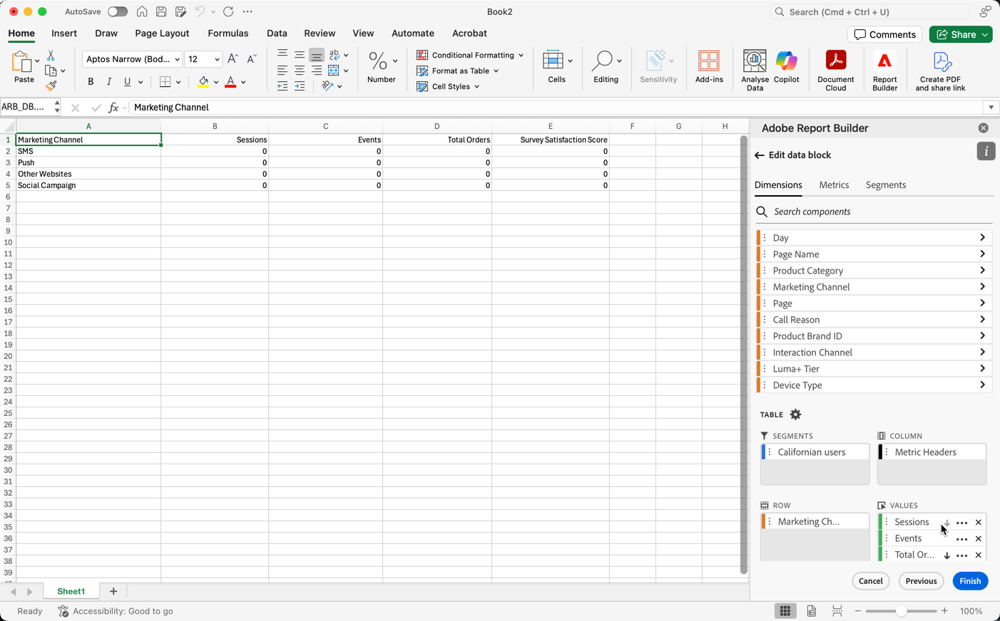{zoomable="yes"}

## Type de filtre

Il existe deux façons de filtrer les éléments de dimension : [Les plus populaires](#most-popular) et [Spécifique](#specific-filtering)

### **[!UICONTROL Les plus populaires]**

L’option **[!UICONTROL Les plus populaires]** vous permet de filtrer les éléments de dimension de manière dynamique en fonction de valeurs de mesure. La plus populaire renvoie les éléments de dimension avec le meilleur classement en fonction des valeurs de mesure. Par défaut, les 10 premiers éléments de dimension sont répertoriés. Ils sont triés en fonction de la première mesure ajoutée au bloc de données.

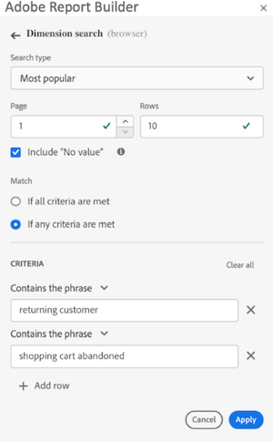{zoomable="yes"}

#### Options Page et Lignes

Utilisez les champs **[!UICONTROL Page]** et **[!UICONTROL Lignes]** pour diviser les données en groupes ou pages séquentiel(le)s. Cette fonctionnalité vous permet d’extraire dans votre rapport des valeurs de ligne autres que les valeurs les mieux classées. Et est particulièrement utile pour extraire des données au-delà de la limite de 50 000 lignes.

La valeur par défaut pour Page est `1` et pour Lignes est `10`. Ces valeurs par défaut impliquent que chaque page comporte 10 lignes de données. La page 1 renvoie les 10 premiers éléments, la page 2 renvoie les 10 éléments suivants, etc.

Le tableau ci-dessous répertorie des exemples de valeurs de page et de lignes, ainsi que la sortie qui en résulte.

| Page | Ligne | Sortie |
|------|--------|----------------------|
| 1 | 10 | 10 premiers éléments |
| 2 | 10 | Éléments 11 à 20 |
| 1 | 100 | 100 premiers éléments |
| 2 | 100 | Éléments 101 à 200 |
| 2 | 50 000 | Éléments 50 001 à 100 000 |

Le tableau ci-dessous répertorie les valeurs minimales et maximales pour la page et les lignes.

|       | Valeurs minimales | Valeurs maximales |
|-------|---------------:|---------------:|
| Page de démarrage | 1 | 50 million |
| Nombre de lignes | 1 | 50 000 |

#### Inclure « Aucune valeur »

Dans Customer Journey Analytics, certaines dimensions collectent une entrée *Aucune valeur*. Le paramètre **[!UICONTROL Inclure « Aucune valeur »]** vous permet d’exclure ces valeurs des rapports. Par exemple, vous pouvez créer une classification telle que la classification Nom du produit en fonction de la clé SKU du produit. Si un SKU de produit spécifique n’a pas été configuré avec sa classification de nom de produit spécifique, sa valeur de nom de produit est définie sur *Aucune valeur*.

**[!UICONTROL Inclure « Aucune valeur »]** est sélectionné par défaut. Désélectionnez cette option pour exclure les entrées sans valeur.

#### Filtrage par critères

Vous pouvez filtrer les éléments de dimension en fonction du respect de tous les critères ou du respect d’au moins l’un d’entre eux.

Pour définir des critères de filtrage :

1. Sélectionnez un opérateur ou une opératrice dans le menu déroulant des opérateurs. Par défaut **[!UICONTROL Contient l’expression]** est sélectionné

   {zoomable="yes"}

1. Saisissez un terme de recherche.

1. Sélectionnez  **[!UICONTROL Ajouter une ligne]** pour confirmer la sélection et ajouter un autre élément de critère.

1. Sélectionnez  pour supprimer un élément de critère.

Vous pouvez inclure jusqu’à 10 éléments de critère.

### **[!UICONTROL spécifique]**

L’option **[!UICONTROL Spécifique]** vous permet de créer une liste fixe d’éléments de dimension pour chaque dimension. Utilisez le type de filtrage **[!UICONTROL Spécifique]** pour spécifier les éléments de dimension exacts à inclure dans votre filtre. Vous pouvez sélectionner des éléments dans une liste ou dans une plage de cellules.

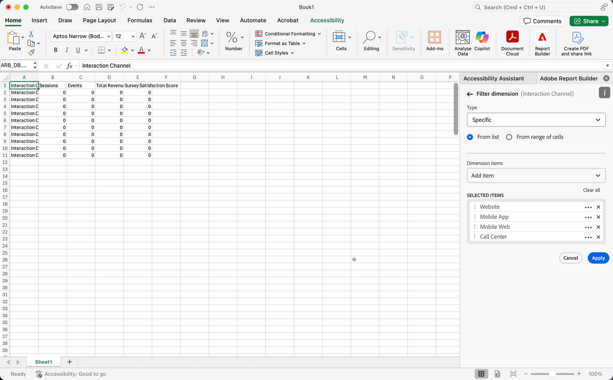{zoomable="yes"}

#### À partir de la liste

1. Sélectionnez l’option **[!UICONTROL À partir de la liste]** pour rechercher et sélectionner des éléments de dimension.

   Lorsque vous sélectionnez l’option **À partir de la liste**, la liste **[!UICONTROL Éléments de Dimension]** est renseignée avec des éléments de dimension triés par nombre d’événements.

   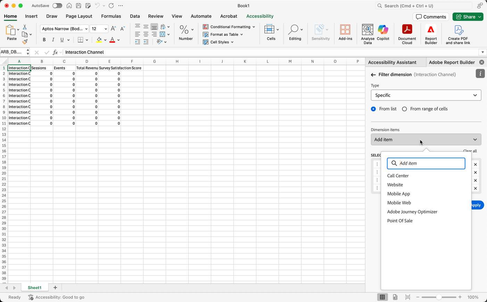{zoomable="yes"}

1. Saisissez un terme de recherche dans le champ  **[!UICONTROL _Ajouter un élément_]** pour effectuer une recherche dans la liste.

1. Pour rechercher un élément non inclus dans les 90 derniers jours de données, sélectionnez **[!UICONTROL Afficher les éléments des 6 derniers mois]** afin d’étendre la recherche. Une fois les données des 6 derniers mois chargées, Report Builder met à jour le lien vers **[!UICONTROL Afficher les éléments des 18 derniers mois]**.

1. Pour supprimer un élément de la liste **[!UICONTROL Éléments sélectionnés]**, sélectionnez .

1. Pour déplacer un élément dans la liste **[!UICONTROL Éléments sélectionnés]**, faites glisser et déposez l’élément ou sélectionnez  pour afficher le menu contextuel et sélectionnez l’une des options de déplacement.

1. Sélectionnez **[!UICONTROL Appliquer]**.

Report Builder met à jour la liste pour afficher le filtrage spécifique appliqué.

#### À partir de la plage de cellules

Sélectionnez l’option **À partir de la plage de cellules** pour choisir une plage de cellules contenant la liste des éléments de dimension à faire correspondre.

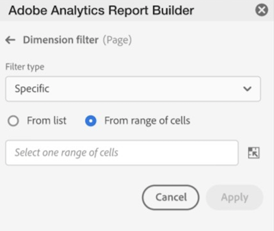{zoomable="yes"}

Lorsque vous sélectionnez une plage de cellules, tenez compte des restrictions suivantes :

- La plage doit comporter au moins une cellule.
- La plage ne peut pas contenir plus de 50 000 cellules.
- La plage doit se trouver dans une seule ligne ou colonne ininterrompue.

Votre sélection peut contenir des cellules vides ou des cellules avec des valeurs qui ne correspondent pas à un élément de dimension spécifique.

### Filtrer rapidement une dimension

Pour filtrer une dimension pour laquelle aucun filtre n’est actuellement appliqué :

1. Sélectionnez  pour une dimension. Par exemple, **[!UICONTROL canal Interaction]**.

1. Sélectionnez deux fois un élément de dimension à ajouter au filtre. Vous pouvez également sélectionner un ou plusieurs éléments de dimension et faire glisser et déposer la sélection dans la section  **[!UICONTROL Row]**.

   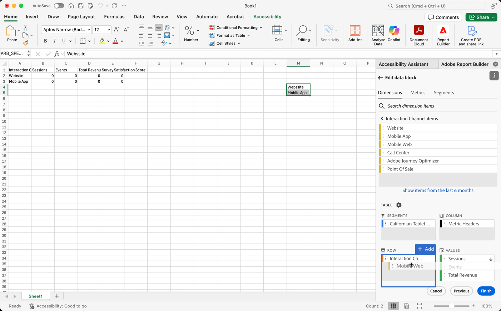{zoomable="yes"}

<!--

By default, each dimension item in the table returns the top 10 items for that dimension.

To change the dimension items returned for each dimension

1. Click **[!UICONTROL Manage]** and select a data block from the list.

   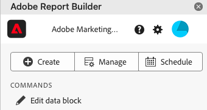

1. Click **[!UICONTROL Edit data block]** in the COMMANDS panel.

1. Click **[!UICONTROL Next]** to display the Dimensions tab.

1. Click the **...** icon next to a component name in the table.

    

1. Select **[!UICONTROL Filter dimension]** in the pop-up menu to display the **[!UICONTROL Filter dimension]** pane.

1. Select **[!UICONTROL Most popular]** or **[!UICONTROL Specific]**.

    

1. Select appropriate options based on the filter type chosen.

1. Click **[!UICONTROL Apply]** to add the filter.

    Report Builder displays a notification to confirm the added filter.

To display applied filters, hover over a dimension. Dimensions with applied filters display a filter icon to the right of the Dimension name.

## Filter Type

There are two ways to filter dimension items: Most popular and Specific.

## Most popular

The [!UICONTROL Most popular] option allows you to dynamically filter dimension items based on metric values. [!UICONTROL Most popular] filtering returns the highest ranked dimension items based on metric values. By default, the first 10 dimensions items are listed, sorted by the first metric added to the data block.

 

### Page and Rows options

Use the **Page** and **Rows** fields to divide data into sequential groups or pages. This allows you to pull ranked row values other than the top-most values into your report. This feature is especially useful for pulling data beyond the 50,000 row limit.

#### Page and Rows defaults

- Page = 1
- Rows = 10

The Page and Rows default settings identify that each page has 10 rows of data. Page 1 returns the top 10 items, page 2 returns the next 10 items, and so on.

The table below lists examples of page and row values and the resulting output.

| Page | Row    | Output               |
|------|--------|----------------------|
| 1    | 10     | Top 10 items         |
| 2    | 10     | Items 11-20          |
| 1    | 100    | Top 100 items        |
| 2    | 100    | Items 101-200        |
| 2    | 50,000 | Items 50,001-100,000 |

#### Minimum and maximum values

- Starting page: Min = 1, Max: 50 million
- Number of rows: Min = 1, Max: 50,000

### Include "No value"

In Adobe Analytics, some dimensions collect a "no value" entry. This filter allows you to exclude these values from reports. For example, you can create a classification such as the Product Name classification based on the Product SKU key. If a specific product SKU has not been set up with its specific Product Name classification, its Product Name value is set to "no value".

Include "**No value**" is selected by default. Deselect this option to exclude entries with no value.

### Filter by Criteria

You can filter dimension items based on whether all criteria are met or if any criteria are met.

To set filtering criteria

1. Select an operator from the drop-down list.

    

1. Enter a value into the search field.

1. Click **[!UICONTROL Add row]** to confirm the selection and add another criteria item.

1. Click the delete icon to remove a criteria item.

    You can include up to 10 criteria items.

### Change the filter and sort order

An arrow appears next to the metric used to filter and sort the data block. The direction of the arrow indicates whether the metric is sorted greatest to least or least to greatest.

To change the sort direction, click the arrow next to the metric.

To change the metric used to filter and sort the data block,

1. Hover over the desired metric component in the Table builder to display additional options.

2. Click the arrow on the preferred metric.

   

## Specific filtering

The Specific option allows you to create a fixed list of dimension items for each dimension. Use the **[!UICONTROL Specific]** filtering type to specify the exact dimension items to include in your filter. You can select items from a list or from a range of cells.

### From list

1. Select the **[!UICONTROL From list]** option to search for and select dimension items.

    When you select the **[!UICONTROL From list]** option, the list is populated with dimension items with the most events first.

    

    The **[!UICONTROL Available items]** list is ordered from dimension items with the most events to those with the least.

1. Enter a search term in the **[!UICONTROL Add item]** field to search the list.

1. To search for an item not included in the last 90 days of data, click **[!UICONTROL Show items for the last 6 months]** to extend the search.

    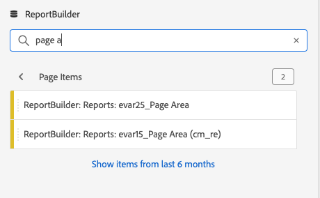

    After data from the past 6 months loads, Report Builder updates the link to **[!UICONTROL Show items for last 18 months]**.

1. Select a dimension item.

    Selected dimension items are automatically added to the **[!UICONTROL Selected items]** list.

    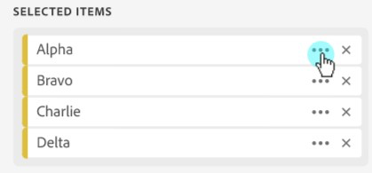

    To delete an item from the list, click the delete icon to remove the item from the list.

    To move an item in the list, drag and drop the item or click ... to display the move menu.

    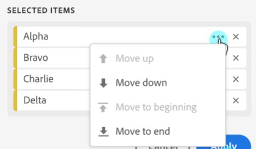

1. Click **[!UICONTROL Apply]**

    Report Builder updates the list to show the specific filtering you applied.

### From range of cells

Select the **[!UICONTROL From range of cells]** option to choose a range of cell that contain the list of dimensions items to match.

 

When you select a range of cells, consider the following restrictions:

- The range must have at least one cell.
- The range can't have more than 50,000 cells.
- The range must be in a single uninterrupted row, or column.

Your selection can contain empty cells or cells with values that don't match with a specific dimension item.

### From the Dimensions tab in the Table builder

From the **[!UICONTROL Dimensions]** tab, click the chevron icon next to a dimension name to view the list of dimension items.

 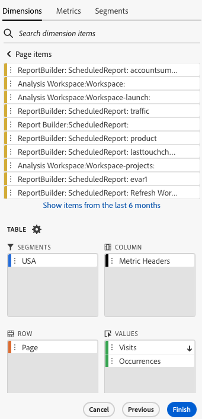

You can drag and drop items onto the **[!UICONTROL Table]** or double-click an item name to add it to the **[!UICONTROL Table]** builder.

-->