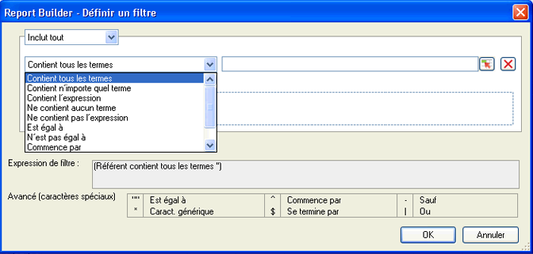

# Dimensions du filtre - Aperçu

Vous pouvez filtrer les dimensions que vous ajoutez à la grille Libellés de lignes. Les filtres permettent de limiter les données renvoyées par les requêtes. Ils peuvent être appliqués à partir des dispositions croisées dynamiques ou personnalisées. Lorsque vous configurez le filtrage des dimensions à partir de la Disposition croisée dynamique, vous pouvez, en outre, préciser le nombre d’entrées de la cellule.

Le formulaire Filtre sélectionné est renseigné selon l’élément et la mesure sélectionnés dans la requête du Créateur de rapports.

## Define filter - values and special characters {#section_15840216A4044C40974945FAA435AD93}

Information about filters in the **[!UICONTROL Most Popular Filter]** &gt; **[!UICONTROL Define Filter]** panel.

Les tableaux suivants contiennent des exemples et des informations sur les filtres :

<table id="table_8AC3A26FF02143DBA949B30F2A46CF11"> 
 <thead> 
  <tr> 
   <th colname="col1" class="entry"> Filtre </th> 
   <th colname="col02" class="entry"> Description </th> 
   <th colname="col2" class="entry"> Exemple de filtre </th> 
   <th colname="col3" class="entry"> Résultats de la correspondance </th> 
  </tr> 
 </thead>
 <tbody> 
  <tr> 
   <td colname="col1"> 
Contient tous les termes 
 </td> 
   <td colname="col02"> 
Contient tous les valeurs délimitées par des espaces dans n’importe quel ordre. 
 </td> 
   <td colname="col2"> 
a b c 
 </td> 
   <td colname="col3"> 
Correspond à  a bcand  b a c, etc. 
 </td> 
  </tr> 
  <tr> 
   <td colname="col1"> 
Contient n’importe quel terme 
 </td> 
   <td colname="col02"> 
Contient au moins l’un des filtres (délimités par des espaces). 
 </td> 
   <td colname="col2"> 
A B C 
 </td> 
   <td colname="col3"> 
Correspond à  A1,  B2,  C3, mais pas  D4. 
 </td> 
  </tr> 
  <tr> 
   <td colname="col1"> 
Contient l’expression 
 </td> 
   <td colname="col02"> 
Contient le filtre de recherche et éventuellement d’autres termes. 
 </td> 
   <td colname="col2"> 
abc 
 </td> 
   <td colname="col3"> 
Correspond à  abc et  abc def. 
 </td> 
  </tr> 
  <tr> 
   <td colname="col1"> 
Ne contient aucun terme 
 </td> 
   <td colname="col02"> 
Renvoie n’importe quel résultat, à moins que vous ne saisissiez une valeur. 
 </td> 
   <td colname="col2"> 
a b c 
 </td> 
   <td colname="col3"> 
Correspond à  d e f mais pas  c d e f. 
 </td> 
  </tr> 
  <tr> 
   <td colname="col1"> 
Ne contient pas l’expression 
 </td> 
   <td colname="col02"> 
Renvoie toutes les valeurs qui ne contiennent pas votre expression. 
 </td> 
   <td colname="col2"> 
abc 
 </td> 
   <td colname="col3"> 
Exclut  abc,  abc def et correspond  def 
 </td> 
  </tr> 
  <tr> 
   <td colname="col1"> 
Est égal à 
 </td> 
   <td colname="col02"> 
Renvoie une correspondance exacte. 
 </td> 
   <td colname="col2"> 
abc 
 </td> 
   <td colname="col3"> 
  abc est renvoyé, et rien d'autre. 
 </td> 
  </tr> 
  <tr> 
   <td colname="col1"> 
N’est pas égal à 
 </td> 
   <td colname="col02"> 
Renvoie n’importe quel résultat qui ne correspond pas exactement à votre saisie. 
 </td> 
   <td colname="col2"> 
a 
 </td> 
   <td colname="col3"> 
Ne correspond pas à  a. 
 
Matches  a b c. 
 
Correspond à  abc. 
 </td> 
  </tr> 
  <tr> 
   <td colname="col1"> 
Commence par 
 </td> 
   <td colname="col02"> 
Renvoie des résultats qui commencent par une valeur spécifique. 
 </td> 
   <td colname="col2"> 
abc 
 </td> 
   <td colname="col3"> 
Correspond à  abcd mais pas  1abc 
 </td> 
  </tr> 
  <tr> 
   <td colname="col1"> 
Se termine par 
 </td> 
   <td colname="col02"> 
Renvoie des résultats qui se terminent par une valeur spécifique. 
 </td> 
   <td colname="col2"> 
xyz 
 </td> 
   <td colname="col3"> 
Correspond à  wxyz mais pas  wxyz0 
 </td> 
  </tr> 
  <tr> 
   <td colname="col1"> 
Avancé (caractères spéciaux) 
 </td> 
   <td colname="col02"> 
Vous permet d’utiliser les caractères suivants : 
 
 <code> "", ^, -, *, $, | </code> 
 </td> 
   <td colname="col2"> 
"^Page*Accueil$" | sports 
 </td> 
   <td colname="col3"> 
 Cet exemple définit un filtre qui commence par  Home, and then looks for zero or more characters, and then ends with  Page. 
 
Aussi, n'importe quelle page comportant  du sport . 
 
Quelques exemples de correspondance : 
 
    <ul id="ul_72D76C5AFEAF405E8A0E4E3C604D10AE"> 
     <li id="li_4D490059B667450DA8A0103167C7B391">PageAccueil </li> 
     <li id="li_1351619156274092AEB2771D882AD357">Page et (autres caractères) Accueil </li> 
     <li id="li_940EAA99A8CF49308E8471065EB317B1">Page sports </li> 
     <li id="li_50A895F14A454BE9BF06EE0F07F99B3B">sports Accueil </li> 
     <li id="li_F3CE0D07941D4C2485D2DE0B73E00677">sports </li> 
     <li id="li_E84C15C061824A5D922D9900392F2996">xyz sports abc </li> 
    </ul> </td> 
  </tr> 
 </tbody> 
</table>

<table id="table_8BBB06C8860745DEA41B39673699DC0F"> 
 <thead> 
  <tr> 
   <th colname="col1" class="entry"> Caractères spéciaux </th> 
   <th colname="col2" class="entry"> Rôle </th> 
   <th colname="col3" class="entry"> Remarques </th> 
  </tr> 
 </thead>
 <tbody> 
  <tr> 
   <td colname="col1"> " " </td> 
   <td colname="col2"> Est égal à </td> 
   <td colname="col3"> 
N’est pas ignoré sauf s’il n’est pas accompagné d’un autre guillemet double. Par exemple : L’affichage  de 17 pouces n’est pas une expression. 
 </td> 
  </tr> 
  <tr> 
   <td colname="col1"> * </td> 
   <td colname="col2"> Caractère générique </td> 
   <td colname="col3"> 
Identique à l’astérisque utilisé dans les expressions régulières. 
 </td> 
  </tr> 
  <tr> 
   <td colname="col1"> ^ </td> 
   <td colname="col2"> Commence par </td> 
   <td colname="col3"> </td> 
  </tr> 
  <tr> 
   <td colname="col1"> $ </td> 
   <td colname="col2"> Se termine par </td> 
   <td colname="col3"> </td> 
  </tr> 
  <tr> 
   <td colname="col1"> - </td> 
   <td colname="col2"> Pas </td> 
   <td colname="col3"> </td> 
  </tr> 
  <tr> 
   <td colname="col1"> | </td> 
   <td colname="col2"> Ou </td> 
   <td colname="col3"> 
Pris en charge uniquement dans le filtre Filtre  avancé (caractères spéciaux) . 
 </td> 
  </tr> 
 </tbody> 
</table>
