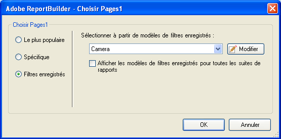

# Filtres enregistrés

Vous pouvez enregistrer des filtres ou d’autres paramètres dans Report Builder et les utiliser dans d’autres feuilles de calcul ou classeurs. Ces paramètres sont enregistrés dans Analytics afin de garantir qu’ils sont disponibles pour d’autres utilisateurs de Report Builder travaillant sur d’autres ordinateurs.

L’enregistrement des filtres s’effectue dans le formulaire [!UICONTROL Sélectionner les pages]. Pour obtenir un exemple de cette procédure, reportez-vous à la section [Filtres spécifiques](/help/analyze/report-builder/layout/c-filter-dimensions/t-specific-filters.md).

