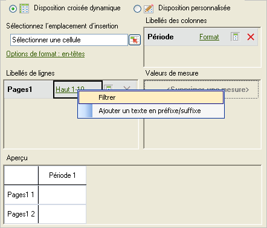
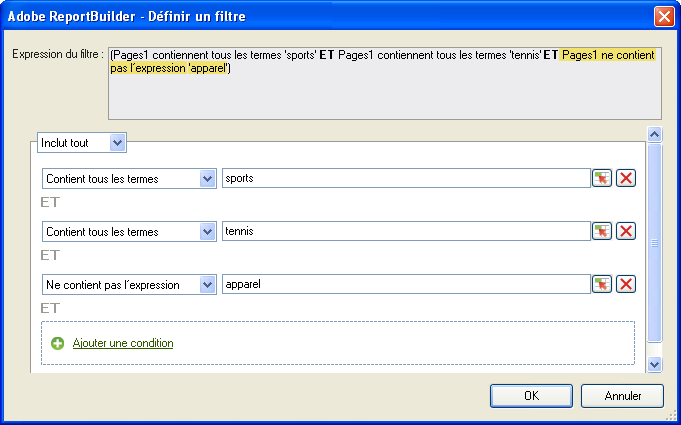
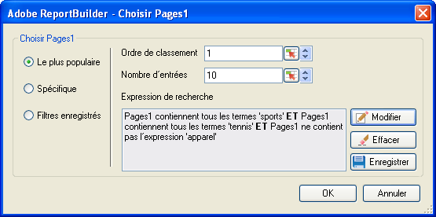

# Filtrage le plus apprécié

Classement et filtres conditionnels pouvant être configurés à l’aide d’une logique booléenne et d’expressions de recherche ET/OU.

Most Popular filters are expression filters that you configure using Boolean logic with AND/OR conditions, such as [!UICONTROL Page does not contain]*`<product name>`* with conditions or groups of conditions like [!UICONTROL Includes All], [!UICONTROL Includes Any], or [!UICONTROL Excludes All]. You can [save](/help/analyze/report-builder/layout/c-filter-dimensions/saved-filters.md) these expressions for other request in this workbook, or in other workbooks.

**Pour créer un filtre de type « Le plus populaire »**

1. Créez ou modifiez une requête, puis passez au formulaire [!UICONTROL Assistant Requête : Étape 2].

   

1. Dans la fenêtre [!UICONTROL Assistant Requête : Étape 2]**, cliquez sur le lien en regard de la dimension dans la grille, puis sélectionnez[!UICONTROL Filtrer]**.
1.  Activez l’option [!UICONTROL Le plus populaire]**dans le formulaire[!UICONTROL Sélectionner les pages]**, puis configurez les options suivantes :

   **Ordre de classement** : il s’agit de l’ordre de classement d’une dimension. La valeur par défaut, à savoir 1, indique l’élément supérieur dans la liste des données faisant l’objet du rapport. Par exemple, dans le cas de la dimension [!UICONTROL Page], un ordre de classement de 1 indique la page la plus demandée de votre site. Vous pouvez spécifier 10 ou une autre valeur comme cellule d’ordre de classement, ce qui a pour effet de générer un rapport commençant par 10 comme valeur maximale. Les mesures sont classées par ordre décroissant, de telle sorte que les éléments les plus actifs apparaissent en premier dans la liste. Si une seule requête doit comporter plus de 50 000 noms de pages, mais que vous disposez de milliers de pages sur lesquelles générer un rapport, vous pouvez copier la requête et modifier l’ordre de classement afin de récupérer les données appropriées par blocs de 50 000.

   **Nombre d’entrées** : ([!UICONTROL Disposition croisée dynamique] uniquement) définit le nombre d’éléments signalés dans le rapport pour une mesure donnée sur une période déterminée. Certaines mesures peuvent répertorier une centaine d’entrées, alors que d’autres n’en afficheront que quelques-unes. Par exemple, dans le cas de la dimension [!UICONTROL Section du site], un nombre d’entrées équivalant à 25 indique que le rapport affiche les 25 pages les plus visitées.

   Des flèches vous permettent de modifier l’[!UICONTROL Ordre de classement] et le [!UICONTROL Nombre d’entrées] du premier point de données dans la feuille. Par défaut, la valeur [!UICONTROL Ordre de classement] est définie sur 1 et la valeur [!UICONTROL Nombre d’entrées], sur 10. Ces valeurs peuvent être définies sur une plage allant de 1 à 50 000 (pour certaines mesures). Chaque mesure possède sa valeur [!UICONTROL Nombre d’entrées] maximale. Ces champs n’acceptent pas les valeurs négatives ou nulles. Si vous définissez un [!UICONTROL Ordre de classement] de 15 et un [!UICONTROL Nombre d’entrées] de 10, les requêtes de données relatives à la mesure renvoient les 10 pages les plus visitées ; la première page la plus visitée correspondant au numéro 15 dans la liste pour la plage de dates spécifique. Toutes les pages les plus demandées classées entre la 15ème et la 25ème positions sont répertoriées dans l’ordre décroissant.

   >[!NOTE]
   >
   >L’application de filtres à des requêtes existantes entraîne des modifications dans les données présentées. Supposons que vous ayez mappé les dix [!UICONTROL Pages] principales sur les cellules $A$1 à $A$10, avec les valeurs 1 pour [!UICONTROL Ordre de classement] et 10 pour [!UICONTROL Nombre d’entrées]. Si vous définissez, à présent, les champs [!UICONTROL Ordre de classement] et [!UICONTROL Nombre d’entrées] sur 1 et 3, respectivement, les données indiquées précédemment dans les cellules $A$4 à $A$10 ne seront plus affichées.

1. Pour créer une expression de recherche, cliquez sur **[!UICONTROL Ajouter]**.

   

1. Dans le formulaire [!UICONTROL Définir un filtre], configurez les conditions adaptées à vos besoins.

    : vous permet de localiser une condition définie dans la valeur d’une cellule.

   **Ajouter une condition** : ajoute une condition à l’expression. Le nombre de conditions qu’il est possible d’ajouter est illimité.

1. Cliquez sur **[!UICONTROL OK]**.

   

1. Dans le formulaire [!UICONTROL Sélectionner les pages]**, cliquez sur[!UICONTROL Enregistrer]** pour enregistrer l’expression.
1. Cliquez sur **[!UICONTROL OK]**.
