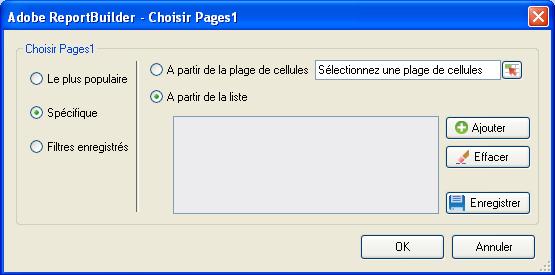

# Filtres spécifiques

Filtres qui s’appliquent à des termes de dimension spécifiques.

Vous pouvez effectuer une recherche sur des éléments de dimension spécifiques en créant un fichier correspondant exactement aux critères. For example, you can create the following type of filter: page in [!DNL homepage.htm], [!DNL contact_us.html], [!DNL corporate_info.html].

**Pour créer un filtre spécifique :**

1. Créez ou modifiez une requête, puis passez au formulaire [!UICONTROL Assistant Requête : Étape 2].

   

1. Dans la fenêtre [!UICONTROL Assistant Requête : Étape 2]**, cliquez sur le lien en regard de la dimension dans la grille, puis sélectionnez[!UICONTROL Filtrer]**.

   

1. Enable **[!UICONTROL Specific]**, then enable one of the following options:

   * **À partir de la plage de cellules** : vous permet de sélectionner des données à partir de cellules. Vous pouvez sélectionner :
   * **Toutes les cellules dans la plage** : vous permet de mapper chaque cellule pour la plage. Un texte descriptif indique le nombre de groupes de cellules à sélectionner. Pour mapper plusieurs groupes de cellules, sélectionnez les éléments de votre choix tout en maintenant la touche Ctrl enfoncée. Si la plage à mapper ne contient qu’une seule cellule, il s’agit de l’unique option disponible.
   * **Première cellule de la plage** : il vous suffit de sélectionner la cellule supérieure gauche de la plage, puis de choisir le sens des données. Si la requête se compose de plusieurs périodes, vous pouvez, en outre, choisir le sens d’affichage et indiquer si vous souhaitez ignorer un nombre défini de cellules entre les périodes.
   * **À partir de la liste** : vous permet de sélectionner, dans une liste, des données auxquelles vous pouvez en ajouter d’autres.
1. Si vous activez l’option **A partir de la liste**, sélectionnez tout élément disponible dans la liste ou cliquez sur **[!UICONTROL Ajouter]**.

   Lorsque vous cliquez sur **[!UICONTROL Ajouter]**, le formulaire [!UICONTROL Sélectionner dans la liste] affiche la liste des valeurs de dimension disponibles pour la plage de dates de la requête actuelle, à concurrence des 10 000 premiers éléments. Vous pouvez effectuer une recherche dans ces éléments ou cliquer sur **[!UICONTROL Plus...]** afin d’afficher le formulaire [!UICONTROL Rechercher] dans lequel vous pouvez créer une recherche plus détaillée pour les dimensions.
1. Cliquez sur [!UICONTROL OK]**dans le formulaire[!UICONTROL Sélectionner dans la liste]**.
1. Dans le formulaire [!UICONTROL Sélectionner les pages]**, enregistrez votre filtre spécifique, le cas échéant, puis cliquez sur[!UICONTROL OK]**.
