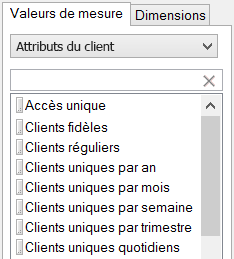
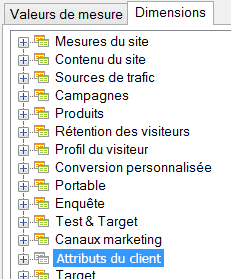

# Attributs du client

Les attributs du client sont stockés dans un nouveau type d’élément appelé VisAttr, qui peut être configuré comme une dimension ou une mesure.

Pour obtenir des informations plus détaillées sur le chargement des attributs du client, reportez-vous à l’[aide d’Experience Cloud](https://experienceleague.adobe.com/docs/core-services/interface/customer-attributes/attributes.html?lang=fr).

* S’il est configuré en tant que mesure, VisAttr est exposé en tant que mesure et &quot;dimension&quot;.

   

* Il prend en charge la même répartition qu’une eVar (tout peut être réparti par tout).
* VisAttr prend en charge toutes les mesures d’eVar.
* VisAttr en tant que mesure prend en charge la « périodisation » (par ex. Durée moyenne de la visite du site : 0 à 30, 31 à 60, ...).
* VisAttr est disponible comme une dimension de segmentation.
