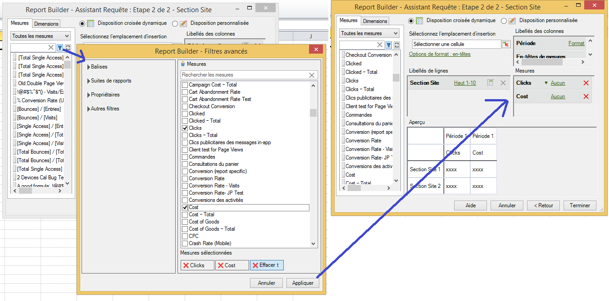

# Mesures calculées

La version 5.2 du Report Builder prend en charge les mesures calculées unifiées d’Adobe Analytics. Entre autres innovations, toutes les mesures calculées sont désormais dotées d’un identifiant global ; elles ne sont plus limitées à une seule suite de rapports.

>[!NOTE] Il est possible que les classeurs existants pointent vers des demandes avec des identifiants de mesure hérités. Lorsque vous utilisez la version 5.2 du Report Builder, ces identifiants de mesure hérités sont convertis en nouvel identifiant global. Si vous partagez ce classeur avec un utilisateur de la version 5.1 ou antérieure du Report Builder, il ne verra pas les mesures calculées.

Pour en savoir plus sur la création et la gestion des mesures calculées à l’aide du nouveau créateur et gestionnaire de mesures calculées, consultez le Guide des mesures  calculées.

A l’étape 2 de l’Assistant Requête, vous pouvez filtrer et appliquer des mesures calculées.

## Filtrage des mesures calculées {#section_376E986D3E684999A7CDB08E53854159}

**Filtrez** les mesures calculées en cliquant sur l’icône Filtrer :  

. La boîte de dialogue  avancé est renseignée avec des mesures standard et calculées.

 de disponibles :

.png)

| Nom du filtre | Description |
|---|---|
| Balises | Permet de filtrer les mesures calculées à l’aide de balises spécifiques. Notez que le de balises  utilise l’opérateur ET. Si vous cochez deux balises, le volet de droite affiche les mesures qui ont été balisées avec les **deux** balises. |
| Suites de rapports | Si vous appliquez le filtre « Uniquement le *nom de la suite de rapports* » dans le Créateur de mesures calculées dans [!DNL Reports & Analytics], puis affichez le filtre avancé dans [!DNL Report Builder], le filtre avancé affiche uniquement les mesures calculées correspondant à la suite de rapports sélectionnée. |
| Propriétaires | Permet de filtrer les mesures par propriétaire. Notez que les propriétaires  utilisent l’opérateur OU. Si vous cochez deux propriétaires, le volet de droite affiche les mesures détenues par **l’un ou l’autre** des propriétaires. |
| Autres filtres > Approuvés | Affiche toutes les mesures officiellement approuvées. |
| Autres filtres > Favoris | Affiche toutes les mesures que vous avez marquées comme Favoris. |
| Autres filtres > À moi | Affiche toutes les mesures que vous possédez. |
| Autres filtres > Partagés avec moi | Affiche toutes les mesures que d’autres ont partagées avec vous. |

## Appliquer les mesures calculées {#section_DF5CF349460A45FDA4B6E6BB8B52F18E}

After you have selected the filters, click **[!UICONTROL Apply]** to apply them to your request. Les mesures sélectionnées sont maintenant ajoutées à la disposition du rapport.

