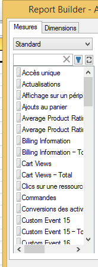

# Association de mesures de trafic et de commerce dans la même requête

Vous pouvez désormais associer ces deux types de mesures en une seule et même requête, au lieu d’avoir à créer des requêtes distinctes.

Les mesures de trafic et de commerce s’affichent désormais dans la même catégorie de mesure à l’étape 2 de l’Assistant Requête. Par le passé, ces mesures étaient séparées en catégorie Commerce et catégorie Trafic.

The new grouped category is labeled **[!UICONTROL Standard]**. .

