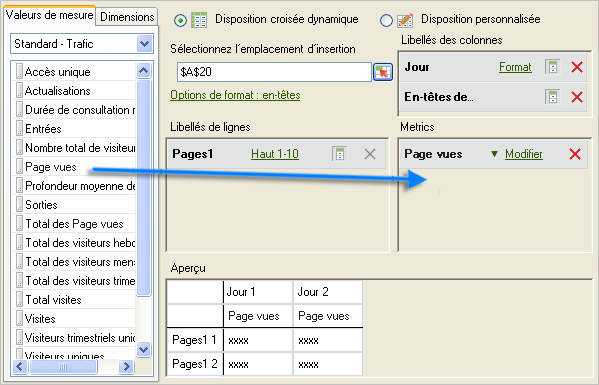
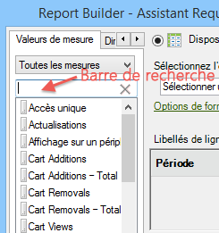

# Ajout de mesures et de dimensions

Procédure d’ajout de mesures et de dimensions à une requête.

1. Utilisez le formulaire [!UICONTROL Assistant Requête : Étape 1] pour [Créer la requête de données](/help/analyze/report-builder/data-requests/data-requests.md), puis cliquez sur **[!UICONTROL Suivant]**.
1. Dans le formulaire [!UICONTROL Assistant Requête : Étape 2], double-cliquez sur les mesures ou faites-les glisser vers l’emplacement de votre choix.

   

   Les mesures que vous ajoutez ne sont pas supprimées de l’onglet [!UICONTROL Valeurs de mesure], car vous pouvez les afficher plusieurs fois dans une requête. Vous pouvez, par exemple, afficher le sous-total de la mesure en plus de chaque valeur. Cependant, la liste des mesures disponibles est modifiée chaque fois que vous ajoutez ou supprimez une dimension.

   Vous pouvez uniquement ajouter des mesures à la section de disposition [!UICONTROL Valeurs de mesure]. Les mesures sont ajoutées à la disposition [!UICONTROL Libellé de colonne] sous forme d’[!UICONTROL En-tête de mesure]. Si vous déplacez un [!UICONTROL En-tête de mesure] depuis la [!UICONTROL Disposition de colonne] vers la [!UICONTROL Disposition de ligne], elle est affichée à cet endroit et utilise la mesure sous la forme d’une répartition.

   Une barre de recherche s’affiche sur l’onglet Mesures, juste au-dessus de la liste Mesure.

   

## Instructions

Tenez compte des recommandations suivantes lorsque vous ajoutez des mesures et des dimensions.

* Lorsque vous entrez un terme de recherche, la liste se met automatiquement à jour afin d’afficher les mesures dont les libellés correspondent au terme de recherche.
* La correspondance n’est pas sensible à la casse et équivaut à une recherche *contient*.
* Recherches de mots complets et autres indicateurs de recherche (commence par, se termine par, AND, OR, etc.) ne sont pas prises en charge.

Le terme recherché est effacé si vous quittez l’Assistant Requête lorsque vous cliquez sur [!UICONTROL Terminer] ou [!UICONTROL Annuler], lorsque vous revenez à l’Étape 1 de l’Assistant Requête ou modifiez la catégorie Mesure.

Le terme recherché n’est pas effacé :

* Lorsque vous faites glisser et déposez (ou double-cliquez) un élément de mesure de la liste afin qu’il soit ajouté au panneau Mesures Disposition croisée dynamique/Disposition personnalisée .
* Lorsque vous supprimez un ou plusieurs éléments de mesure du panneau Mesures Disposition croisée dynamique/Disposition personnalisée.
* Lorsque vous cliquez sur l’onglet Dimension , revenez à l’onglet Mesure .
* Lorsque vous appelez d’autres formulaires secondaires (modaux ou sans mode) qui, à la fermeture, retournent à l’étape 2 de l’Assistant Requête. Exemple de ces formulaires :

   * Formulaires de filtre de dimension
   * Formulaires de mise en forme de la plage de sortie
   * Formulaire d’options de format
   * Formulaire Ajouter un texte en préfixe/suffixe
   * Formulaire d’emplacement de la plage de sortie

## Tri d’une requête par mesure

Vous pouvez éventuellement trier une requête par mesure.

Pour trier une requête par mesure

1. Cliquez sur le libellé de la mesure.
1. Ajouter des dimensions. Ajoutez des dimensions de la même manière que vous ajoutez des mesures. Voir les étapes 1 et 2 ci-dessus.

   Sur l’onglet [!UICONTROL Dimensions] , le système affiche les dimensions qui ventilent tout rapport de base sélectionné dans [!UICONTROL Assistant Requête : Étape 1] ou qui en sont une classification, et sur la configuration de la suite de rapports. Lorsque vous déposez une dimension sur les grilles de disposition, elle est supprimée de l’arborescence et elle recalcule la liste des dimensions restantes disponibles.

   La dimension [!UICONTROL Date] est ajoutée automatiquement. Les dimensions de date disponibles varient en fonction de la granularité sélectionnée dans le formulaire [!UICONTROL Assistant Requête : Étape 1]. Les valeurs valides sont :

   * Heure 
   * Jour
   * Semaine
   * Mois
   * Année
   * Période (si aucune granularité n’est spécifiée)

1. Modifiez les mesures et les dimensions en configurant les [options de format](/help/analyze/report-builder/layout/t-format-display-headers.md) et les filtres.
1. Cliquez sur **[!UICONTROL Terminer]**.
Dans l’exemple suivant, des dimensions sont en relation avec la mesure [!UICONTROL Page]. La dimension [!UICONTROL Domaine référent] crée un rapport de ventilation entre [!UICONTROL Page] et [!UICONTROL Domaine référent]. L’onglet [!UICONTROL Dimension] est mis à jour avec les seules dimensions que vous pouvez ajouter à un rapport de répartition.

   
