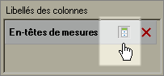

# Masquage ou affichage des en-têtes

Cette procédure explique comment masquer ou afficher des en-têtes.

Cliquez sur **[!UICONTROL Masquer/Afficher]** dans la sortie [!UICONTROL Disposition croisée dynamique] ou [!UICONTROL Disposition personnalisée] du formulaire [!UICONTROL Assistant Requête : Étape 2].

