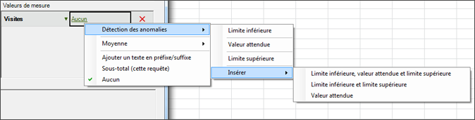
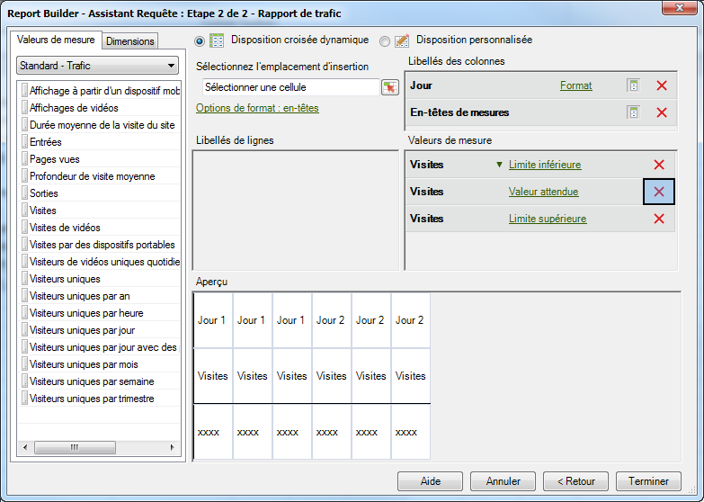

# Configuration d’une requête de détection des anomalies

Étapes qui décrivent comment créer une requête de détection des anomalies dans le Créateur de rapports.

1. Sélectionnez un rapport de tendance, par exemple sur un rapport **Mesures du site** &gt; **[!UICONTROL Trafic.]**
1. Dans le menu [!UICONTROL Appliquer la granularité]**, sélectionnez[!UICONTROL Jour]**.

   >[!NOTE]
   >
   >The [!UICONTROL Anomaly Detection] menu is available only when you select Day granularity. Les 30 jours précédents de données sont utilisés comme période de formation des données statistiques, quelle que soit la plage de données que vous sélectionnez.

1. After configuring date ranges, click **[!UICONTROL Next]**.

   Résultat de l’étape 1. On the Request Wizard: Step 2 of 2, add a metric, such as **[!UICONTROL Visits]**.

   Résultat de l’étape 1. For the added metric, click the **[!UICONTROL None]** link.

   

1. Select **[!UICONTROL Anomaly Detection]** &gt; **[!UICONTROL `<selection>`]**.

   

   Lorsque vous sélectionnez l’une de ces options, le système crée des copies Détection des anomalies de la mesure d’origine. Par exemple, pour la mesure Visite, une mesure Limite inférieure - Visite est ajoutée au groupe [!UICONTROL Mesure].
1. Click **[!UICONTROL Finish]** and select the cell for output to Excel.

   See [Anomaly Detection](/help/analyze/analysis-workspace/virtual-analyst/c-anomaly-detection/anomaly-detection.md) for definitions.
