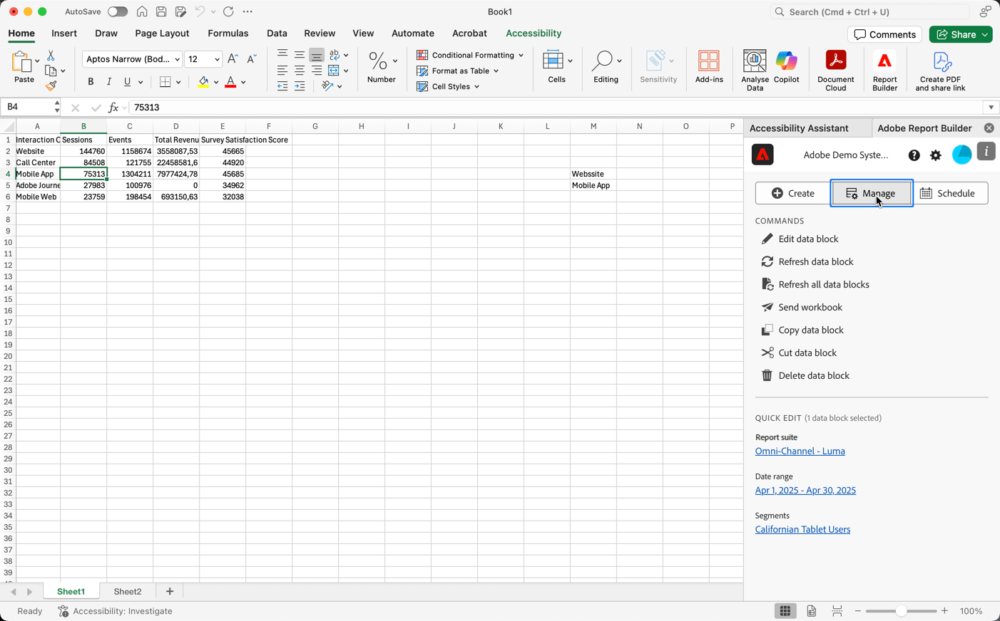
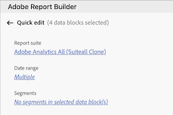
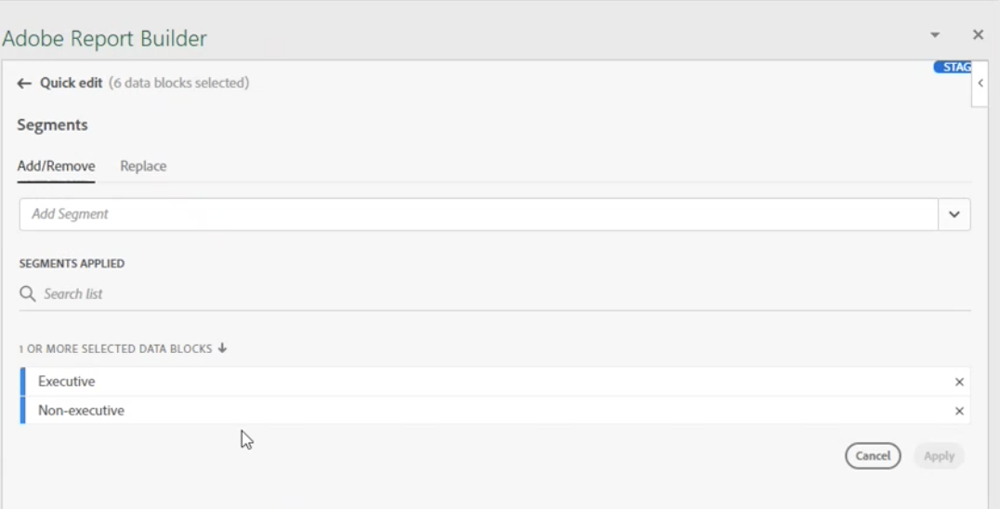
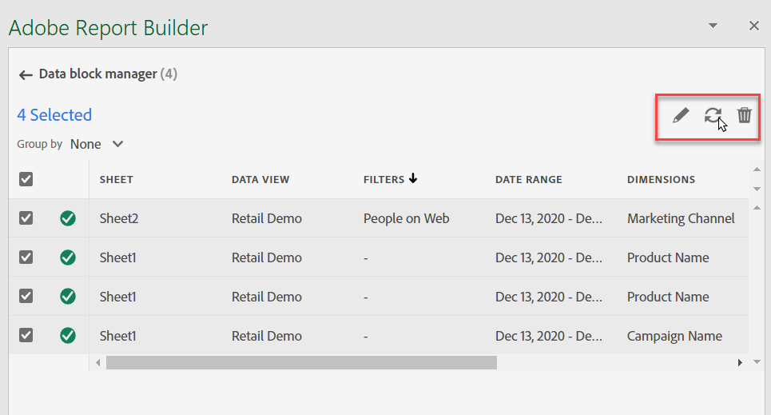
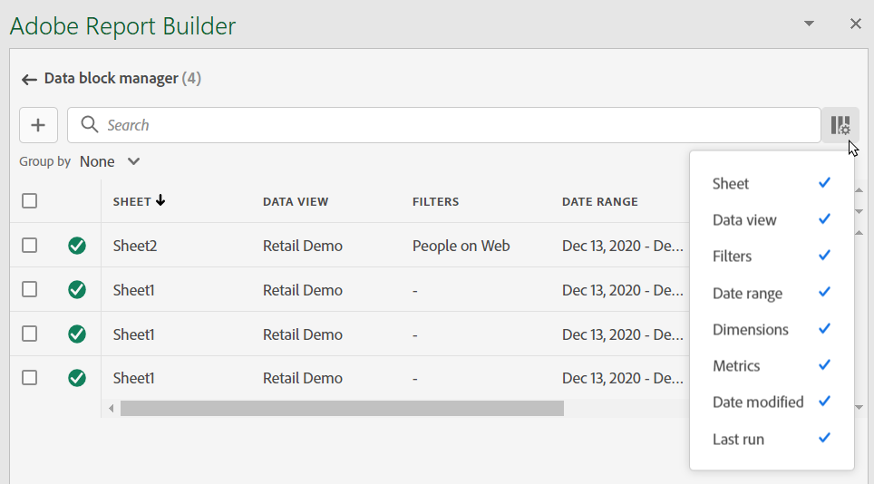

# Gérer les blocs de données

Vous pouvez afficher et gérer tous les blocs de données d’un classeur à l’aide du [!UICONTROL Gestionnaire de blocs de données]. Le [!UICONTROL Gestionnaire de blocs de données] fournit des fonctionnalités de recherche, de filtrage et de tri qui vous permettent de localiser des blocs de données spécifiques. Après avoir sélectionné un ou plusieurs blocs de données, vous pouvez modifier, supprimer ou actualiser les blocs de données sélectionnés.

## Affichage des blocs de données

Pour afficher un tableau répertoriant tous les blocs de données d’un classeur, sélectionnez  **[!UICONTROL Manage]**.

{zoomable="yes"}

Le **[!UICONTROL Gestionnaire de blocs de données]** affiche un tableau avec tous les blocs de données présents dans un classeur.

{zoomable="yes"}

Vous pouvez utiliser  pour sélectionner les colonnes à afficher.

## Tri des blocs de données

Vous pouvez trier le tableau des blocs de données par colonne affichée. Vous pouvez, par exemple, trier les blocs de données par suite de rapports, segment, période et autres variables.

Pour trier le tableau de blocs de données, sélectionnez un en-tête de colonne. Sélectionnez le même en-tête de colonne pour inverser l’ordre de tri.

## Rechercher des blocs de données

Utilisez le champ  **[!UICONTROL _Recherche_]** pour localiser tout ce qui se trouve dans le tableau des blocs de données. Par exemple, vous pouvez rechercher les mesures contenues dans les blocs de données ou la suite de rapports. Vous pouvez également rechercher des dates apparaissant dans les colonnes de périodes, de date de modification ou de date de dernière exécution.

## Modifier les blocs de données

Vous pouvez modifier les suites de rapports et les périodes pour les blocs de données. Ou les segments appliqués aux blocs de données.

Par exemple, vous pouvez remplacer un segment existant par un nouveau segment dans un ou plusieurs blocs de données.

1. Sélectionnez les blocs de données à mettre à jour. Vous pouvez cocher la case de niveau supérieur pour sélectionner tous les blocs de données ou sélectionner des blocs de données individuels.

   {zoomable="yes"}

1. Sélectionnez  pour afficher la fenêtre **[!UICONTROL Modification rapide]**.

   {zoomable="yes"}

1. Sélectionnez un lien pour mettre à jour les suites de rapports, les périodes ou les segments. Dans **[!UICONTROL Modification rapide]** - **[!UICONTROL Segments]** vous pouvez ajouter, supprimer ou mettre à jour les segments pour les blocs de données sélectionnés.

   {zoomable="yes"}

## Actualiser les blocs de données

Sélectionnez  pour actualiser le tableau des blocs de données.

Pour vérifier si un bloc de données est actualisé, consultez l’icône de statut de l’actualisation :

- Un bloc de données actualisé avec succès affiche un .

- Un bloc de données qui n’a pas été actualisé affiche une .

## Supprimer les blocs de données

Pour supprimer un ou plusieurs blocs de données :

1. Sélectionnez un ou plusieurs blocs de données.
1. Sélectionnez .
1. Sélectionnez **[!UICONTROL Supprimer]** dans la boîte de dialogue **[!UICONTROL Supprimer le bloc de données]** ou **[!UICONTROL Annuler]** pour annuler la suppression.

## Regrouper les blocs de données

Vous pouvez regrouper des blocs de données à l’aide du menu déroulant **[!UICONTROL Regrouper par]** ou sélectionner un titre de colonne.

Pour trier les blocs de données par colonne, sélectionnez le titre de la colonne. Pour regrouper des blocs de données par groupes, sélectionnez un nom de groupe dans le menu déroulant **[!UICONTROL Grouper par]**. Par exemple, la capture d’écran ci-dessous montre des blocs de données regroupés par suite de rapports.

Vous pouvez utiliser le regroupement pour sélectionner rapidement les blocs de données pour lesquels vous souhaitez modifier un élément commun, tel qu’un segment.

{zoomable="yes"}

<!--

# Manage Data Blocks in Report Builder

You can view and manage all data blocks in a workbook using the Data Block Manager. The Data Block Manager provides search, filter, and sort capabilities that allow you to quickly locate specific data blocks. After selecting one or more data blocks, you can edit, delete, or refresh the selected data blocks.

## View Data Blocks

Click **Manage** to view a list of all data blocks in a workbook.

The Data Block Manager lists all data blocks present in a workbook. 

## Sort the Data Blocks list

You can sort the data block list by a displayed column. For example, you can sort the data block list by report suites, segments, date range, and other variables.

To sort the data block list, click a column heading.

## Search the Data Block list

Use the Search field to locate anything in the data block table. For example, you could search for metrics contained in the data blocks or report suite. You can also search for dates appearing in the date range, date modified, or last run date columns.

## Edit Data Blocks

You can edit the report suite, date range, or the segments applied to one or more data blocks.

For example, you can replace an existing segment with a new segment in one or more data blocks.

1. Select the data blocks that you want to update. You can select the top-level check box to select all data blocks or you can select individual data blocks.

   

1. Click the edit icon to display the Quick edit window.

   

1. Select a segment link to update report suites, date ranges, or segments.

   

## Refresh Data Blocks

Click the refresh icon to refresh the data blocks in the list.

To verify if a data block is refreshed, view the refresh status icon. 

A successfully refreshed data block displays a checkmark in a green circle: . 

A data block that has failed to refresh displays a warning icon: .This makes it easy to identify if any data blocks have errors.

## Delete a Data Block

1. Select a data block in the Data Block manager. 
1. Click the trash can icon to delete the selected data block.

## Group Data Blocks

You can group data blocks using the **Group by** drop-down menu or you can click a column title. To sort data blocks by column, click the column title. To group data blocks by groups, select a group name from the **Group by** drop-down menu. For example, the screenshot below shows data blocks grouped by Sheet. It shows data blocks grouped by Sheet1 and Sheet2.  This is useful, for example, in the segment-replacing use case. If you have multiple segments applied to each data block, it is helpful to create a group containing all the data blocks that you want to replace. Then you can easily select and edit them all at once.

## Modify the Data Block Manager view

You can modify which columns are visible in the Data Block Manager window.

Click the column list  icon to select which columns are listed in the Data Block Manager. Select a column name to display the column. Deselect the column name to remove the column from view.

-->