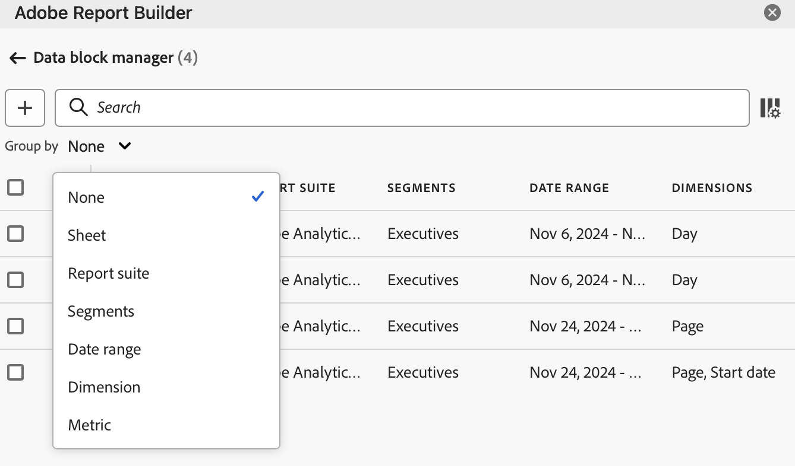

# Gérer les blocs de données dans Report Builder

Vous pouvez afficher et gérer tous les blocs de données d’un classeur à l’aide du Gestionnaire de blocs de données. Le Gestionnaire de blocs de données fournit des fonctionnalités de recherche, de filtrage et de tri qui vous permettent de localiser rapidement des blocs de données spécifiques. Après avoir sélectionné un ou plusieurs blocs de données, vous pouvez modifier, supprimer ou actualiser les blocs de données sélectionnés.

## Afficher les blocs de données

Cliquez sur **Gérer** pour afficher la liste de tous les blocs de données d’un classeur.

Le Gestionnaire de blocs de données répertorie tous les blocs de données présents dans un classeur. 

## Trier la liste Blocs de données

Vous pouvez trier la liste Blocs de données par colonne affichée. Vous pouvez, par exemple, trier la liste bloquée de données par suites de rapports, segments, période et autres variables.

Pour trier la liste Blocs de données, cliquez sur un en-tête de colonne.

## Rechercher dans la Liste Blocs de données

Utilisez le champ Rechercher pour localiser tout élément dans le tableau des blocs de données. Par exemple, vous pouvez rechercher les mesures contenues dans les blocs de données ou la suite de rapports. Vous pouvez également rechercher des dates apparaissant dans les colonnes de périodes, de date de modification ou de date de dernière exécution.

## Modifier les blocs de données

Vous pouvez modifier la suite de rapports, la période ou les segments appliqués à un ou plusieurs blocs de données.

Par exemple, vous pouvez remplacer un segment existant par un nouveau segment dans un ou plusieurs blocs de données.

1. Sélectionnez les blocs de données à mettre à jour. Vous pouvez cocher la case de niveau supérieur pour sélectionner tous les blocs de données ou sélectionner des blocs de données individuels.

   

1. Cliquez sur l’icône d’édition pour afficher la fenêtre Modification rapide.

   

1. Sélectionnez un lien de segment pour mettre à jour les suites de rapports, les périodes ou les segments.

   

## Actualiser les blocs de données

Cliquez sur l’icône d’actualisation pour actualiser les blocs de données de la liste.

Pour vérifier si un bloc de données est actualisé, cliquez sur l’icône Actualiser l’état .

Un bloc de données correctement actualisé affiche une coche dans un cercle vert : .

Un bloc de données qui n’a pas été actualisé affiche une icône d’avertissement : . Cela permet d’identifier facilement si des blocs de données comportent des erreurs.

## Supprimer un bloc de données

1. Sélectionnez un bloc de données dans le gestionnaire de blocs de données.
1. Cliquez sur l&#39;icône représentant une corbeille pour supprimer le bloc de données sélectionné.

## Regrouper les blocs de données

Vous pouvez regrouper des blocs de données à l’aide de la variable **Grouper par** ou cliquer sur le titre d’une colonne. Pour trier les blocs de données par colonne, cliquez sur le titre de la colonne. Pour regrouper des blocs de données par groupes, sélectionnez un nom de groupe dans le menu déroulant **Grouper par**. Par exemple, la capture d’écran ci-dessous présente les blocs de données regroupés par feuille. Elle affiche les blocs de données regroupés par Feuille1 et Feuille2. Cela s’avère utile, par exemple, dans le cas d’utilisation du remplacement de segment. Si plusieurs segments sont appliqués à chaque bloc de données, il est utile de créer un groupe contenant tous les blocs de données à remplacer. Vous pouvez ensuite facilement les sélectionner et les modifier tous en même temps.

## Modifier la vue Gestionnaire de blocs de données

Vous pouvez modifier les colonnes visibles dans la fenêtre Gestionnaire de blocs de données.

Cliquez sur l’icône de la liste des colonnes  pour sélectionner les colonnes répertoriées dans le Gestionnaire de blocs de données. Sélectionnez le nom de la colonne à afficher. Désélectionnez le nom de la colonne pour la supprimer de la vue.

