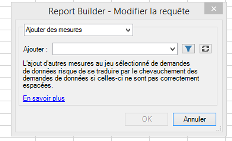
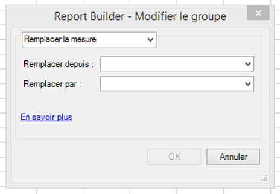
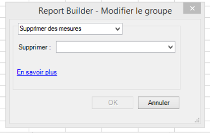

# Modification des mesures de plusieurs demandes

La fonctionnalité Modifier les mesures de plusieurs demandes vous permet d’ajouter, de supprimer ou de remplacer facilement des mesures dans des demandes préexistantes ou parmi un groupe de demandes.

## Ajouter des mesures {#section_3FBDA9668039404895059618D70FCBCD}

Gardez à l’esprit que :

* Les mesures peuvent uniquement être ajoutées à des demandes de type Disposition croisée dynamique. Si certaines des demandes sélectionnées sont de type Disposition personnalisée, les mesures ne peuvent pas être ajoutées. En effet, la disposition étant personnalisée, le Report Builder ne sait pas où placer la nouvelle mesure dans la feuille de calcul.
* Par conséquent, si vous avez uniquement sélectionné demandes de type Disposition personnalisée, l’option **[!UICONTROL Ajouter des mesures]** n’est pas disponible.
* L’ajout de mesures augmente la taille de la demande, si bien qu’elle risque d’en chevaucher une autre. Assurez-vous que la demande dispose de suffisamment d’espace pour permettre l’ajout de mesures.
* Si la mesure ajoutée est déjà présente dans l’une des demandes sélectionnées, elle n’est pas ajoutée à celle-ci.

Pour ajouter une ou plusieurs mesures :

1. Sélectionnez une ou plusieurs demandes dans Excel et cliquez avec le bouton droit pour sélectionner **[!UICONTROL Modifier les mesures]**. (Ou cliquez sur **[!UICONTROL Gérer]** > **[!UICONTROL Modifier plusieurs]** > `<choose metric>` > **[!UICONTROL Modifier le groupe]** pour sélectionner le groupe de demandes à modifier.)
1. Sélectionnez **[!UICONTROL Ajouter des mesures]** et sélectionnez les mesures à ajouter.

   

1. Actualisez la demande pour afficher les données réelles. Tant que vous n’avez pas actualisé, les données hors connexion s’affichent.

## Remplacer une mesure {#section_D773AAC7B30C4FBEBDB66B203C217818}

Gardez à l’esprit que :

* Seuls les remplacements de type 1:1 sont autorisés, pas les remplacements de type 1:plusieurs ou plusieurs:1.
* Si la mesure sélectionnée pour le remplacement n’est pas présente dans l’une des demandes sélectionnées, celle-ci reste inchangée.
* La nouvelle mesure sera placée au même endroit que la mesure remplacée. Autrement dit :

   * **Dans une disposition croisée dynamique** : si une demande de type Disposition croisée dynamique génère les valeurs date, visite, visiteurs et unique par jour et que la valeur « visiteurs » est remplacée par la valeur « recettes », la disposition de la demande modifiée sera : date, visite, recettes, unique par jour.
   * **Dans une disposition personnalisée** : si la mesure « visiteurs » était générée dans la cellule F11, la disposition de la demande modifiée affichera « recettes » dans cette même cellule.

* Si une ou plusieurs opérations étaient appliquées à la mesure remplacée (moyenne, texte en préfixe, texte en suffixe, micrographique), celles-ci seront également appliquées à la nouvelle mesure.

Pour remplacer une mesure

1. Sélectionnez une ou plusieurs demandes dans Excel et cliquez avec le bouton droit pour sélectionner **[!UICONTROL Modifier les mesures]**. (Ou cliquez sur **[!UICONTROL Gérer]** > **[!UICONTROL Modifier plusieurs]** > **`<choose metric>`** > **[!UICONTROL Modifier le groupe]** pour sélectionner le groupe de demandes à modifier.)

1. Sélectionnez **[!UICONTROL Remplacer la mesure]**.

   

1. Sélectionnez la mesure à remplacer et la mesure de remplacement.
1. Actualisez la demande. Tant que vous n’avez pas actualisé, les données hors connexion s’affichent.

## Supprimer des mesures {#section_D3CD5BAC7670416593B633B2B8423C60}

Gardez à l’esprit que :

* Si l’une des mesures sélectionnées pour le remplacement n’est pas présente dans l’une des demandes sélectionnées, la demande reste inchangée.
* Dans une disposition croisée dynamique, en cas de suppression d’une mesure, la disposition bascule sur les mesures situées après la mesure supprimée.

   **Exemple** : si une demande de type Disposition croisée dynamique génère les valeurs date, visites, visiteurs et unique par jour, et que vous supprimez la valeur « visites », la disposition modifiée pour la demande affichera : date, visiteurs et unique par jour.

Pour supprimer des mesures :

1. Sélectionnez une ou plusieurs demandes dans Excel et cliquez avec le bouton droit pour sélectionner **[!UICONTROL Modifier les mesures]**. (Ou cliquez sur **[!UICONTROL Gérer]** > **[!UICONTROL Modifier plusieurs]** > **`<choose metric>`** > **[!UICONTROL Modifier le groupe]** pour sélectionner le groupe de demandes à modifier.)

1. Sélectionnez **[!UICONTROL Supprimer des mesures]**.

   

1. Sélectionnez une ou plusieurs mesures à supprimer de la demande.
1. Actualisez la demande. Tant que vous n’avez pas actualisé, les données hors connexion s’affichent.

