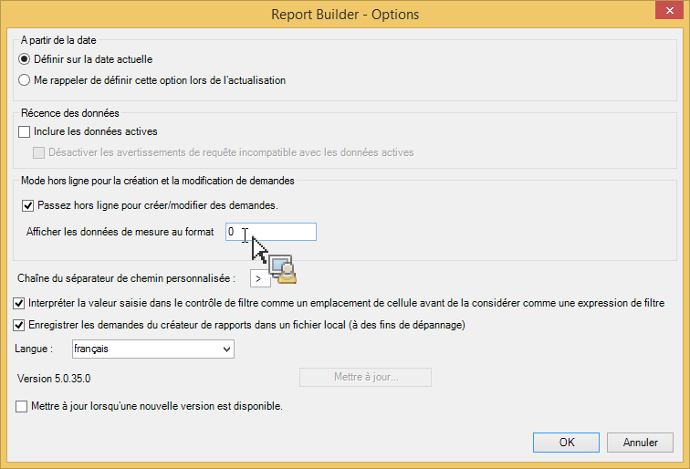
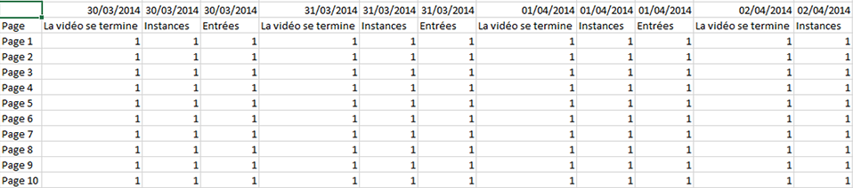

# Mode hors ligne pour la création et la modification de requêtes

Le mode hors ligne renvoie des données d’espace réservé afin d’accélérer le processus de création et de modification des requêtes.

Lorsque vous créez ou modifiez une nouvelle requête, des appels à l’API des rapports sont passés pour récupérer la réponse. Cela ralentit le processus de création de requêtes car vous devez attendre que les données reviennent avant de passer à l’étape suivante. Le mode hors ligne renvoie les données d’espace réservé uniquement. De ce fait, aucun appel à l’API ne doit être effectué.

Pour activer le mode hors ligne :

1. Cliquez sur **[!UICONTROL Options]dans le menu du Créateur de rapports.**

   

1. Cochez la case en regard de l’option **[!UICONTROL Passez hors ligne pour créer/modifier des demandes]**.
1. Dans le champ **[!UICONTROL Afficher les données de mesure au format], saisissez les données d’espace réservé que vous voulez renvoyer dans votre requête.** Par exemple, saisissez « 1 ».
1. Cliquez sur **[!UICONTROL OK]**.
1. Maintenant, créez et exécutez votre requête (en mode hors ligne) à l’aide de l’Assistant Requête.
1. Votre requête avec « 1 » en tant que donnée d’espace réservé ressemblera à ce tableau :

   

   >[!IMPORTANT]
   >
   >Veillez à désactiver le mode hors ligne avant d’exécuter vos requêtes avec des données réelles. Pour ce faire, retournez à **[!UICONTROL Options]et décochez la case.**

