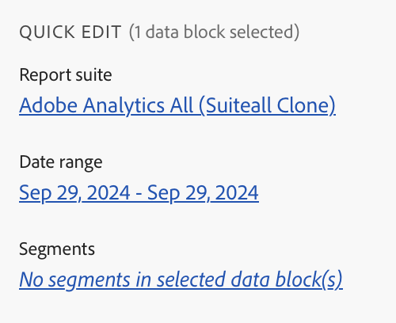

# Centre Report Builder

Utilisez le centre Report Builder pour créer, mettre à jour, supprimer et gérer des blocs de données.

Le hub de Report Builder contient les boutons Créer, Gérer et Planifier, le panneau COMMANDES et le panneau ÉDITION RAPIDE.


## boutons Créer, Gérer et Planifier

Utilisez les boutons Créer, Gérer et Planifier pour créer des blocs de données, gérer des blocs de données existants ou planifier des blocs de données.

>[!NOTE]
>
>La planification des classeurs pour cette version de Report Builder sur Adobe Analytics n’a pas encore été publiée, mais elle sera disponible début 2025. Vous pouvez commencer maintenant sur les classeurs qui ne nécessitent pas de planification.

## Panneau COMMANDES

Utilisez le panneau COMMANDES pour accéder aux commandes compatibles avec les cellules sélectionnées ou à une action précédente.

### Commandes

| Commandes affichées | Disponible lorsque… | Rôle |
|------|------------------|--------|
| Modifier le bloc de données | La ou les cellules sélectionnées font partie d’un seul bloc de données. | Sert à modifier un bloc de données |
| Actualiser le bloc de données | La sélection contient au moins un bloc de données. La commande actualise uniquement les blocs de données de la sélection. | Sert à actualiser un ou plusieurs blocs de données |
| Actualiser tous les blocs de données | Le classeur contient un ou plusieurs blocs de données. | Sert à actualiser TOUS les blocs de données dans le classeur |
| Envoyer le classeur |   | Envoyer un classeur selon un planning. |
| Copier le bloc de données | La cellule ou la plage de cellules sélectionnée fait partie d’un ou de plusieurs blocs de données. | Sert à copier un bloc de données |
| Couper le bloc de données |   | Utilisé pour couper un bloc de données |
| Supprimer le bloc de données | La ou les cellules sélectionnées font partie d’un seul bloc de données. | Sert à supprimer un bloc de données |

## Panneau ÉDITION RAPIDE

Lorsque vous sélectionnez un ou plusieurs blocs de données dans une feuille de calculs, Report Builder affiche le panneau ÉDITION RAPIDE. Vous pouvez utiliser le panneau ÉDITION RAPIDE pour modifier les paramètres d’un seul ou de plusieurs blocs de données en même temps.



Les modifications effectuées à l’aide des sections Édition rapide s’appliquent à tous les blocs de données sélectionnés.

### Suites de rapports

Les blocs de données extraient des données d’une suite de rapports sélectionnée. Si plusieurs blocs de données sont sélectionnés dans une feuille de calcul et qu’ils n’extraient pas les données de la même suite de rapports, le lien **Suites de rapports** affiche *Multiple*.

Lorsque vous modifiez la suite de rapports, tous les blocs de données de la sélection adoptent la nouvelle suite de rapports. Les composants du bloc de données sont associés à la nouvelle suite de rapports en fonction de l’identifiant, par exemple la ```evars``` correspondante). Si un composant est introuvable dans un bloc de données, un message d’avertissement s’affiche et le composant est supprimé du bloc de données.

Pour modifier la suite de rapports, sélectionnez une nouvelle suite de rapports dans le menu déroulant.


### Période

**[!UICONTROL Période]** affiche la période des blocs de données sélectionnés. Si plusieurs blocs de données sont sélectionnés avec plusieurs périodes, le lien **[!UICONTROL Période]** s’affiche *Multiple*. [En savoir plus](/help/analyze/report-builder/select-date-range.md)

### Segments

Le lien **Segments** affiche une liste récapitulative des segments utilisés par les blocs de données sélectionnés. Si plusieurs blocs de données sont sélectionnés avec plusieurs segments appliqués, le lien **Segments** s’affiche *Multiple*. [En savoir plus](/help/analyze/report-builder/work-with-segments.md)
