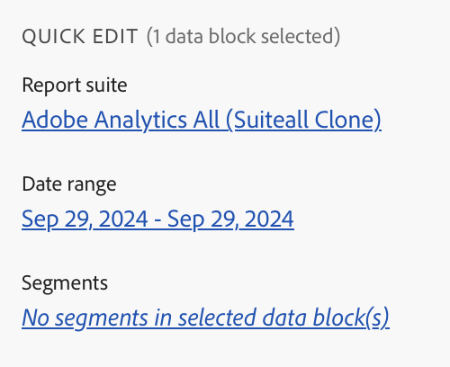
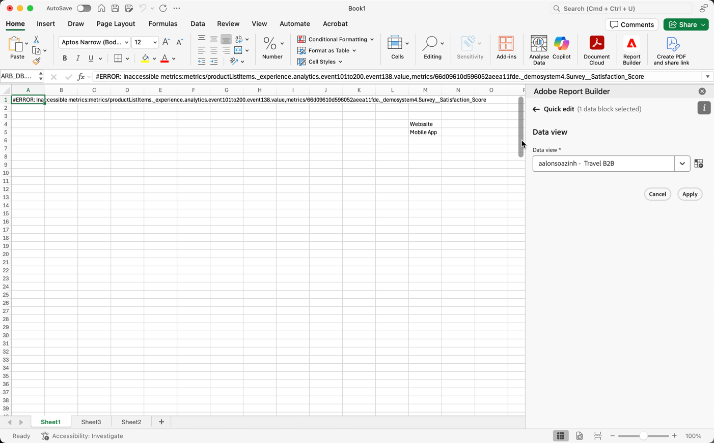

# Hub Report Builder


Le hub Report Builder est le volet de droite qui s’affiche dans votre classeur Excel lorsque vous sélectionnez  **[!UICONTROL Report Builder]** dans la barre de ruban Excel.

Utilisez le centre Report Builder pour créer, mettre à jour, supprimer et gérer des blocs de données.

Le hub Report Builder contient les boutons  **[!UICONTROL Create]**,  **[!UICONTROL Manage]** et Schedule **[!UICONTROL , le panneau]** Commands **[!UICONTROL et le panneau]** Quick edit **&#x200B;**.

{zoomable="yes"}


Sélectionner

*  **[!UICONTROL Create]** pour [créer de nouveaux blocs de données](create-a-data-block.md).
*  **[!UICONTROL Manage]** pour [gérer les blocs de données existants](manage-reportbuilder.md).
*  **[!UICONTROL Planification]** pour [gérer les planifications afin d’envoyer votre classeur par e-mail](schedule-reportbuilder.md).

## Panneau Commandes

Utilisez le panneau **[!UICONTROL Commandes]** pour accéder aux commandes compatibles avec les cellules sélectionnées ou à une action précédente.

| Commandes | Disponible lorsque… | Rôle |
|------|------------------|--------|
|  **[!UICONTROL Modifier le bloc de données]** | La ou les cellules sélectionnées font partie d’un seul bloc de données. | Permet de modifier un bloc de données. |
|  **[!UICONTROL Actualiser le bloc de données]** | La sélection contient au moins un bloc de données. La commande actualise uniquement les blocs de données de la sélection. | Permet d’actualiser un ou plusieurs blocs de données. |
|  **[!UICONTROL Actualiser tous les blocs de données]** | Le classeur contient un ou plusieurs blocs de données. | Permet d’actualiser tous les blocs de données du classeur |
|  **[!UICONTROL Envoyer le classeur]** | Le classeur contient un ou plusieurs blocs de données. | Utilisez pour [envoyer le classeur en tant que fichier par e-mail](schedule-reportbuilder.md). |
|  **[!UICONTROL Copier le bloc de données]** | La cellule ou la plage de cellules sélectionnée fait partie d’un ou de plusieurs blocs de données. | Permet de copier un bloc de données. |
|  **[!UICONTROL Couper le bloc]** | La cellule ou la plage de cellules sélectionnée fait partie d’un ou de plusieurs blocs de données. | Utilisez pour couper un bloc de données. |
|  **[!UICONTROL Supprimer le bloc de données]** | La ou les cellules sélectionnées font partie d’un seul bloc de données. | Utiliser pour supprimer un bloc de données |

## Panneau Modification rapide

Lorsque vous sélectionnez un ou plusieurs blocs de données dans une feuille de calcul, Report Builder affiche le panneau **[!UICONTROL Modification rapide]**. Vous pouvez utiliser le panneau **[!UICONTROL Modification rapide]** pour modifier simultanément des paramètres dans un ou plusieurs blocs de données.

Les modifications que vous apportez lorsque vous utilisez les sections **[!UICONTROL Modification rapide]** s’appliquent à tous les blocs de données sélectionnés.

### Suites de rapports

Les blocs de données extraient des données d’une suite de rapports sélectionnée. Si plusieurs blocs de données sont sélectionnés dans une feuille de calcul et qu’ils n’extraient pas les données de la même suite de rapports, le lien **Suites de rapports** s’affiche **[!UICONTROL _Multiple_]**.

Lorsque vous modifiez la suite de rapports, tous les blocs de données de la sélection adoptent la nouvelle suite de rapports. Les composants du bloc de données sont associés à la nouvelle suite de rapports en fonction de l’identifiant. Si un composant est introuvable dans un bloc de données, il est supprimé et remplacé par **[!UICONTROL Valeur non valide]** ou un  s’affiche pour le composant spécifique.

Pour modifier la suite de rapports, sélectionnez une nouvelle suite de rapports dans le menu déroulant **[!UICONTROL Suite de rapports]**.


### Période

**Période** affiche la période des blocs de données sélectionnés. Si plusieurs blocs de données sont sélectionnés avec plusieurs périodes, le lien **[!UICONTROL Période]** s’affiche **[!UICONTROL _Multiple_]**.

### Segments

Le lien **Segments** affiche une liste récapitulative des segments utilisés par les blocs de données sélectionnés. Si plusieurs blocs de données sont sélectionnés avec plusieurs segments appliqués, le lien **Segments** s’affiche **[!UICONTROL _Multiple_]**.

>[!MORELIKETHIS]
>
>[Sélectionnez une suite de rapports](select-report-suite.md)
>[Sélectionnez une période](select-date-range.md)
>[Utiliser des filtres](work-with-segments.md)
>

<!--

Use the Report Builder hub to create, update, delete, and manage data blocks.

The Report Builder hub contains the Create, Manage, and Schedule buttons, the COMMANDS panel, and The QUICK EDIT panel.


## Create, Manage, and Schedule buttons

Use the Create, Manage, and Schedule buttons to create new data blocks, manage existing data blocks, or schedule datablocks.

## COMMANDS panel

Use the COMMANDS panel to access commands that are compatible with the selected cells or a previous action.

### Commands

| Commands displayed      | Available when…   | Purpose          |
|------|------------------|--------|
| Edit data block | The selected cell or cells range is part of one data block only. | Used to edit a data block |
| Refresh data block | The selection contains at least one data block. The command refreshes only the data blocks in the selection. | Used to refresh one or more data blocks |
| Refresh all data blocks | The workbook contains one or more data blocks. | Used to refresh ALL data blocks in the workbook |
| Send workbook |   |  Send a workbook on a schedule. |
| Copy data block   | The selected cell or cell range is part of one or more data blocks. | Used to copy a data block   |
| Cut data block |   | Used to cut a data block |
| Delete data block | The selected cell or cells range is part of one data block only. | Used to delete a data block |

## QUICK EDIT panel

When you select one or more data blocks in a spreadsheet, Report Builder displays the QUICK EDIT panel. You can use the QUICK EDIT panel to change parameters in a single data block or to change parameters in multiple data blocks at the same time.



The changes made using the Quick Edit sections apply to all selected data blocks.

### Report suites

Data blocks pull data from a selected report suite. If multiple data blocks are selected in a worksheet and they don't pull data from the same report suite, the **Report Suites** link displays *Multiple*.

When you change the report suite, all data blocks in the selection adopt the new report suite. Components in the data block are matched to the new report suite based on ID, for example, matching ```evars```). If a component isn't found in a data block, a warning message is displayed and the component is removed from the data block.

To change the report suite, select a new report suite from the drop-down menu.



### Date range

**[!UICONTROL Date range]** shows the date range for the selected data blocks. If multiple data blocks are selected with multiple date ranges, the **[!UICONTROL Date range]** link displays *Multiple*. [Learn more](/help/analyze/report-builder/select-date-range.md)

### Segments

The **Segments** link displays a summary list of the segments used by the selected data blocks. If multiple data blocks are selected with multiple segments applied, the **Segments** link displays *Multiple*. [Learn more](/help/analyze/report-builder/work-with-segments.md)

-->