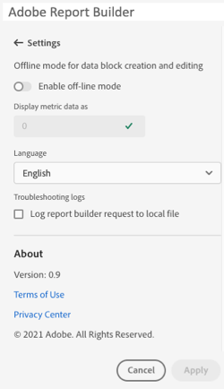
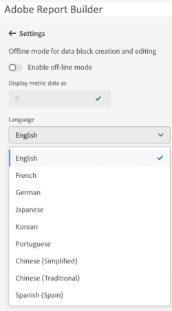

# Paramètres de Report Builder

Utilisez le volet **Paramètres** pour configurer les paramètres au niveau de l’application, tels que la langue affichée par l’interface utilisateur ou si vous souhaitez travailler ou non en mode hors ligne. Les paramètres sont appliqués immédiatement et ils sont définis pour toutes les sessions suivantes jusqu’à ce qu’ils soient modifiés.

Pour modifier les paramètres de Report Builder

1. Sélectionnez l’icône **Paramètres**.

1. Apportez des modifications à [activer ou désactiver le mode hors ligne](#off-line-mode), [sélectionner une langue](#language) ou [activer le dépannage](#troubleshooting).

1. Sélectionnez **[!UICONTROL Appliquer]**.

   {zoomable="yes"}

## Mode hors ligne

Lorsque vous créez et modifiez un bloc de données en mode hors ligne, les données ne sont pas récupérées. Au lieu de cela, des données de simulation sont utilisées afin que vous puissiez travailler rapidement sans attendre que la requête s’exécute. Lorsque vous êtes de retour en ligne, sélectionnez  **[!UICONTROL Actualiser le bloc de données]** ou  **[!UICONTROL Actualiser tous les blocs de données]** pour actualiser les blocs de données avec les données réelles.

Pour activer le mode hors ligne

1. Sélectionnez .

1. Activez le bouton (bascule) **[!UICONTROL Activer le mode hors ligne]**.

1. Saisissez un entier positif dans le champ **[!UICONTROL Afficher les données de mesure]**.

1. Sélectionnez **[!UICONTROL Appliquer]**.

## Langue

Vous pouvez choisir la langue de l’interface de Report Builder. Toutes les langues Customer Journey Analytics prises en charge sont disponibles.

Pour sélectionner la langue utilisée dans l’interface de Report Builder :

1. Sélectionnez une langue dans le menu déroulant **[!UICONTROL Langue]**.

1. Sélectionnez **Appliquer.**

## Résolution des problèmes

Le paramètre **[!UICONTROL Journaux de dépannage]** consigne toutes les données client/serveur dans un fichier local. Utilisez cette option pour résoudre les tickets d’assistance.

Pour activer les journaux de dépannage, cochez la case **[!UICONTROL Enregistrer la requête Report Builder dans le fichier local]**.

<!--
Use the **Settings** pane to configure application-level settings such as the language displayed by the UI or whether or not to work in off-line mode. The settings are applied immediately and they are set for all future sessions until they're changed.

To change Report Builder settings

1. Click the **Settings** icon.

1. Make changes to Enable off-line mode, select a Language, or enable Troubleshooting log settings.

1. Click **Apply**.

    

## Off-line mode

When creating and editing a data block in off-line mode, data is not retrieved. Instead, simulation data is used so that you can quickly create and edit a data block without waiting for the request to run. When you are back online, the *Refresh data block* command or *Refresh all data blocks* command refreshes the data blocks that you created with actual data.

To enable off-line mode

1. Click the **[!UICONTROL Settings]** icon.

1. Select **[!UICONTROL Enable off-line mod]e**.

1. Enter a positive integer in the **[!UICONTROL Display metric data as]** field.

1. Click **[!UICONTROL Apply]**.

## Language

You can choose the language for the Report Builder UI. All supported Adobe Analytics languages are available.

To select the language used in the Report Builder UI

 1. Click Settings.

 1. Select a language from the **[!UICONTROL Language]** drop down menu.

     

 1. Click **[!UICONTROL Apply].**

## Troubleshooting

Use the Troubleshooting setting to log all client/server data to a local file. Use this option to help resolve support tickets.

To enable the Troubleshooting option, select **[!UICONTROL Log report builder data block to web console]**.
-->