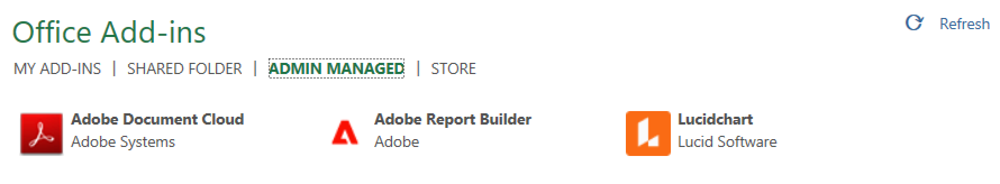

# Configuration de Report Builder

Cet article décrit les exigences relatives à l’utilisation de Report Builder pour Adobe Analytics dans [!DNL Microsoft] [!DNL Excel]. Découvrez également comment installer et configurer le complément.

## Exigences

Report Builder pour Adobe Analytics est pris en charge dans les systèmes d’exploitation et navigateurs web ci-après.

### macOS

- macOS, version 10.x ou ultérieure
- Toutes [!DNL Microsoft] versions [!DNL Excel]

### Windows

- Windows 10, version 1904 ou ultérieure
- [!DNL Excel] version 2106 ou ultérieure

  Tous les utilisateurs de [!DNL Excel] de bureau Windows doivent installer Microsoft Edge Webview2 pour utiliser le complément. Pour installer le contrôleur :

   1. Accédez à <https://aka.ms/webview2installer>.
   1. Sélectionnez et téléchargez le programme dʼinstallation dʼEvergreen en mode autonome.
   1. Suivez les invites dʼinstallation.

### Office pour le web

- Prise en charge de tous les navigateurs et versions

## Complément Excel pour Report Builder

Vous devez installer le complément Report Builder [!DNL Excel] pour utiliser [!DNL Report Builder] pour Adobe Analytics. Une fois que vous avez installé le complément Report Builder [!DNL Excel], vous pouvez accéder à Report Builder à partir d’un classeur [!DNL Excel] ouvert.

### Téléchargement et installation du complément Report Builder

Pour télécharger et installer le complément Report Builder

1. Lancez [!DNL Excel] et ouvrez un nouveau classeur.

1. Sélectionnez **[!UICONTROL Insérer]** > **[!UICONTROL Obtenir les compléments]**.

1. Dans la boîte de dialogue Compléments Office, sélectionnez lʼonglet Boutique.

1. Recherchez « Report Builder » et cliquez sur **[!UICONTROL Ajouter]**.

1. Dans la boîte de dialogue Termes de licence et politique de confidentialité, cliquez sur **[!UICONTROL Continuer]**.

**Si lʼonglet Boutique nʼest pas affiché**

1. Dans [!DNL Excel], sélectionnez Fichier > Compte > Gérer les paramètres.

1. Cochez la case en regard de l’option « Activer les expériences connectées facultatives ».

1. Redémarrez [!DNL Excel].

**Si votre organisation bloque lʼaccès au Microsoft Store**

- Contactez votre spécialiste en informatique ou en sécurité pour lui demander lʼapprobation du complément Report Builder. Une fois l&#39;approbation accordée, dans la boîte de dialogue Compléments Office, sélectionnez l&#39;onglet **[!UICONTROL Administrateur géré]**.

  

- Vous pouvez également récupérer manuellement le fichier [manifeste](https://reportbuilder.an.adobe.com/manifest.xml) et héberger le fichier sur votre propre infrastructure informatique.  Veuillez suivre la documentation en ligne [Microsoft Office](https://learn.microsoft.com/en-us/office/dev/add-ins/publish/publish) pour obtenir des instructions sur la façon d&#39;installer un fichier manifeste Excel qui n&#39;est pas diffusé à partir du magasin Microsoft.

Après l&#39;installation du complément Report Builder, l&#39;icône Report Builder est affichée dans le ruban [!DNL Excel] sous l&#39;onglet Accueil.

## Connexion à Report Builder

Après avoir installé le complément Report Builder for Excel pour votre plateforme d’exploitation ou votre navigateur, procédez comme suit pour vous connecter à Report Builder.

1. Ouvrez un classeur Excel.

1. Cliquez sur lʼicône Report Builder pour lancer Report Builder.

1. Dans la barre d’outils de Adobe Report Builder, cliquez sur **[!UICONTROL Connexion]**.

   

1. Entrez les informations correspondant à votre compte Adobe Experience ID. Les informations de votre compte doivent correspondre à vos informations d’identification Adobe Analytics.

   

Une fois la connexion effectuée, l’icône et l’organisation de connexion s’affichent en haut du panneau

## Changement dʼorganisation

Lors de votre première connexion, vous êtes connecté à lʼorganisation par défaut affectée à votre profil.

1. Cliquez sur le nom de lʼorganisation qui sʼaffiche lorsque vous vous connectez.

1. Sélectionnez une organisation dans la liste des organisations disponibles. Seules les organisations auxquelles vous avez accès sont répertoriées.

   

## Vous déconnecter ;

Vous pouvez vous déconnecter de Report Builder à partir du profil utilisateur.

1. Enregistrez les modifications dans les classeurs ouverts.

1. Cliquez sur lʼicône dʼavatar pour afficher votre profil utilisateur.

   

1. Cliquez sur **Se déconnecter**.
