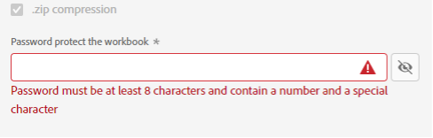
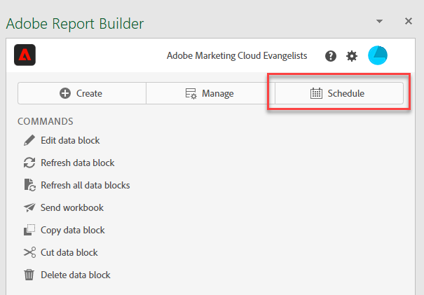
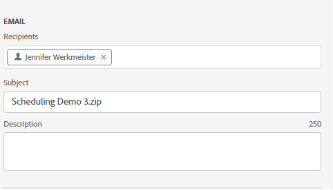
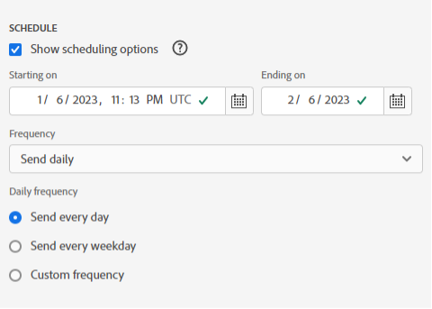
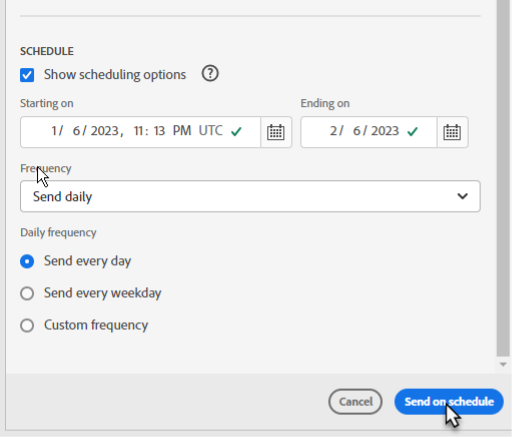
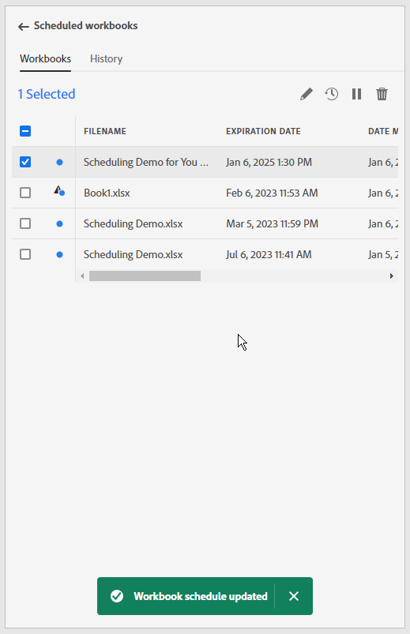
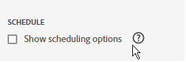

# Planification de classeurs par partage via e-mail

>[!NOTE]
>
>Outre la planification de classeurs pour le partage par e-mail, comme décrit dans cette section, vous pouvez planifier l’exportation de classeurs vers des destinations cloud, comme décrit dans la section [Planification de classeurs pour l’exportation vers des destinations cloud](/help/analyze/report-builder/report-builder-export.md).

Une fois le classeur enregistré et l’analyse terminée, vous pouvez facilement le partager avec d’autres membres de l’équipe à l’aide de la fonction de planification. La fonction Planification vous permet de créer une planification qui actualise automatiquement les données du classeur et d’envoyer par e-mail le fichier .xlsx du classeur Excel en tant que pièce jointe à une audience spécifiée à une date et une heure spécifiques. La configuration d’une planification permet aux destinataires de recevoir automatiquement des mises à jour régulières. Vous pouvez également utiliser la fonction de planification pour envoyer le classeur une seule fois sans planifier de mises à jour automatiques.

Vous pouvez créer plusieurs planifications pour un seul classeur. Par exemple, vous pouvez envoyer un classeur à votre équipe sur une base quotidienne et l’envoyer à votre responsable une fois par semaine en créant deux planifications différentes.

La fonction Planification vous permet également de configurer la protection par mot de passe d’un classeur et de modifier les classeurs planifiés précédemment.

>[!BEGINSHADEBOX]

Voir  [Planning des classeurs](https://video.tv.adobe.com/v/3413079?quality=12&learn=on){target="_blank"} pour une vidéo de démonstration.

>[!ENDSHADEBOX]

## Planifier un classeur

Pour planifier un classeur :

1. Sélectionnez **[!UICONTROL Planification]** dans le hub Report Builder pour créer une planification afin de pouvoir distribuer automatiquement un fichier Excel de classeur (.xlsx) à un individu ou à un groupe.

   {zoomable="yes"}

1. Sélectionnez **[!UICONTROL Planifier le classeur]** ou  pour créer un classeur planifié.

   {zoomable="yes"}

   Le volet de planification affiche des informations prédéfinies sur le classeur, telles que le nom du classeur et la date de la dernière modification.

### Fichier

Dans la section **[!UICONTROL Fichier]**, vous fournissez des détails sur le type de fichier, le nom et un mot de passe pour protéger le fichier.

{zoomable="yes"}

1. Utilisez  pour sélectionner le classeur actif, s’il n’est pas déjà sélectionné.

1. (Facultatif) Saisissez un **[!UICONTROL Nom de fichier]**.

   Par défaut, le nom de fichier du classeur correspond au nom du classeur, mais vous pouvez le modifier si vous le souhaitez.

1. Sélectionnez un **[!UICONTROL Type de fichier]**.

   * **[!UICONTROL Excel]**
   * **[!UICONTROL PDF]**
   * **[!UICONTROL CSV]**

   Lorsque vous sélectionnez **[!UICONTROL CSV]**, sachez que le classeur planifié est envoyé en tant que pièce jointe. Certaines administrations de messagerie d&#39;entreprise peuvent bloquer les e-mails contenant des pièces jointes au format zip. Un avertissement s’affiche en conséquence.

1. (Facultatif) Sélectionnez **[!UICONTROL Ajouter un horodatage au nom du fichier]**.

   Vous pouvez ajouter un horodatage au nom du fichier pour indiquer la date à laquelle le classeur a été mis à jour. Un horodatage est utile pour savoir quelle version d’un classeur a été envoyée à une date spécifique. Lorsque cette option est sélectionnée, vous pouvez choisir entre :

   * **[!UICONTROL Format de date ISO]**, ce qui entraîne l’ajout de `YYYY-MM-DD` au nom de fichier.
   * **[!UICONTROL Format de date ISO + horodatage]**, ce qui entraîne l’ajout de `YYYY-MM-DD_HH-MM-SS` au nom de fichier.

<!-- Does no longer seem to be an option? 
1. (Optional) Select **.zip compression** to compress the file and set up password protection on the file.

    When you make this selection, you're prompted to enter a password to open the file. This is helpful if you have concerns about data security and you want to password protect the workbook. Protecting the file with a password requires you to select **.zip compression**. The password must be at least 8 characters and contain a number and a special character.

    {zoomable="yes"}{width="55%"}
-->

1. Saisissez un mot de passe dans **[!UICONTROL Protéger le classeur par mot de passe]**. Un mot de passe valide nécessite au moins 8 caractères, un nombre et un caractère spécial. Sélectionnez  pour afficher le mot de passe et  pour le masquer (par défaut).

### Adresse électronique

Dans la section **[!UICONTROL E-mail]**, indiquez les destinataires, l’objet et la description de l’e-mail.

{zoomable="yes"}

1. Saisissez les **Destinataires**. Vous pouvez saisir le nom d&#39;une personne reconnue dans votre organisation. Vous pouvez également saisir l’adresse e-mail d’une personne extérieure à votre entreprise.

1. Saisissez l’**Objet** de l’e-mail et une description pour vos destinataires. Par défaut, l’objet correspond au nom de fichier du classeur, mais vous pouvez modifier l’objet si nécessaire. Vous pouvez ajouter des détails dans la section de description.

1. Vous pouvez éventuellement saisir une description dans la zone de texte **[!UICONTROL Description]**.

### Planifier

Dans la section **[!UICONTROL Planifier]**, vous pouvez définir la planification pour envoyer les e-mails avec le classeur à vos destinataires.

{zoomable="yes"}

1. Sélectionnez **[!UICONTROL Afficher les options de planification]** pour définir une planification.

1. Saisissez une date de début dans **[!UICONTROL À partir du]**. Vous pouvez également sélectionner  pour choisir une date de début dans le calendrier.

1. Saisissez une date de fin dans **[!UICONTROL Se terminant le]**. Vous pouvez également sélectionner  pour choisir une date de fin dans le calendrier.

1. Sélectionnez une **[!UICONTROL Fréquence]**. Selon la fréquence sélectionnée, vous disposez d’options supplémentaires. Voir le tableau ci-dessous.

   | Fréquence | Options |
   |---|---|
   | **[!UICONTROL Envoyer par heure]** | Saisissez une valeur pour **[!UICONTROL Envoyer toutes les heures]**. |
   | **[!UICONTROL Envoyer quotidiennement]** | Sélectionnez une **[!UICONTROL Fréquence quotidienne]** : **[!UICONTROL Envoyer tous les jours]**, **[!UICONTROL Envoyer tous les jours de la semaine]** ou **[!UICONTROL Fréquence personnalisée]**. Si vous sélectionnez **[!UICONTROL Fréquence personnalisée]**, saisissez une valeur pour **[!UICONTROL Envoyer tous les jours]**. |
   | **[!UICONTROL Envoyer une fois par semaine]** | Saisissez une valeur pour **[!UICONTROL Envoyer toutes les semaines]**. Sélectionnez ensuite un **[!UICONTROL Jour de la semaine]**. |
   | **[!UICONTROL Envoyer mensuellement par jour de la semaine]** | Sélectionnez un **[!UICONTROL Jour de la semaine]** et un **[!UICONTROL Semaine du mois]**. |
   | **[!UICONTROL Envoyer mensuellement par jour du mois]** | Sélectionnez une valeur dans **[!UICONTROL Envoyer ce jour du mois]**. |
   | **[!UICONTROL Envoyer annuellement par jour du mois]** | Sélectionnez un **[!UICONTROL Jour de la semaine]**, une **[!UICONTROL Semaine du mois]** et une **[!UICONTROL Mensuel de l’année]**. |
   | **[!UICONTROL Envoyer annuellement par date spécifique]** | Sélectionnez un **[!UICONTROL Mois de l’année]** et sélectionnez une valeur dans **[!UICONTROL Envoyer ce jour du mois]**. |

### Envoyer

Pour envoyer le classeur :

* Si vous n’avez pas défini de planning à l’aide de l’option **[!UICONTROL Afficher les options de planification]**, sélectionnez **[!UICONTROL Envoyer maintenant]** pour envoyer immédiatement le classeur par e-mail.
* Si vous avez défini une planification à l’aide de l’option **[!UICONTROL Afficher les options de planification]**, sélectionnez **[!UICONTROL Envoyer selon le calendrier]** pour envoyer le classeur par e-mail à l’aide de la planification que vous avez définie.

Dans les deux cas, un toast de confirmation s’affiche au bas du hub Report Builder.

Pour annuler l’envoi du classeur, sélectionnez **[!UICONTROL Annuler]**.

## Gérer les classeurs planifiés

Pour plus d’informations sur la gestion des classeurs déjà planifiés, voir [&#x200B; Gérer les classeurs planifiés &#x200B;](/help/analyze/report-builder/manage-reportbuilder.md).

<!--

## Schedule a workbook

Use the Schedule button in the Report Builder hub to quickly create a schedule so that you can automatically distribute a workbook Excel file (.xlsx) to an individual or a group.

1. Click the Schedule button in the Report Builder hub.

    {width="55%"}

1. Click Schedule Workbook or the plus button in the upper-left to create a new scheduled workbook.

    {width="55%"}

    The scheduling pane displays some pre-defined information about the workbook such as the workbook name and the last date that the workbook was modified.

    {width="55%"}

1. (Optional) Enter a file name.

    The workbook file name defaults to the name of the workbook but you can change this if you want. If you\'re sending the same workbook to multiple audiences and you want to name it something a little bit more friendly for a certain audience, you can change the name.

1. (Optional) Select **Append time-stamp to file name**.

    You can append a timestamp to the file name to identify the date the workbook was updated. This is helpful to quickly see which version of a workbook was sent on a specific date. The **Filename preview** shows how the workbook file name will appear in the email when the workbook is distributed. The time-stamp format is YYYY-MM-DD.

1. (Optional) Select **.zip compression** to compress the file and set up password protection on the file.

    When you make this selection, you're prompted to enter a password to open the file. This is helpful if you have concerns about data security and you want to password protect the workbook. Protecting the file with a password requires you to select **.zip compression**. The password must be at least 8 characters and contain a number and a special character.

    {width="55%"}

1. Enter **Recipients**. You can enter the name of a person that is recognized in your organization, or you can enter an email address of a person inside or outside of your organization.

1. Enter the **Subject** of the email and a description for your recipients. The subject defaults to the workbook file name but you can modify the subject if needed. You can add details in the description section.

    {width="55%"}

1. Set up the scheduling options to set the date and time that you want the workbook emailed to your recipients.

    Choose the start and end date and time frames. This can be today's date or a date in the future.

    Choose the **Frequency** from the drop-down menu. You can set the frequency to be hourly, daily, weekly, monthly, or yearly on a specific day. For example, you can set up a schedule to send the workbook on the first Sunday night of the month so that your recipients will have the email in their inbox first thing on Monday morning.

    {width="55%"}

1. After you set the schedule, click **Send on schedule**.

    {width="55%"}

    You see a confirmation toast at the bottom of the Report Builder hub and the scheduled workbook is listed under the Workbooks tab.

    {width="55%"}

## Schedule a converted workbook {#converted}

1. Schedule a [converted](/help/analyze/report-builder/convert-workbooks.md) legacy workbook.

   A pop up appears, asking if you want to use the scheduling metada from the legacy workbook to create a new scheduled task. 

1. If you select **[!UICONTROL Use]**, Report Builder automatically fills in the legacy scheduling information. 

1. Ensure that this information is correct and schedule. 

1. If you want to send the workbook on a different schedule, schedule a completely fresh scheduled task. 

## Send the workbook one-time only

You can also send out the workbook only once.

1. Un-check **Show scheduling options** 

    {width="40%"}

1. Click **Send Now**.

## Manage scheduled workbooks

For information about managing workbooks that are already scheduled, see [Manage scheduled workbooks](/help/analyze/report-builder/manage-schedules-reportbuilder.md).

-->