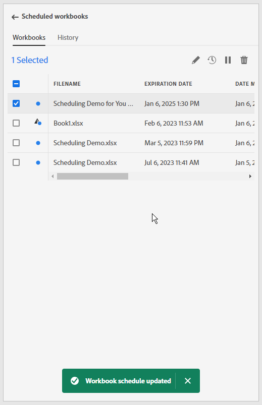

# Planification de classeurs par partage via e-mail

>[!NOTE]
>
>Outre la planification de classeurs pour le partage par e-mail, comme décrit dans cette section, vous pouvez planifier l’exportation de classeurs vers des destinations cloud, comme décrit dans la section [Planification de classeurs pour l’exportation vers des destinations cloud](/help/analyze/report-builder/report-builder-export.md).

Une fois le classeur enregistré et l’analyse terminée, vous pouvez facilement le partager avec d’autres membres de l’équipe à l’aide de la fonction de planification. La fonction Planification vous permet de créer une planification qui actualise automatiquement les données du classeur et d’envoyer par e-mail le fichier .xlsx du classeur Excel en tant que pièce jointe à une audience spécifiée à une date et une heure spécifiques. La configuration d’une planification permet aux destinataires de recevoir automatiquement des mises à jour régulières. Vous pouvez également utiliser la fonction de planification pour envoyer le classeur une seule fois sans planifier de mises à jour automatiques.

Vous pouvez créer plusieurs planifications pour un seul classeur. Par exemple, vous pouvez envoyer un classeur à votre équipe sur une base quotidienne et l’envoyer à votre responsable une fois par semaine en créant deux planifications différentes.

La fonction Planification vous permet également de configurer la protection par mot de passe d’un classeur et de modifier les classeurs planifiés précédemment.

>[!BEGINSHADEBOX]

Voir  [Planning des classeurs](https://video.tv.adobe.com/v/3417504?quality=12&learn=on&captions=fre_fr){target="_blank"} pour une vidéo de démonstration.

>[!ENDSHADEBOX]

## Planifier un classeur

Utilisez le bouton Planifier dans le hub Report Builder pour créer rapidement une planification afin de pouvoir distribuer automatiquement un fichier Excel de classeur (.xlsx) à un individu ou à un groupe.

1. Cliquez sur le bouton Planifier dans le centre Report Builder.

   {width="55%"}

1. Cliquez sur Planifier un classeur ou sur le bouton Plus dans le coin supérieur gauche pour créer un classeur planifié.

   {width="55%"}

   Le volet de planification affiche des informations prédéfinies sur le classeur, telles que le nom du classeur et la date de la dernière modification.

   {width="55%"}

1. (Facultatif) Saisissez un nom de fichier.

   Par défaut, le nom de fichier du classeur correspond au nom du classeur, mais vous pouvez le modifier si vous le souhaitez. Si vous envoyez le même classeur à plusieurs audiences et que vous souhaitez lui donner un nom un peu plus convivial pour une audience particulière, vous pouvez changer son nom.

1. (Facultatif) Sélectionnez **Ajouter un horodatage au nom du fichier**.

   Vous pouvez ajouter un horodatage au nom du fichier pour indiquer la date à laquelle le classeur a été mis à jour. Ceci est utile pour vérifier rapidement quelle version d’un classeur a été envoyée à une date spécifique. L’**Aperçu du nom de fichier** permet de voir la manière dont le nom de fichier du classeur apparaîtra dans l’e-mail lors de la distribution du classeur. Le format d’horodatage est AAAA-MM-JJ.

1. (Facultatif) Sélectionnez **compression .zip** pour compresser le fichier et configurer sa protection par mot de passe.

   Lorsque vous effectuez cette sélection, vous êtes invité à saisir un mot de passe pour ouvrir le fichier. Ceci est utile si vous avez des inquiétudes concernant la sécurité des données et que vous souhaitez protéger le classeur par mot de passe. Pour protéger le fichier avec un mot de passe, vous devez sélectionner **compression .zip**. Le mot de passe doit contenir au moins 8 caractères, un chiffre et un caractère spécial.

   {width="55%"}.

1. Saisissez les **Destinataires**. Vous pouvez saisir le nom d’une personne reconnue dans votre organisation ou saisir l’adresse e-mail d’une personne interne ou externe à votre organisation.

1. Saisissez l’**Objet** de l’e-mail et une description pour vos destinataires. Par défaut, l’objet correspond au nom de fichier du classeur, mais vous pouvez modifier l’objet si nécessaire. Vous pouvez ajouter des détails dans la section de description.

   {width="55%"}

1. Configurez les options de planification pour définir la date et l’heure auxquelles le classeur doit être envoyé par e-mail aux destinataires.

   Sélectionnez les dates et périodes de début et de fin. Il peut s’agir de la date d’aujourd’hui ou d’une date ultérieure.

   Choisissez la **Fréquence** dans le menu déroulant. Vous pouvez choisir une fréquence horaire, quotidienne, hebdomadaire, mensuelle ou annuelle pour un jour spécifique. Par exemple, vous pouvez configurer une planification pour envoyer le classeur le premier dimanche soir du mois afin que vos destinataires voient l’e-mail dans leur boîte de réception à la première heure le lundi matin.

   {width="55%"}

1. Une fois la planification définie, cliquez sur **Envoyer selon le calendrier**.

   {width="55%"}

   Un toast de confirmation s’affiche au bas du hub Report Builder et le classeur planifié est répertorié sous l’onglet Classeurs.

   {width="55%"}

## Planifier un classeur converti {#converted}

1. Planifiez un classeur hérité [&#x200B; converti &#x200B;](/help/analyze/report-builder/convert-workbooks.md).

   Une fenêtre contextuelle s’affiche, vous demandant si vous souhaitez utiliser les métadonnées de planification de l’ancien classeur pour créer une nouvelle tâche planifiée.

1. Si vous sélectionnez **[!UICONTROL Utiliser]**, Report Builder renseigne automatiquement les informations de planification héritées.

1. Assurez-vous que ces informations sont correctes et programmez-les.

1. Si vous souhaitez envoyer le classeur selon une planification différente, planifiez une tâche planifiée entièrement nouvelle.

## Envoyer le classeur une seule fois

Vous pouvez également envoyer le classeur une seule fois.

1. Désélectionnez **Afficher les options de planification**.

   {width="40%"}

1. Cliquez sur **Envoyer maintenant**.

## Gérer les classeurs planifiés

Pour plus d’informations sur la gestion des classeurs déjà planifiés, voir [&#x200B; Gérer les classeurs planifiés &#x200B;](/help/analyze/report-builder/manage-schedules-reportbuilder.md).
