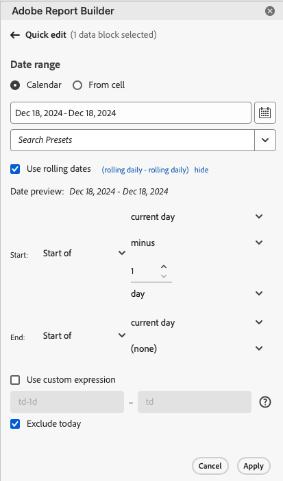

# Sélection dʼune période

Pour modifier la période dʼun bloc de données existant, sélectionnez Modifier un bloc de données ou utilisez le panneau MODIFICATION RAPIDE.

Utilisez les options suivantes pour modifier une période dʼun bloc de données.

**Calendrier**

Le Calendrier vous permet de créer des dates fixes ou variables à lʼaide des options suivantes :

- Champ de période
- Calendrier
- Menu déroulant des Paramètres prédéfinis
- Mode Date roulante
- Personnalisation des expressions


**À partir de la cellule**

Lʼoption À partir de la cellule vous permet de référencer les dates saisies dans les cellules des feuilles de calcul.

Vous avez la possibilité dʼexclure la date dʼaujourdʼhui pour nʼimporte quelle période sélectionnée.



## Utilisation du calendrier

Lorsque vous utilisez le **Calendrier**, le champ de période affiche la période en cours pour la requête du bloc de données. Vous pouvez saisir des dates directement dans le champ de période ou utiliser lʼoption de sélection de période.

### Champ de période

Pour saisir des dates directement dans le champ de période, procédez comme suit :

1. Cliquez sur le champ Période en regard de lʼicône Calendrier.

1. Entrez les dates de début et de fin pour la période.

### Calendrier

Pour sélectionner des dates à lʼaide du calendrier, procédez comme suit :

1. Cliquez sur lʼicône Calendrier pour afficher un calendrier mensuel.

1. Cliquez sur une date de début.

1. Cliquez sur une date de fin.

Pour définir une période en sens inverse, cliquez dʼabord sur la date de fin, puis sur la date de début.


### Menu déroulant Paramètre prédéfini

Le menu déroulant des paramètres prédéfinis comprend un ensemble standard de périodes et de composants de période prédéfinis pour une vue de données que vous avez enregistrée ou qui a été partagée avec vous.

### Dates roulantes

Lʼoption Dates roulantes vous permet de sélectionner une période à lʼaide de dates roulantes.

1. Sélectionnez **Utiliser des dates roulantes**.

1. Sélectionnez une expression variable pour les dates de début et/ou de fin.

   

   **Début du** - Permet de sélectionner le début dʼun jour, dʼune semaine, dʼun mois, dʼun trimestre ou dʼune année.

   **Fin du** - Permet de sélectionner la fin dʼun jour, dʼune semaine, dʼun mois, dʼun trimestre ou dʼune année.

   **Jour fixe** - Permet de fixer une date de début ou de fin alors que lʼautre date est roulante.

1. Sélectionnez la période roulante : jour, semaine, mois, trimestre ou année.

   

1. Ajoutez ou enlevez des jours, semaines, mois, trimestres ou années à votre date roulante.

   

1. Cliquez sur Suivant pour définir la période.

   Utilisez lʼaperçu de la date pour vous assurer que la période obtenue est bien celle que vous souhaitez.

### Expressions personnalisées

Lʼoption dʼexpression personnalisée vous permet de modifier la période en créant une expression personnalisée ou en saisissant une formule arithmétique.

1. Sélectionnez lʼoption **Utiliser des dates roulantes**.

1. Sélectionnez ensuite **Utiliser une expression personnalisée**.

   Lorsque vous sélectionnez lʼoption **Utiliser une expression personnalisée**, les commandes standard relatives aux périodes roulantes sont désactivées.

   

1. Saisissez une expression personnalisée.

   Pour obtenir un exemple de liste dʼexpressions personnalisées, consultez la page **Expressions de date**.

1. Utilisez lʼaperçu de la date pour vérifier que la période obtenue est bien celle que vous souhaitez.

#### Création dʼune expression personnalisée

1. Saisissez une **Référence de date**.

1. Ajoutez des **Opérateurs de date** pour déplacer la date vers le passé ou le futur.

Vous pouvez saisir une expression de date personnalisée qui comprend plusieurs opérateurs, tels que ```tm-11m-1d```.

#### Références de date

Le tableau suivant dresse une liste dʼexemples de références de date.

| Référence de date | Type | Description |
|----------------|--------------|----------------------------|
| 1/1/10 | Date statique | Saisie au format de date ISO |
| td | Date roulante | Début du jour en cours |
| tw | Date roulante | Début de la semaine en cours |
| tm | Date roulante | Début du mois en cours |
| tq | Date roulante | Début du trimestre en cours |
| ty | Date roulante | Début de lʼannée en cours |

#### Opérateurs de date

Le tableau suivant dresse une liste dʼexemples dʼopérateurs de date.

| Opérateurs de date | Unité | Description |
|----------------|---------|--------------------|
| +6d | Jour | Ajout de 6 jours à la référence de date |
| +1w | Semaine | Ajout dʼune semaine complète à la référence de date |
| -2m | Mois | Soustraction de 2 mois complets à la référence de date |
| -4q | Trimestre | Soustraction de 4 trimestres à la référence de date |
| -1y | Année | Soustraction dʼune année à la référence de date |

#### Expressions de date

Le tableau suivant dresse une liste dʼexemples dʼexpressions de date.

| Expression de date | Signification |
|-----------------|--------------------------------------|
| td-1w | Premier jour de la semaine dernière |
| tm-1d | Dernier jour du mois précédent |
| td-52w | Même jour, 52 semaines auparavant |
| tm-11m-1d | Dernier jour du même mois il y a un an |
| &quot;2020-09-06&quot; | 9 septembre 2020 |

## Période à partir dʼune cellule

La période peut être spécifiée dans les cellules des feuilles de calcul. Utilisez lʼoption **Période à partir dʼune cellule** pour choisir la date de début et de fin du bloc de données à partir des cellules sélectionnées. Lorsque vous sélectionnez lʼoption **À partir de la cellule**, le panneau affiche les champs **De** et **À** dans lesquels vous pouvez saisir un emplacement de cellule.


## Exclure aujourdʼhui

Choisissez lʼoption **Exclure aujourdʼhui** pour exclure aujourd’hui dʼune période sélectionnée. Si vous choisissez dʼinclure aujourd’hui, les données peuvent se révéler incomplètes.

Lorsque lʼoption **Exclure aujourdʼhui** est sélectionnée, le jour en cours est exclus de tous les modes de période, y compris le calendrier, les dates roulantes ou les expressions personnalisées.

## Périodes valides

La liste suivante décrit les formats de période valides.

- Les dates de début et de fin doivent respecter le format suivant : AAAA-MM-JJ.

- La date de début doit être antérieure ou égale à la date de fin. Les deux dates peuvent être définies dans le futur.

- Lors de lʼutilisation de dates roulantes, la date de début doit correspondre au jour en cours ou à une date dans le passé. La date de début doit obligatoirement se situer dans le passé si la case **Exclure aujourdʼhui** est cochée.

- Vous pouvez créer une période fixe définie dans le futur. Par exemple, vous pourriez avoir besoin de définir une date dans le futur à lʼoccasion du lancement dʼune campagne marketing, prévue la semaine suivante. Cette option permet de créer une surveillance préalable des classeurs pour une campagne.

## Modification de la période

Vous pouvez modifier la période dʼun bloc de données existant en sélectionnant Modifier le bloc de données dans le panneau COMMANDES, ou en accédant au lien de la période dans le panneau MODIFICATION RAPIDE.

**Modifier le bloc de données** : permet de modifier plusieurs paramètres dʼun bloc de données, y compris la période, pour un bloc de données unique.

**Modification rapide : période** - Permet de modifier la période dʼun ou de plusieurs blocs de données.

Pour modifier la période dans le panneau MODIFICATION RAPIDE, effectuez les étapes suivantes :

1. sélectionnez des cellules dans un ou plusieurs blocs de données dʼune feuille de calcul.

1. Cliquez sur le lien de la **Période** dans le panneau MODIFICATION RAPIDE.

1. Sélectionnez la période à lʼaide de lʼune des options de sélection de la date.

1. Cliquez sur **Appliquer**.


Report Builder applique la nouvelle période à tous les blocs de données de la sélection.
