# Sélectionner une période

Pour modifier la période d’un bloc de données existant :

- Sélectionnez **[!UICONTROL Modifier un bloc de données]** ou
- Sélectionnez le lien **[!UICONTROL Période]** dans **[!UICONTROL Modification rapide]**.

Utilisez les options suivantes pour modifier une période dʼun bloc de données.

## Calendrier

L’option **[!UICONTROL Calendrier]** vous permet de créer des dates statiques ou flottantes à l’aide des options suivantes :

### Période

Le champ de période affiche la période en cours pour la requête du bloc de données. Vous pouvez saisir des dates directement ou utiliser  pour spécifier une période.

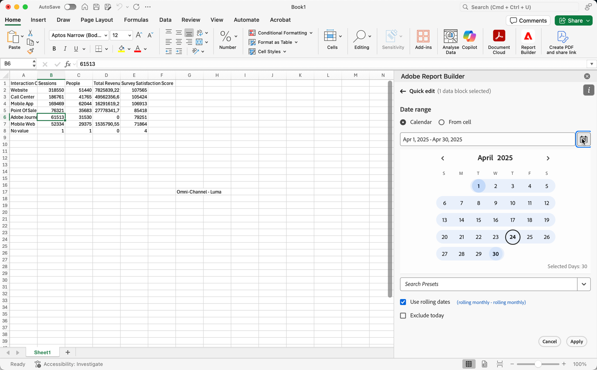{zoomable="yes"}

### Paramètres prédéfinis

Utilisez le menu déroulant des paramètres prédéfinis pour sélectionner un paramètre prédéfini. Vous pouvez également saisir du texte pour rechercher des paramètres prédéfinis.

{zoomable="yes"}

Le menu déroulant des paramètres prédéfinis comprend un ensemble standard de périodes et de composants de période prédéfinis pour une suite de rapports que vous avez enregistrée ou qui a été partagée avec vous.

### Dates roulantes

Pour définir des dates flottantes :

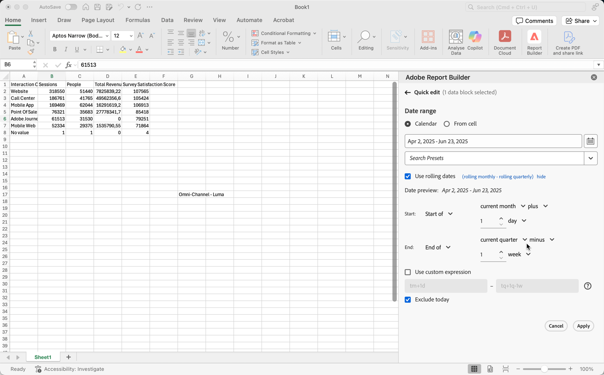{zoomable="yes"}

1. Sélectionnez **[!UICONTROL Utiliser des dates flottantes]** pour définir la logique d’une définition de date flottante. Vous pouvez sélectionner le texte entre crochets (par exemple, **[!UICONTROL début fixe - roulement quotidien]**) pour étendre le panneau et spécifier des détails pour **[!UICONTROL Début]** et **[!UICONTROL Fin]**.

1. Sélectionnez **[!UICONTROL Début de]**, **[!UICONTROL Fin de]** ou **[!UICONTROL Jour fixe]**.

   - Lorsque vous avez sélectionné **[!UICONTROL Début de]** ou **[!UICONTROL Fin de]**, vous pouvez créer une expression complète. Par exemple : **[!UICONTROL Fin de]** **[!UICONTROL l’année en cours]** **[!UICONTROL plus]** `1` **[!UICONTROL jour]**. Sélectionnez la valeur appropriée pour chaque partie de l’expression.

      - Sélectionnez une valeur pour la période actuelle. Par exemple, **[!UICONTROL année en cours]**.
      - Sélectionnez une valeur pour un calcul supplémentaire facultatif. Par exemple, **[!UICONTROL plus]**.
      - Lorsque vous avez spécifié un calcul supplémentaire, indiquez une valeur. Par exemple : `1`.
      - Lorsque vous avez spécifié un calcul supplémentaire, sélectionnez la période à utiliser pour le calcul. Par exemple, **[!UICONTROL day]**.

   - Lorsque vous avez sélectionné **[!UICONTROL Jour fixe]**, spécifiez un jour fixe ou utilisez le sélecteur pour sélectionner un jour.

1. Sélectionnez **[!UICONTROL masquer]** pour masquer les détails du calcul des dates flottantes.


### Expressions personnalisées

Lʼoption dʼexpression personnalisée vous permet de modifier la période en créant une expression personnalisée ou en saisissant une formule arithmétique.

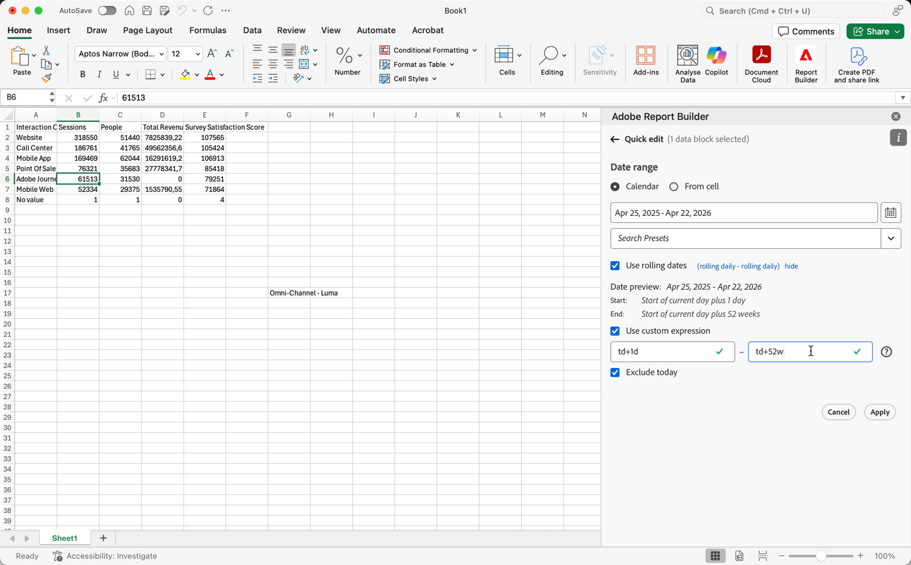{zoomable="yes"}

1. Sélectionnez lʼoption **[!UICONTROL Utiliser des dates roulantes]**.

1. Sélectionnez ensuite **[!UICONTROL Utiliser une expression personnalisée]**.

   Lorsque vous sélectionnez **[!UICONTROL Utiliser une expression personnalisée]**, les contrôles standard des périodes flottantes sont désactivés.

1. Saisissez une [expression personnalisée](#create-a-custom-expression).

1. Utilisez l’**[!UICONTROL Aperçu de la date]** pour vérifier la période résultante.

#### Création dʼune expression personnalisée

1. Saisissez une [référence de date](#date-references).

1. Ajoutez un [opérateur de date](#date-operators) facultatif pour déplacer la date vers le passé ou le futur.

Vous pouvez saisir une expression personnalisée qui comprend plusieurs opérateurs, tels que `tm-11m-1d`.

#### Références de date

Le tableau suivant dresse une liste dʼexemples de références de date.

| Référence de date | Type | Description |
|----------------|--------------|----------------------------|
| `1/1/10` | Date statique | Saisie au format de date ISO |
| `td` | Date roulante | Début du jour en cours |
| `tw` | Date roulante | Début de la semaine en cours |
| `tm` | Date roulante | Début du mois en cours |
| `tq` | Date roulante | Début du trimestre en cours |
| `ty` | Date roulante | Début de lʼannée en cours |

#### Opérateurs de date

Le tableau suivant dresse une liste dʼexemples dʼopérateurs de date.

| Opérateur de date | Unité | Description |
|----------------|---------|--------------------|
| `+6d` | Jour | Ajout de 6 jours à la référence de date |
| `+1w` | Semaine | Ajout dʼune semaine complète à la référence de date |
| `-2m` | Mois | Soustraction de 2 mois complets à la référence de date |
| `-4q` | Trimestre | Soustraction de 4 trimestres à la référence de date |
| -`1y` | Année | Soustraction dʼune année à la référence de date |

#### Expressions de date

Le tableau suivant dresse une liste dʼexemples dʼexpressions de date.

| Expression de date | Signification |
|-----------------|--------------------------------------|
| `td` | Today |
| `td-1w` | Premier jour de la semaine dernière |
| `tm-1d` | Dernier jour du mois précédent |
| `td-52w` | Même jour, 52 semaines auparavant |
| `tm-11m-1d` | Dernier jour du même mois il y a un an |
| `"2020-09-06"` | Date précise, 9 septembre 2020 |


## Période à partir dʼune cellule

La période peut être spécifiée dans les cellules des feuilles de calcul. Utilisez l’option **[!UICONTROL Période à partir de la cellule]** pour choisir les dates de début et de fin du bloc de données dans les cellules sélectionnées. Lorsque vous sélectionnez l’option **[!UICONTROL À partir de la cellule]**, le panneau affiche les champs **[!UICONTROL De]** et **[!UICONTROL À]** dans lesquels vous pouvez saisir l’emplacement d’une cellule ou utiliser  pour sélectionner la cellule sélectionnée.

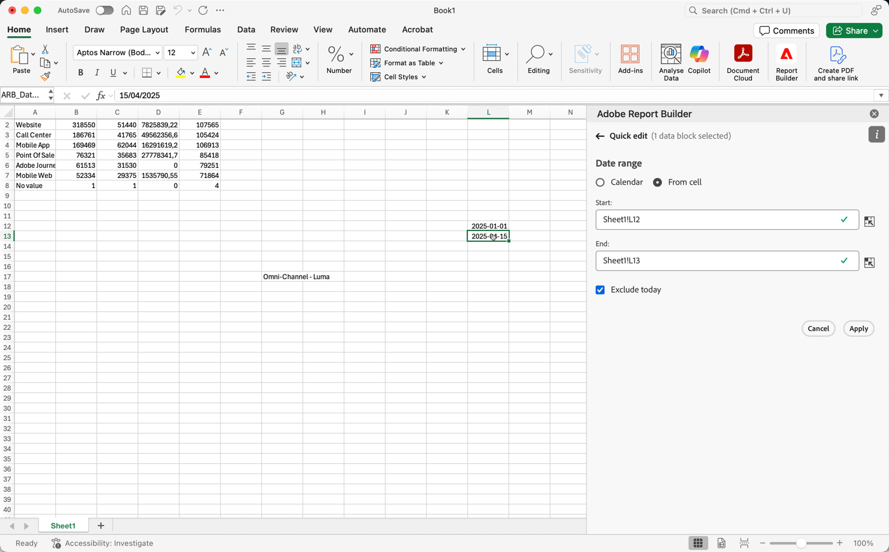{zoomable="yes"}


## Exclure aujourdʼhui

Sélectionnez **[!UICONTROL Exclure aujourd’hui]** pour exclure aujourd’hui d’une période sélectionnée. Le jour en cours est exclu de tous les modes utilisés pour définir une période : calendrier, dates flottantes ou expressions personnalisées.


## Périodes valides

La liste suivante décrit les formats de période valides.

- Les dates de début et de fin doivent respecter le format suivant : AAAA-MM-JJ.

- La date de début doit être antérieure ou égale à la date de fin. Les deux dates peuvent être définies dans le futur.

- Lors de lʼutilisation de dates roulantes, la date de début doit correspondre au jour en cours ou à une date dans le passé. Le jour de début doit être dans le passé si l’option **[!UICONTROL Exclure aujourd’hui]** est sélectionnée.

- Vous pouvez créer une période fixe définie dans le futur. Par exemple, vous pourriez avoir besoin de définir une date dans le futur à lʼoccasion du lancement dʼune campagne marketing, prévue la semaine suivante. Cette option permet de créer une surveillance préalable des classeurs pour une campagne.

## Modification de la période

Vous pouvez modifier la période d’un bloc de données existant.

1. Sélectionnez une cellule dans votre bloc de données.

- Sélectionnez **[!UICONTROL Modifier le bloc de données]** dans le panneau **[!UICONTROL Commandes]** ou
- Sélectionnez le lien **[!UICONTROL Période]** dans le panneau **[!UICONTROL Modification rapide]**.

1. Modifiez la période à l’aide de l’une des options de sélection de date disponibles.

1. Sélectionnez **[!UICONTROL Appliquer]**.

Report Builder applique la nouvelle période à tous les blocs de données de la sélection.

<!--
To change the date range of an existing data block, select Edit a data block or use the QUICK EDIT panel.

Use the following options to change a date range for a data block.

**Calendar**

 The Calendar allows you to create static or rolling dates using the following options:

- Date range field
- Calendar
- Preset drop-down menu
- Rolling date mode
- Customize expressions


**From cell**

The **[!UICONTROL From cell]** option allows you to reference dates entered in worksheet cells.

You have the option to exclude today on any selected date range.

 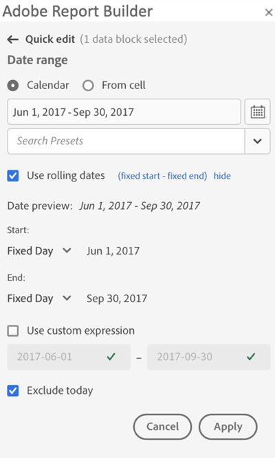

## Use the Calendar

When you use the **Calendar**, the date range field displays the current date range for the data block request. You can enter dates directly into the date range field or use a data range selection option.

### Date range field

To enter dates directly into the date range field

1. Click the date range field next to the calendar icon.

1. Enter start and end dates for your date range.

### Calendar

To select dates using the calendar

1. Click the calendar icon to display a monthly calendar.

1. Click a start date.

1. Click an end date.

To set a date range in reverse, click the end date first and then click the start date.

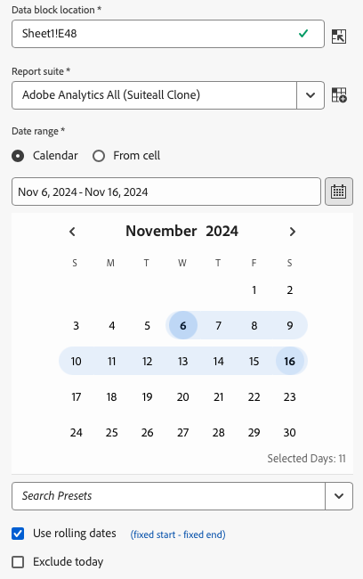

### Preset drop down menu

The preset drop-down menu includes a standard set of preset date ranges and date range components for a report suite that you saved or a report suite that was shared with you.

### Rolling dates

The rolling dates option allows you to select a date range using rolling dates.

1. Select **Use rolling dates**.

1. Select a rolling expression for your start and or end date.

    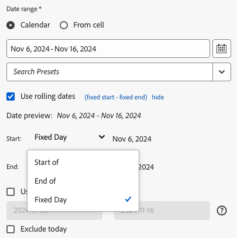

    **Start of** — Allows you to select the beginning of a day, week, month, quarter, or year.

    **End of** — Allows you to select the end of a day, week, month, quarter, or year.

    **Fixed day** — Allows you to fix a start or end date while the other date is rolling.

1. Choose day, week, month, quarter, or year as the rolling period.

    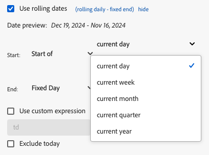

1. Add or subtract days, weeks, months, quarters, or years from your rolling date.

    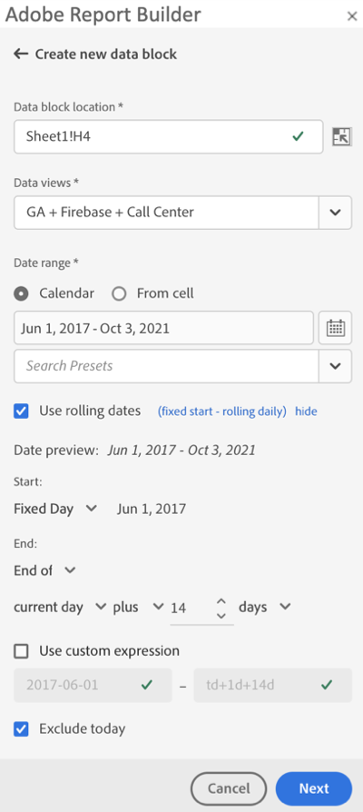

1. Click Next to define the data range.

    Use the date preview to confirm the resulting date range is the desired range.

### Custom expressions

The custom expression option allows you to change the date range by building a custom expression or you can enter an arithmetic formula.

1. Select **Use rolling dates**.

1. Select **Use custom expression**.

    When you select the **Use custom expression** option, the standard rolling date range controls are disabled.

    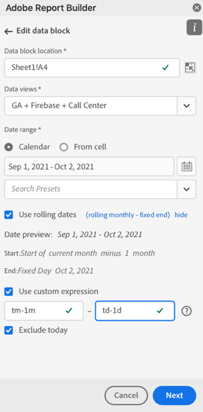

1. Enter a custom expression.

    For a sample list of custom expressions, see **Date expressions**.

1. Use the date preview to verify the resulting date range is the desired range.

#### Create a custom expression

1. Enter a **Date reference**.

1. Add **Date operators** to move the date to the past or future.

You can enter a custom date expression that includes multiple operators, such as ```tm-11m-1d```.

#### Date references

The following table lists date reference examples.

| Date Reference | Type         | Description                |
|----------------|--------------|----------------------------|
| 1/1/10         | Static Date  | Entered in ISO Date format |
| td             | Rolling Date | Start of current day       |
| tw             | Rolling Date | Start of current week      |
| tm             | Rolling Date | Start of current month     |
| tq             | Rolling Date | Start of current quarter   |
| ty             | Rolling Date | Start of current year      |

#### Date operators

The following table lists date operator examples.

| Date Operators | Unit    | Description   |
|----------------|---------|--------------------|
| +6d            | Day     | Add 6 days to the Date Reference |
| +1w            | Week    | Add one full week to the Date Reference |
| -2m            | Month   | Subtract 2 full months to the Date Reference |
| -4q            | Quarter | Subtract 4 quarters to the Date Reference |
| -1y            | Year    | Subtract one year to the Date Reference |

#### Date expressions

The following table lists date expression examples.

| Date Expression | Meaning                              |
|-----------------|--------------------------------------|
| td-1w           | First day of last week               |
| tm-1d           | Last day of previous month           |
| td-52w          | Same day, 52 weeks ago               |
| tm-11m-1d       | Last day of the same month last year |
| "2020-09-06"    | Sept 9th, 2020                       |

## Date range from cell

The date range can be specified in worksheet cells. Use the **Date range from cell** option to choose the data block start and end date from selected cells. When you select the **From cell** option, the panel displays **From** and **To** fields where you can enter a cell location.

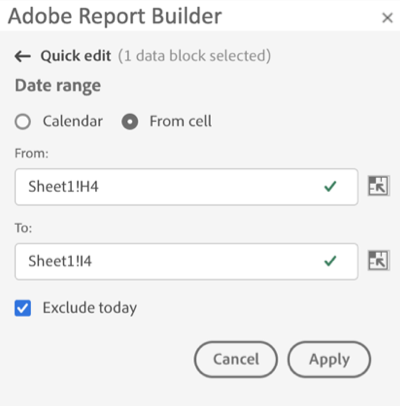

## Exclude today

Choose the **Exclude today** option to exclude today from a selected date range. Choosing to include today may pull incomplete data for today.

When selected, the **Exclude today** option excludes the current day from all date range modes including calendar, rolling dates, or custom expressions.

## Valid date ranges

The following list describe valid date range formats.

- The start and end dates must be in the following format: YYYY-MM-DD

- The start date must be earlier to or equal to the end date. Both dates can be set to the future.

- When using rolling dates, the start date must be today or in the past. It must be in the past if **Exclude today** is checked.

- You can create a static date range set for the future. For example, you may need to set a future date for a marketing campaign launch next week. This option creates a workbook monitoring for a campaign ahead of time.

## Change the date range

You can edit the date range of an existing data block by selecting Edit data block in the COMMANDS panel or by selecting the date range link in the QUICK EDIT panel.

**Edit data block** — Allows you to edit multiple data block parameters, including date range, for a single data block.

**Quick Edit: Date range** — Allows you to edit the date range of one or more data blocks.

To edit the date range from the QUICK EDIT panel

1. Select cells within one or more data blocks in a worksheet.

1. Click the **Date range** link in the QUICK EDIT panel.

1. Select the date range using any of the date selection options.

1. Click **Apply**.


Report Builder applies the new date range to all data blocks in the selection.
-->