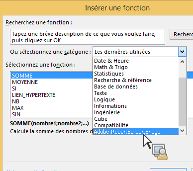
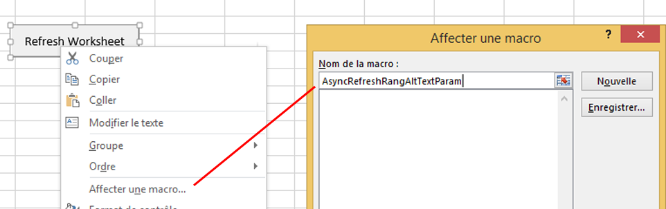
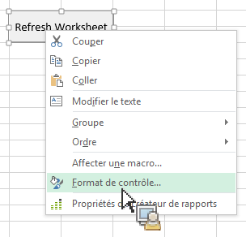
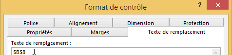

# Appel de la fonctionnalité de Report Builder depuis les fonctions Microsoft Excel

Cette fonctionnalité intègre un peu plus l’utilisation du Créateur de rapports dans le processus Excel naturel, sans nécessiter d’accéder à l’interface utilisateur du Créateur de rapports.

Par exemple, vous souhaitez peut-être actualiser automatiquement les requêtes du Créateur de rapports dont le filtre d’entrée est basé sur des données extraites d’Excel provenant d’autres sources. Vous pouvez effectuer cette opération à l’aide de la fonction string RefreshRequestsInCellsRange(..) . Tous les appels sont asynchrones. Ils renvoient immédiatement et n’attendent pas un appel pour s’exécuter entièrement.

> [!NOTE] Pour que cette fonctionnalité fonctionne, vous devez avoir installé la version 5.0 (ou une version ultérieure) du créateur de rapports.

Vous trouverez ci-dessous un tableau comportant la liste des fonctions présentées :

| Nom de la fonction | Description |
|---|---|
| string AsyncRefreshAll() | Actualise toutes les requêtes du Créateur de rapports présentes dans un classeur. |
| string AsyncRefreshRange(string rangeAddressInA1Format) | Actualise toutes les requêtes du Créateur de rapports présentes dans l’adresse de plage de cellules spécifiée (une expression string représentant une plage de cellules au format A1, par exemple « Sheet1!A2:A10 »). |
| string AsyncRefreshRangeAltTextParam() | Actualise toutes les requêtes du Créateur de rapports présentes dans la plage de cellules spécifiée qui est transférée par l’intermédiaire du Texte de remplacement du Contrôle de formulaire MS. |
| string AsyncRefreshActiveWorksheet() | Actualise toutes les requêtes du Créateur de rapports présentes dans la feuille de calcul active. |
| string AsyncRefreshWorksheet(string worksheetName) | Actualise toutes les requêtes du Créateur de rapports présentes dans la feuille de calcul indiquée (le nom de la feuille de calcul tel qu’il s’affiche dans l’onglet). |
| string AsyncRefreshWorksheetAltTextParam(); | Actualise toutes les requêtes du Créateur de rapports présentes dans le nom de feuille de calcul spécifique qui a été transféré par l’intermédiaire du Texte de remplacement du Contrôle de formulaire MS. |
| string GetLastRunStatus() | Renvoie une chaîne qui décrit l’état de l’exécution la plus récente. |

Pour accéder à ces fonctions dans le Créateur de rapports, accédez à [!UICONTROL Formules] &gt; [!UICONTROL Insérer fonction]. Dans la partie inférieure de la liste de catégories, vous trouverez Adobe.ReportBuilder.Bridge :



## Use these functions in a formula {#section_034311081C8D4D7AA9275C1435A087CD}

Par exemple, la formule

```
=IF(OR(ISTEXT(P5),ISBLANK(P5)),AsyncRefreshRange("P9"),"")
```

indique « Si la cellule P5 contient du texte ou est vierge, actualisez la plage se trouvant dans la cellule P9. »

## Use Report Builder functions with format control {#section_26123090B5BD49748C8D8ED7A1C5ED84}

Vous pouvez à présent affecter une macro à un contrôle que vous avez créé et ce dernier peut être une fonction qui actualise une requête de classeur. Par exemple, la fonction AsyncRefreshActiveWorksheet actualise toutes les requêtes d’une feuille de calcul. Parfois, néanmoins, vous souhaitez n’actualiser que certaines requêtes, pas toutes.

1. Définissez le paramètre de macro.
1. Cliquez avec le bouton droit et sélectionnez **[!UICONTROL Affecter une macro]**.
1. Saisissez le nom de la fonction du Créateur de rapports (sans paramètre ou parenthèse).



## Pass parameters to Report Builder functions via format control {#section_ECCA1F4990D244619DFD79138064CEF0}

Les deux fonctions qui utilisent un paramètre peuvent être utilisées avec le format de contrôle mais uniquement par l’intermédiaire du champ Texte de remplacement :

* AsyncRefreshRange(string rangeAddressInA1Format)
* AsyncRefreshWorksheet(string worksheetName)

1. Cliquez avec le bouton droit et sélectionnez **[!UICONTROL Format de contrôle]**.

   

1. Cliquez sur l’onglet [!UICONTROL Texte de remplacement].

   

1. Sous [!UICONTROL Texte de remplacement], saisissez la plage de cellules que vous souhaitez actualiser.
1. Ouvrez la liste des paramètres du Créateur de rapports sous [!UICONTROL Formules] &gt; [!UICONTROL Insérer fonction] &gt; [!UICONTROL Adobe.ReportBuilder.Bridge].

1. Sélectionnez une des deux fonctions qui se terminent par AltTextParam et cliquez sur **[!UICONTROL OK]**.

