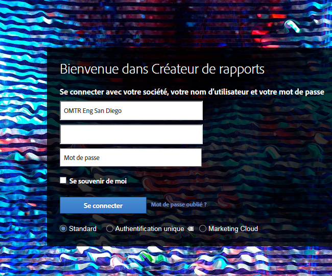
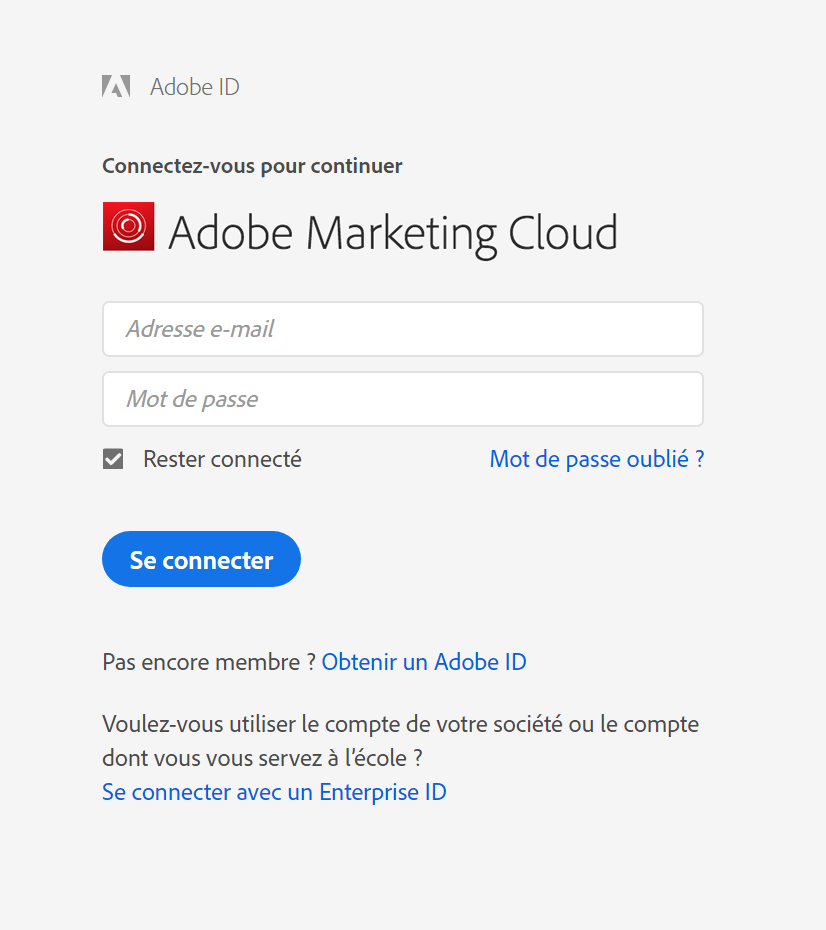

# Ouverture de session dans le Report Builder

Informations sur les trois façons de se connecter au Report Builder.

Currently, the following login options are available when you click **[!UICONTROL Sign In]** to Report Builder.

* [Standard ](/help/analyze/report-builder/setup/login.md#section_6D54B8ADAE7F416BB83F5082B3771CFA)
* [Authentification unique](/help/analyze/report-builder/setup/login.md#section_6970A5F926774976B85FFE576610E85F)
* [Experience Cloud et authentification unique ](/help/analyze/report-builder/setup/login.md#section_1FA230F35AB54021A874A7A28DE4C850)

## Standard {#section_6D54B8ADAE7F416BB83F5082B3771CFA}

Utilisez cette méthode de connexion pour accéder au Report Builder à l’aide de vos informations d’identification d’Adobe Analytics.

**Connexion au Report Builder : définitions des champs**

| Champ | Définition |
|--- |--- |
| Société  | Le  les informations d’identification de connexion que vous utilisez pour Adobe Analytics. |
| Nom d’utilisateur | Nom d’utilisateur servant pour Adobe Analytics. Les  planifiées pour un utilisateur sont liées au nom d’utilisateur. Vous pouvez  votre planifié  depuis n’importe quel ordinateur si vous vous connectez au créateur de rapports avec les mêmes informations de connexion. |
| Mot de passe | Votre mot de passe Analytics. |
| Se souvenir de moi | Les informations de connexion sont chiffrées et stockées dans un fichier de profils utilisateur sur l’ordinateur où est installé le Report Builder. Étant donné que ces informations sont enregistrées, toute personne utilisant le même ordinateur que le créateur du rapport qui ouvre une feuille de calcul contenant un rapport peut en actualiser et en modifier les données. N’activez pas cette option si vous partagez votre ordinateur et souhaitez préserver la confidentialité des données. Pour désactiver le paramètre de connexion automatique, cliquez sur **[!UICONTROL Log in With Different Credentials]** la barre d’outils et désactivez **[!UICONTROL Remember Me]**. |
| Utiliser un serveur proxy | Activez cette option si vous accédez à Internet par le biais d’un serveur proxy et que vous devez fournir un nom d’utilisateur et un mot de passe de proxy. |

## Authentification unique {#section_6970A5F926774976B85FFE576610E85F}

Cette authentification unique (héritée) vous connecte à Adobe Analytics uniquement, et non à l’ensemble d’Experience Cloud.

Vous pouvez également saisir du texte dans un domaine et le système reconnaîtra le domaine et vous redirigera vers votre page de connexion  pour vous connecter à Adobe Analytics.

## Experience Cloud {#section_1FA230F35AB54021A874A7A28DE4C850}

La connexion à Experience Cloud vous permet d’utiliser votre Enterprise ID (adresse électronique et mot de passe) pour vous connecter à Adobe Experience Cloud. Cliquez sur **[!UICONTROL Sign In]** > **[!UICONTROL Sign in with an Enterprise ID]** pour être redirigé vers votre  page de connexion unique. Pour plus d’informations sur Enterprise ID, cliquez [ici](https://helpx.adobe.com/fr/enterprise/kb/enterprise-id-faq.html#whatis).

>[!NOTE] La connexion à Experience Cloud repose sur une session ; le jeton expire après 30 jours.

