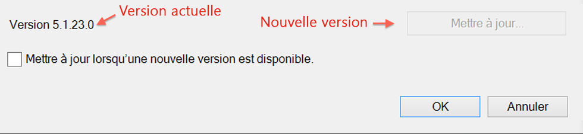
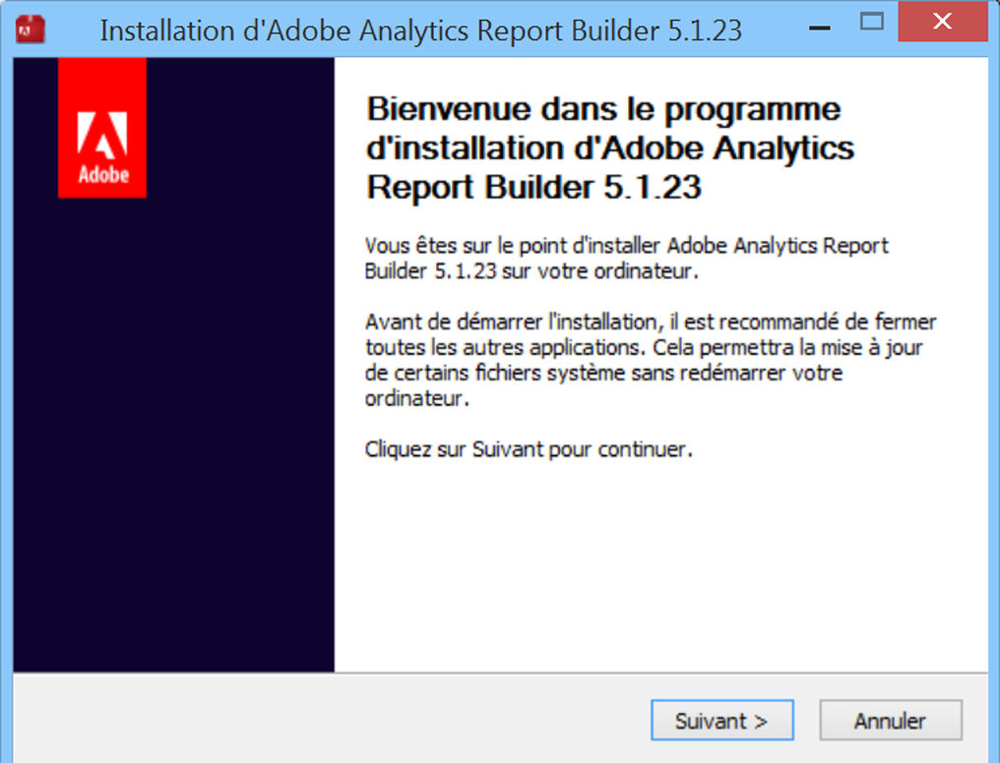

# Mise à niveau de Report Builder

Procédure de mise à niveau du Créateur de rapports et considérations à prendre en compte.

## Questions fréquentes sur la mise à niveau {#section_AFE40FF5544C418790A1C298C25CC18A}

**Q : Est-ce que l’ancienne version du Créateur de rapports est conservée en cas de mise à niveau ?**

R : Non, l’ancienne version sera supprimée.

**Q : Mes rapports existants seront-ils perdus ?**

R : Non, tous les rapports existants continueront à fonctionner.

**Q : Dois-je recommencer la procédure d’authentification dans la nouvelle version ?**

R : Non, tous vos paramètres, y compris les paramètres d’authentification, continueront à fonctionner.

## Upgrade instructions {#section_73B8110A619549189A30079735E81867}

1. Connectez-vous à votre version existante du Créateur de rapports.
1. Accédez au menu **[!UICONTROL Options]pour effectuer la mise à niveau vers la nouvelle version.** Le numéro de la version actuelle s’affiche au bas de la boîte de dialogue Options.

   

1. **[!UICONTROL Si une nouvelle version est disponible, cliquez sur]** Mettre à jour.... Le bouton présentera la version de la mise à jour, par exemple « Mettre à jour vers la version 5.0.50 ».

   >[!NOTE]
   >
   >Si ce bouton est grisé, aucune nouvelle version du créateur de rapports n’est disponible.

1. Vous pouvez également cocher la case **[!UICONTROL Mettre à jour lorsqu’une nouvelle version est disponible].** À l’avenir, le processus de mise à jour commencera automatiquement à chaque fois qu’une nouvelle version est disponible.
1. When the setup screen appears, click **[!UICONTROL Next &gt;]**.

   

1. Une fois la mise à niveau terminée, reconnectez-vous au Créateur de rapports.

## Manual upgrade instructions {#section_27A0200010DC4747A718F1A65B180599}

Vous pouvez toujours obtenir la dernière version du Créateur de rapports dans Adobe Analytics.

1. Connectez-vous à Adobe Analytics et sélectionnez **[!UICONTROL Outils]**.
1. Cliquez sur **[!UICONTROL Créateur de rapports]**.
1. Dans l’écran **[!UICONTROL Aperçu], sélectionnez la version 32 bits ou 64 bits.**
1. Cliquez sur **[!UICONTROL Télécharger maintenant!]**.

