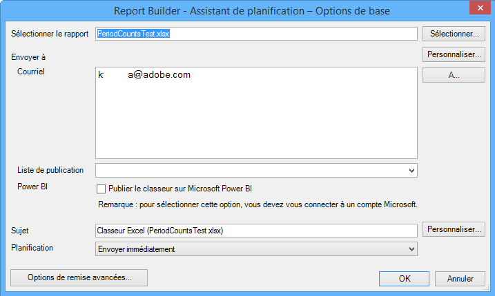

# Planifier des classeurs

Vous pouvez planifier des classeurs, définir des options de remise avancées, spécifier des destinataires et afficher l’historique de planification. Les options de remise avancées vous permettent de configurer les classeurs que vous souhaitez envoyer à un moment ou à des intervalles spécifiques. Vous pouvez également spécifier le format de fichier dans lequel envoyer le classeur.

For example, you can schedule workbooks to be delivered immediately or on a recurring schedule, and specify the file format in [!DNL Advanced Delivery Options]. La taille du fichier est limitée à 5 Mo pour le transfert d’un classeur.

Additionally, after you create a workbook schedule in Report Builder, you can view and edit the schedule in **[!UICONTROL Analytics]** &gt; **[!UICONTROL Reports]**. (Voir [Planification et distribution de rapports](/help/analyze/reports-analytics/scheduling.md) dans l’aide de Rapports et analyses.)

> [!NOTE] Pour programmer un classeur, vous devez avoir installé Excel 2007 ou le pack de compatibilité. Vous pouvez avoir un maximum de 10 classeurs planifiés par licence du créateur de rapports. Néanmoins, vous pouvez augmenter ce nombre en utilisant des classeurs d’autres licences. To do so, go to **[!UICONTROL Admin]** &gt; **[!UICONTROL Company Settings]** &gt; **[!UICONTROL Report Builder Reports]**. Un classeur qui a été planifié (ou téléchargé dans la bibliothèque des classeurs) et qui n’a pas été modifié (mis à jour, remplacé) depuis plus de 28 mois sera supprimé.

> [!NOTE] La valeur "Heure de remise"/"Heure du jour" entrée par l’utilisateur indique l’heure à laquelle le classeur doit commencer le traitement, et non l’heure à laquelle il sera réellement remis. Le temps réel de remise du classeur dépend principalement du temps nécessaire au traitement (le traitement des classeurs complexes et volumineux prend plus de temps que celui des classeurs plus simples). Si, par exemple, le traitement d’un classeur prend 15 minutes, le temps de remise réel est au moins de 15 minutes après le délai de remise initialement spécifié.
>En outre, un certain nombre d’autres facteurs peuvent accroître le délai avant la remise du classeur :
>
> * **L’exécution simultanée** de plusieurs planifications différentes du même type peut entraîner une surcharge du système. Le système de planification ne permet l’exécution simultanée que de quelques classeurs (5 à 10) de n’importe quel type. Par conséquent, lorsque plus de 5 à 10 sont tous programmés à la fois, certains devront patienter jusqu’à ce que d’autres classeurs soient terminés avant de pouvoir commencer le traitement. Ce problème peut être atténué en planifiant les classeurs d’une entreprise à des heures décalées tout au long de la journée ou de l’heure, plutôt qu’à la fois.
> * Outre le type de classeur spécifique, les classeurs attendent également dans la file d'attente si l'entreprise dispose de **plus de 15 à 20 types de classeurs planifiés simultanément (dans tous les types de classeurs)**. Cela peut être atténué par des temps de planification ahurissants au lieu d'avoir plusieurs exécutions en même temps.
> * **Les problèmes des services** en aval sur lesquels le planificateur s’appuie peuvent également affecter la livraison des classeurs. Par exemple, si vous utilisez indépendamment les API pour exécuter des classeurs et remplir la file d’attente des demandes d’API, vos classeurs planifiés peuvent être distribués lentement pendant que vous êtes en concurrence pour cette ressource.
> * **La latence** des suites de rapports (un retard dans la collecte des données) peut également retarder certains classeurs planifiés.

## Planification d’un classeur

1. Générez et enregistrez un classeur.
1. On the Report Builder Toolbar, click **[!UICONTROL Schedule]**.

   L’onglet [!UICONTROL Rapports programmés] affiche un récapitulatif de toutes les tâches que vous avez créées, ainsi que le nombre de tâches restantes.
1. Sur l’onglet **Rapports programmés**, cliquez sur **[!UICONTROL Nouveau]**.
1. L’Assistant de planification - Options de base s’affiche :

   

1. Dans [!UICONTROL l’Assistant de planification - Options de base], configurez les options suivantes :

| Champ | Description |
|--- |--- |
| Sélectionner le rapport | Nom du classeur. Dans le cas des nouveaux rapports programmés, ce champ contient le nom du classeur actif. |
| Select | Affiche la page Sélectionner le rapport. Vous pouvez sélectionner un rapport sur le serveur (où sont stockés tous les classeurs déjà programmés) ou sur votre machine locale. Si vous sélectionnez un classeur sur le disque local au format .xls, le système convertit le fichier au format .xlsx. Dans le cadre de cette conversion, le fichier est ouvert dans Excel et rendu actif. Si le classeur sélectionné pour le rapport planifié porte le même nom de fichier que celui ouvert actuellement dans Excel, le système sélectionne le fichier local au lieu de celui transféré précédemment. Si vous sélectionnez un rapport dans le référentiel de planification, une copie du classeur est créée sur le serveur, avec son nom de fichier mis à jour avec 1. Le rapport planifié nouvellement créé utilise le classeur copié. |
| Personnaliser | Vous permet de personnaliser le format de date. |
| À | Affiche le Carnet d’adresses Outlook, le cas échéant. |
| Envoyer à : Courriel | Le destinataire du courrier électronique du classeur. |
| Envoyer à : Liste de publication | Répertorie les listes de distribution disponibles pour cette société. |
| Power BI | Voir [Publier le classeur sur Microsoft Power BI](/help/analyze/report-builder/c-publish-power-bi/integration-power-bi.md) pour en savoir plus. |
| Objet | Description définie par l’utilisateur. |
| Planification | Vous permet de spécifier le moment d’envoi du classeur. (Immédiatement, Horaire, Quotidiennement, Hebdomadairement, Mensuellement et Annuellement). |

## Options de remise avancées

1. Click **[!UICONTROL Advanced Delivery Options]** to configure file and publishing options:

| Champ | Description |
|--- |--- |
| Onglet **Planification** |  |
| Heure de remise | Permet de planifier le classeur immédiatement ou ultérieurement. L’heure indiquée est fonction du fuseau horaire défini sur votre ordinateur. |
| Modèle de répétition | Envoie le classeur en fonction de vos sélections. |
| Plage de répétition | Vous permet de spécifier le moment où démarrer et arrêter la réception du classeur.   Remarque :  La planification d’un classeur le premier jour d’une période en cours (semaine, mois, trimestre ou année) renvoie des données uniquement pour le premier jour. |
| Onglet **Options de fichier** |  |
| Format du fichier | Permet de sélectionner le format de remise : Excel 2007 (.xlsx) ou 2003 (.xls), .pdf, .csv, .mht, .txt et .xml. |
| Description du fichier | Précise E-mail ou FTP. Les options disponibles sur cette page varient en fonction de la sélection. Dans le cas de FTP, vous devez vous assurer que l’hôte est disponible en externe. |
| Liste de publication | Si vous envoyez le classeur planifié à plusieurs listes de publication, il s’exécute une fois pour chaque liste. Les suites de rapports variables sont remplacées par celle qui est affectée à la liste de publication. |
| Langue du contenu du fichier | Indique la langue que vous souhaitez utiliser pour la lettre d’envoi. Vous avez le choix entre l’allemand, le portugais (du Brésil), le chinois (simplifié ou traditionnel), le coréen, l’espagnol, le français ou le japonais. |
| Onglet **Options de publication** |  |
| Publication sur Power Bi | <ul><li>Publier le classeur sur Power BI</li><li>Publier toutes les requêtes du Créateur de rapports sous forme de jeux de données Power BI</li><li>Publier tous les tableaux formatés sous forme de jeux de données Power BI</li></ul> |
| Intituler ce rapport Power BI par | Informations d’intitulé |

1. Click **[!UICONTROL OK]**, then click **[!UICONTROL Exit]**.

   Report Builder displays the scheduled workbook in the [Scheduled Task Manager](/help/analyze/report-builder/r-arb-scheduled-reports.md).

