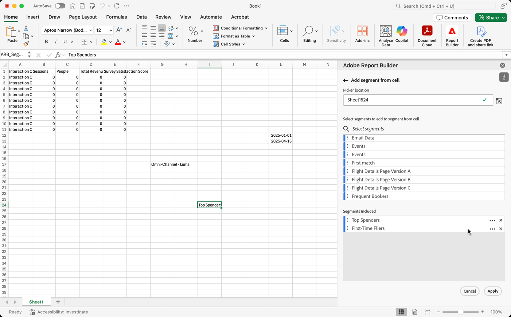
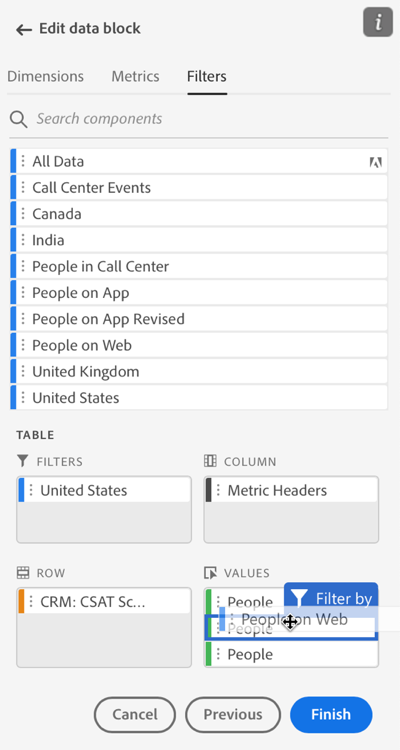
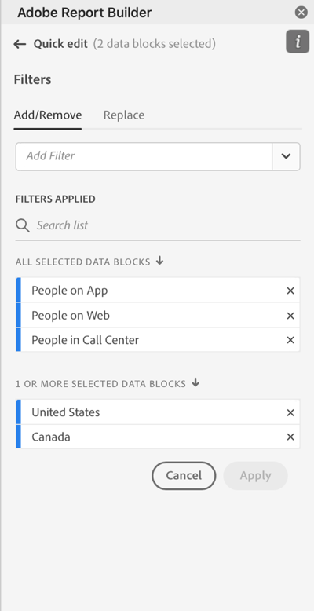
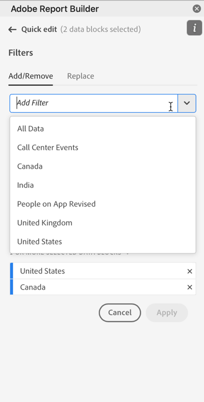
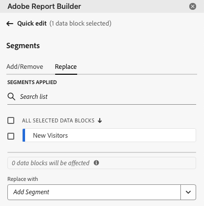
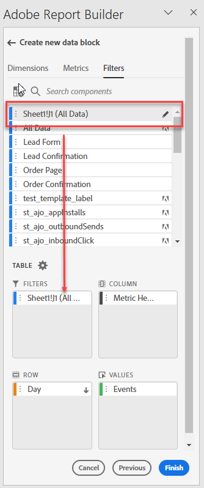
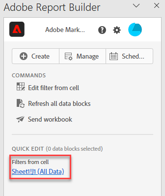
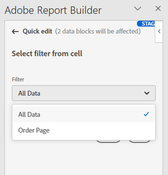

# Utiliser des segments

Vous pouvez appliquer des segments lorsque vous créez un bloc de données ou lorsque vous sélectionnez **[!UICONTROL Modifier le bloc de données]** dans le panneau **[!UICONTROL Commandes]**.

## Application de segments à un bloc de données

Pour appliquer un segment à l’ensemble du bloc de données, sélectionnez deux fois un segment ou faites glisser des segments de la liste des composants vers la section des segments du tableau.

## Application de filtres à des mesures individuelles

Pour appliquer des filtres à l’aide de segments à des mesures individuelles :

* Effectuez un glisser-déposer d’un ou plusieurs segments depuis **[!UICONTROL Segments]** vers une mesure du tableau.

* Sinon :

   1. Sélectionnez  pour une mesure spécifique dans le volet **[!UICONTROL Tableau]**, puis sélectionnez **[!UICONTROL Filtrer la mesure]**.

      {zoomable="yes"}

   1. Sélectionnez un ou plusieurs segments dans le menu déroulant **[!UICONTROL Segments]**. Les segments sont ajoutés à la liste **[!UICONTROL Segments appliqués]**.

      
   1. Sélectionnez  pour supprimer un segment de la liste **[!UICONTROL Segment appliqué]**. Ou sélectionnez **[!UICONTROL Effacer tout]** pour supprimer tous les segments de la liste **[!UICONTROL Segment appliqué]**.
   1. Sélectionnez **[!UICONTROL Appliquer]**.

Pour afficher les filtres appliqués, survolez une mesure avec la souris ou sélectionnez-la dans le volet Tableau. Les mesures avec des segments appliqués affichent une icône de segment.

## Modification rapide de segments

Vous pouvez utiliser le panneau **[!UICONTROL Modification rapide]** pour ajouter, supprimer ou remplacer des segments pour des blocs de données existants.

Lorsque vous sélectionnez une plage de cellules dans la feuille de calcul, le lien **[!UICONTROL Segments]** du panneau **[!UICONTROL Modification rapide]** affiche une liste récapitulative des segments utilisés par les blocs de données dans cette sélection.

Pour modifier des segments à l’aide du panneau **[!UICONTROL Modification rapide]** :

1. Sélectionnez une plage de cellules à partir dʼun ou de plusieurs blocs de données.

1. Sélectionnez le lien **[!UICONTROL Segments]** pour lancer le panneau **[!UICONTROL Modification rapide]** **[!UICONTROL Segments]**.

### Ajouter ou supprimer des segments

Vous pouvez ajouter ou supprimer des segments à l’aide des options Ajouter/Supprimer .

1. Sélectionnez l’onglet **[!UICONTROL Ajouter/Supprimer]** dans le panneau **[!UICONTROL Modification rapide]** **[!UICONTROL Segments]**.

   1. Sélectionnez un ou plusieurs segments dans le menu déroulant **[!UICONTROL Segments]**. Les segments sont ajoutés à la liste **[!UICONTROL Segments appliqués]**.
   1. Sélectionnez  pour supprimer un segment de la liste **[!UICONTROL Segment appliqué]**.
   1. Sélectionnez **[!UICONTROL Appliquer]**.

Report Builder affiche un message pour confirmer les modifications apportées au segment.

### Remplacer les segments

Vous pouvez remplacer un segment existant par un autre segment pour modifier la manière dont les données sont segmentées.

1. Sélectionnez l’onglet **[!UICONTROL Remplacer]** dans le panneau **[!UICONTROL Modification rapide]** **[!UICONTROL Segments]**.

1. Utilisez le champ de recherche **Liste de recherche** pour localiser des segments spécifiques.

1. Sélectionnez un ou plusieurs segments à remplacer.

1. Recherchez un ou plusieurs segments dans le menu déroulant Remplacer par pour ajouter le segment à la liste **[!UICONTROL Remplacer par]**.

1. Sélectionnez **[!UICONTROL Appliquer]**.

Report Builder met à jour la liste des segments pour refléter le remplacement.

## Définir des segments de blocs de données depuis la cellule

Les blocs de données peuvent référencer des segments à partir d’une cellule. Plusieurs blocs de données peuvent référencer la même cellule pour des segments, ce qui vous permet de changer facilement de segment pour plusieurs blocs de données à la fois.

Pour appliquer des segments à partir d’une cellule :

1. [Créez un bloc de données](create-a-data-block.md#create-a-data-block) ou modifiez un bloc de données existant.
1. Sélectionnez l’onglet **[!UICONTROL Segments]** pour définir des segments.
1. Sélectionnez .

   {zoomable="yes"}

1. Sélectionnez la cellule à partir de laquelle vous souhaitez que les blocs de données référencent un segment.

1. Sélectionnez deux fois pour ajouter un segment à la cellule. Vous pouvez également faire glisser et déposer un ou plusieurs segments dans la section **[!UICONTROL Segments inclus]**.

1. Sélectionnez **[!UICONTROL Appliquer]** pour créer la cellule de référence.

1. Dans l’onglet **Segments**, ajoutez le segment de cellule de référence nouvellement créé à votre bloc de données.

   {zoomable="yes"}

1. Sélectionnez **[!UICONTROL Terminer]**.

Pour appliquer la cellule de référence sous la forme d’un segment à d’autres blocs de données, utilisez la référence de cellule comme l’un des segments de la liste **[!UICONTROL Segments]** de l’onglet **[!UICONTROL Tableau]**.

### Utiliser une cellule de référence pour modifier les segments de bloc de données

1. Sélectionnez la cellule de référence dans votre feuille de calcul.

1. Sélectionnez le lien sous **[!UICONTROL Segments depuis la cellule]** dans le menu **[!UICONTROL Modification rapide]**.

   {zoomable="yes"}

1. Sélectionnez votre segment dans le menu déroulant.

1. Sélectionnez **[!UICONTROL Appliquer]**.

<!--
You can apply segments when you create a new data block or when you select the **Edit data block** option from the COMMANDS panel.

## Apply segments to a data block

To apply a segment to the entire data block, double-click a segment or drag and drop filters from the components list into the Segments section of the Table.

## Apply segments to individual metrics

To apply segments to individual metrics, drag and drop a segment onto a metric in the table. You can also click the **...** icon to the right of a metric in the Table pane and then select **[!UICONTROL Segment metric]**. To view applied segments, hover over or select a metric in the Table pane. Metrics with applied segments display a filter icon.

## Quick edit segments

You can use the Quick edit panel to add, remove, or replace segments for existing data blocks.

When you select a range of cells in the spreadsheet, the **[!UICONTROL Segments]** link in the Quick edit panel displays a summary list of the segments used by the data blocks in that selection.

To edit segments using the Quick edit panel

1. Select a range of cells from one or multiple data blocks.

    

1. Click the link underneath **[!UICONTROL Segments]** to launch the Quick edit - Filters panel.

    

### Add or remove a segment

You can add or remove segments using the Add/Remove options.

1. Select the **[!UICONTROL Add/Remove]** tab in the Quick edit-segments panel.

    All segments applied to the selected data blocks are listed in the Quick Edit-segments panel. Segments applied to all data blocks in the selection are listed under the **[!UICONTROL Applied to all selected data blocks]** heading. Segments applied to some but not all data blocks are listed under the **[!UICONTROL Applied to 1 or more selected data blocks]** heading.

    When multiple segments are present in the selected data blocks, you can search for specific segments using the **[!UICONTROL Add Filter]** search field.

    

1. Add segments by selecting segments from the **[!UICONTROL Add segment]** drop down menu.

    The list of searchable segments includes all segments accessible to the report suites that are present in one or more of the selected data blocks as well as all the segments that are available globally in the organization.

    Adding a segment applies the segment to all data blocks in the selection.

1. To remove segments, click the delete icon **x** to the right of segments in the **[!UICONTROL Segments applied]** list.

1. Click **[!UICONTROL Apply]** to save changes and return to the hub panel.

    Report Builder displays a message to confirm the applied segment changes.

### Replace a segment

You can replace an existing segment with another segment to change how the data is segmented.

1. Select the **[!UICONTROL Replace]** tab in the Quick edit-segment panel.

    

1. Use the **[!UICONTROL Search list]** search field to locate specific segments.

1. Choose one or more segments that you want to replace.

1. Search for one or more segments in the Replace with field.

    Selecting a filter adds it to the **[!UICONTROL Replace with]**... list.

1. Click **[!UICONTROL Apply]**.

    Report Builder updates the list of segments to reflect the replacement.

### Define data block segments from cell

Data blocks can reference segments from a cell. Multiple data blocks can reference the same cell for segments, allowing you to easily switch segments for multiple data blocks at a time.

To apply segments from a cell

1. Navigate to Step 2 in either the data block creation or editing process. See [Create a Data Block](./create-a-data-block.md).
1. Click the **[!UICONTROL Segments]** tab to define filters.
1. Click **[!UICONTROL Create segment from cell]**.

    

1. Select the cell from which you want the data blocks to reference a segment.
   
1. Add the segment choice you wish to add to the cell by either double clicking the segment, or by dragging and dropping it into the **[!UICONTROL Segments Included]** section. 
   
   Note: Only one choice may be selected for the given cell at one time.

    

1. Click **[!UICONTROL Apply]** to create the reference cell.

1. From the **[!UICONTROL Segments]** tab, add the newly created reference cell segments to your data block.

    

1. Click **[!UICONTROL Finish]**.

    Now this cell can be referenced by other data blocks in their segments. To apply the reference cell as a segment to other data blocks, simply add the cell reference to their segments from the Segments tab. 

#### Use the reference cell to change data block segments

1. Select the reference cell in your spreadsheet.

1. Click the link under **[!UICONTROL Segments from Cell]** in the Quick Edit menu.

    

1. Select your segment from the drop-down menu.

    

1. Click **[!UICONTROL Apply]**.
-->